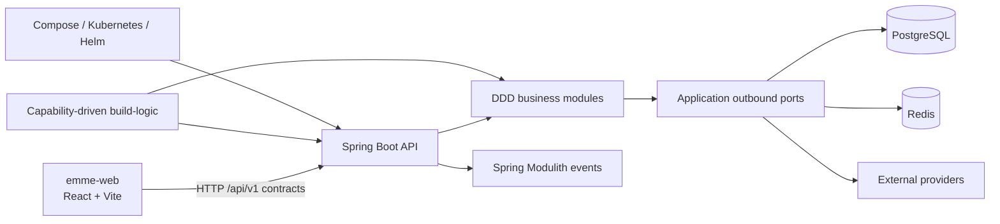

# EMME Service


[](https://github.com/migangdelzar/emme-service/actions/workflows/ci-backend.yml)

The EMME service is a multi-tenant Spring Modulith for salon operations. It is
one deployable backend with explicit business-module boundaries, DDD + Hexagonal
package structure, capability-driven Gradle build logic, and production-oriented
deployment assets.

> **Full-stack partner:** [emme-web](https://github.com/migangdelzar/emme-web)

The repositories are intentionally independent, like the Clara full-stack
challenge. The service owns business truth, authorization, tenancy, persistence,
API contracts, events, and backend delivery. The web repository owns
presentation and interaction.

## Architecture at a glance



## Quick start

### Prerequisites

| Tool | Version | Purpose |
|---|---:|---|
| Temurin Java | 25 | Runtime and Gradle toolchain |
| Gradle | Wrapper | Build, test, and delivery tasks |
| Docker | Current | Local infrastructure and Testcontainers |
| mise | Current, optional | Reproducible local commands |

```bash
git clone https://github.com/migangdelzar/emme-service.git
cd emme-service

./gradlew :applications:emme-platform:build
./gradlew :applications:emme-platform:test
./gradlew :applications:emme-platform:archTest
```

For a local runtime, use the deployment assets documented in
[`docs/architecture/04-delivery/deployment.md`](docs/architecture/04-delivery/deployment.md).
The default health endpoint is:

```bash
curl http://localhost:8081/actuator/health
```

## Repository structure

```text
applications/     Deployable Spring Boot applications
modules/          DDD business modules; package-by-capability
libraries/        Reusable framework-neutral and test support libraries
platform/         Shared dependency and platform conventions
database/         Database lifecycle and migration support
build-logic/      Capability-Driven Gradle plugins, tasks, and providers
deployment/       Compose, Kubernetes, k3d, and Helm delivery assets
infra/            Supporting infrastructure and Terraform
docs/             Architecture handbook, contracts, ADRs, and requirements
```

## Architectural boundaries

Backend modules follow:

```text
<module>/
├── api/            Public module contract
├── application/    Use-case orchestration and outbound ports
├── domain/         Business model and invariants
├── adapter/in/     HTTP, messaging, and scheduled entry points
├── adapter/out/    Persistence and external-system adapters
└── configuration/  Framework/module wiring
```

Other modules consume `api.*` contracts or public events. They do not import
repositories, entities, adapters, or infrastructure internals. See the
[module template](docs/templates/module-package-structure-template.md).

Build logic uses a different architecture: capabilities own their plugins,
extensions, tasks, providers, and technology adapters. See
[`build-logic/README.md`](build-logic/README.md) and the
[Capability-Driven Build Logic guide](docs/architecture/00-project/build-logic.md).

## Verification

```bash
./gradlew check --no-configuration-cache
./gradlew :build-logic:test
./gradlew :applications:emme-platform:archTest
```

The CI workflows run compilation, tests, module-boundary verification, and the
boot-jar verification. Secrets and runtime credentials must be supplied through
the environment or deployment secret manager; never commit them to this repo.

## Documentation map

| Topic | Location |
|---|---|
| Project and repository split | [`docs/architecture/00-project/`](docs/architecture/00-project/) |
| Backend modules | [`docs/architecture/01-backend/`](docs/architecture/01-backend/) |
| Frontend/backend contracts | [`docs/architecture/03-integration/`](docs/architecture/03-integration/) |
| Delivery and release | [`docs/architecture/04-delivery/`](docs/architecture/04-delivery/) |
| Operations and production evidence | [`docs/architecture/05-operations/`](docs/architecture/05-operations/) |
| Engineering policies | [`docs/principles.md`](docs/principles.md), [`docs/security.md`](docs/security.md), [`docs/testing.md`](docs/testing.md) |
| ADRs | [`docs/adr/`](docs/adr/) |

## License

Proprietary. See the repository's licensing policy before distributing this
software or its generated artifacts.
