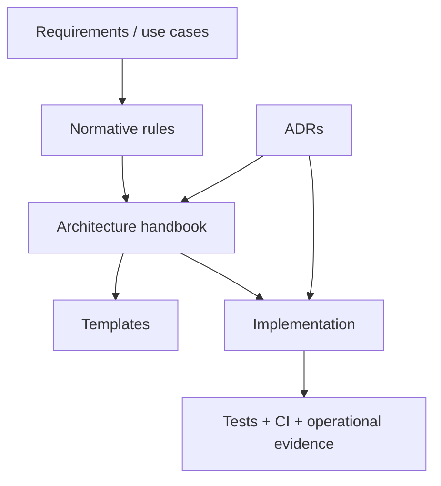

# EMME Service Documentation

This directory is the service repository's documentation system. It separates
normative architecture rules from templates, decisions, requirements, and
operational evidence.

## Start here

1. Read the [architecture handbook](architecture/README.md).
2. Read the [architecture model](architecture/00-project/architecture-model.md)
   before changing boundaries.
3. Use the [application template](templates/modulith-application-template.md)
   for a deployable service and the [module template](templates/module-package-structure-template.md)
   for each business module.
4. Use [production readiness](architecture/05-operations/production-readiness.md)
   as the release approval map.

## Source hierarchy

| Area | Canonical location |
|---|---|
| Architecture rules | [`architecture/`](architecture/) |
| Engineering principles | [`principles.md`](principles.md) |
| Security and privacy | [`security.md`](security.md) |
| Testing policy | [`testing.md`](testing.md) |
| Git and review policy | [`git.md`](git.md) |
| Reusable package/build templates | [`templates/`](templates/) |
| Consequential decisions | [`adr/`](adr/) |
| Product requirements and use cases | [`prd/`](prd/), [`requirements/`](requirements/), [`use_cases/`](use_cases/) |

The frontend repository has its own consumer-side handbook. Cross-repository
contracts are owned by this service repository and linked from
[`emme-web`](https://github.com/migangdelzar/emme-web).

## Documentation rules

- Architecture pages define repeatable constraints.
- Templates define copy-ready structure and evidence fields.
- ADRs explain consequential choices and are never deleted when superseded.
- READMEs explain how to use the current repository; they do not replace rules.
- Generated diagrams and OpenAPI output are evidence, not manually maintained
  alternatives to the source of truth.
- Examples are marked as examples and never imply that the example is deployed.
