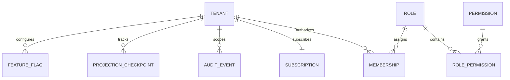

# Admin App — Entity Model

Entities owned by the platform administration app. See [`docs/entity_model.md`](../entity_model.md) for the complete model.

| Entity | Description | Location |
|---|---|---|
| **TENANT** | Isolated service business; lifecycle: ACTIVE, SUSPENDED, DELETED. Slug is the stable URL name. | [`entity_model.md`](../entity_model.md#tenant) |
| **MEMBERSHIP** | Associates a user identity with a tenant and role. One active membership per role per tenant. | [`entity_model.md`](../entity_model.md#membership) |
| **ROLE** | Named collection of permissions; scoped PLATFORM or TENANT. | [`entity_model.md`](../entity_model.md#role) |
| **PERMISSION** | One protected business action (e.g., `appointment:write`). | [`entity_model.md`](../entity_model.md#permission) |
| **ROLE_PERMISSION** | Links a permission to a role. | [`entity_model.md`](../entity_model.md#role_permission) |
| **SUBSCRIPTION** | Tenant commercial plan: STARTER, PRO, ENTERPRISE. Status: TRIAL, ACTIVE, PAST_DUE, SUSPENDED, CANCELLED. | [`entity_model.md`](../entity_model.md#subscription) |
| **AUDIT_EVENT** | Records security-sensitive activities with actor, action, outcome, and tenant scope. | [`entity_model.md`](../entity_model.md#audit_event) |
| **PROJECTION_CHECKPOINT** | Tracks pgvector and graph projection progress for reconciliation. | [`entity_model.md`](../entity_model.md#projection_checkpoint) |

> **Feature flags** are managed via the identity module's platform feature flag API. They are configuration-driven rather than modeled as domain entities in v1.
