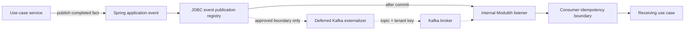

# ADR-0005: Spring Modulith event streaming through Kafka

| Field | Value |
|---|---|
| Status | Accepted as a deferred capability |
| Date | 2026-08-02 |
| Owners | EMME service maintainers |
| Supersedes | The assumption that Kafka is active for the initial MVP event set |

## Context

EMME is a Spring Modulith application whose modules communicate through public
Java APIs and application events. Some completed facts must be durable, replayable,
and consumable by independently scaled capabilities or future services. Publishing
directly with `KafkaTemplate` from application services would couple business
workflows to Kafka and bypass the Modulith publication lifecycle.

The Clara challenge uses Spring Modulith `@Externalized` event contracts with
Kafka topics and tenant-aware keys. EMME retains that future model while
preserving the module boundary rule: domain and application code must not
depend on Kafka. The initial runtime has no approved independent event
consumer, so its current business facts remain internal Spring Modulith events.

## Decision

Retain Spring Modulith's Kafka externalization capability behind an explicit
future boundary, while using the JDBC event publication registry for the
initial runtime:

1. Add `spring-modulith-events-kafka` and Spring Kafka through the
   capability-driven `emme.messaging` convention plugin.
2. Use the Spring Modulith JDBC starter in the deployable application and own
   the `event_publication` schema through Liquibase.
3. Publish application facts inside the producer transaction through
   `ApplicationEventPublisher` or an application-owned event publisher port.
4. Mark a stable, public `api.event` record with `@Externalized` only after an
   independently deployed consumer or equivalent delivery boundary is
   approved. Current business event records remain unannotated.
5. Use `topic::key` routing, with tenant identity as the key for tenant-scoped
   events. This preserves ordering per tenant without forcing one global Kafka
   partition.
6. When the capability is activated, configure producer acknowledgements,
   idempotence, bounded retries, compression, and serialized externalization.
7. When activated, treat broker delivery as at-least-once. Every consumer owns
   idempotency, retry, poison-message, and replay behavior.

## Scope of externalization

No business event is externalized in the initial runtime. The explicit deferred
Kafka integration test uses a test-local event:

- `TestExternalizedEvent` → `emme.test.kafka-event`

All current business events remain local. In particular, tenant, appointment,
learning, calendar coordination, and dashboard/SSE events are not streamed
merely because they are Java records under `api/event`.

## Alternatives considered

### Direct `KafkaTemplate` in application services

Rejected. It exposes broker concerns to use-case orchestration, makes atomic
publication harder to enforce, and spreads topic/key policy across modules.

### RabbitMQ / AMQP

Rejected for v1. It remains an intentionally unsupported transport. Kafka is the
single selected event-streaming transport so operational and contract policy do
not split across two brokers.

### Spring Modulith local events only for the initial runtime

Chosen for the current runtime. Local events are the right mechanism for
in-process module reactions and the JDBC publication registry provides durable
retryable delivery. Kafka remains available when an independently consumable
broker stream is actually required.

### Debezium CDC

Rejected as the primary event contract mechanism. CDC exposes persistence changes
rather than explicit business facts and would make event ownership and schema
compatibility depend on table internals.

## Consequences

Positive:

- Business modules remain Kafka-agnostic.
- State and publication intent are recorded within the same transaction.
- Kafka topics and partition keys are explicit and testable.
- Failed publications can be inspected and resubmitted through Modulith APIs.
- The application can later extract a module or consumer without changing its
  domain model.

Trade-offs:

- Kafka is not an initial-runtime operational dependency. It remains a deferred
  capability with an explicit opt-in profile and integration test.
- Delivery is at least once, not exactly once; consumers must deduplicate.
- Public event payloads require compatibility governance and retention policy.
- The native Spring Modulith externalizer is an event-publication-registry-backed
  asynchronous externalizer, not a claim of Kafka's end-to-end exactly-once
  semantics.

## Verification

- `EventContractTest` verifies immutable internal event records and prevents
  accidental production externalization.
- `KafkaEventStreamingIntegrationTest` uses a test-local externalized event;
  when explicitly enabled, it starts a real Kafka container and verifies topic,
  tenant key, and JSON payload.
- The Liquibase `013-event-publication` migration owns the PostgreSQL registry
  schema used by production validation.
- Architecture rules continue to prohibit Kafka imports from `domain` and
  application orchestration packages.

## References

- [Spring Modulith event publication and externalization](https://docs.spring.io/spring-modulith/reference/events.html)
- [Spring Modulith Kafka externalizer API](https://docs.spring.io/spring-modulith/docs/current/api/org/springframework/modulith/events/kafka/package-summary.html)
