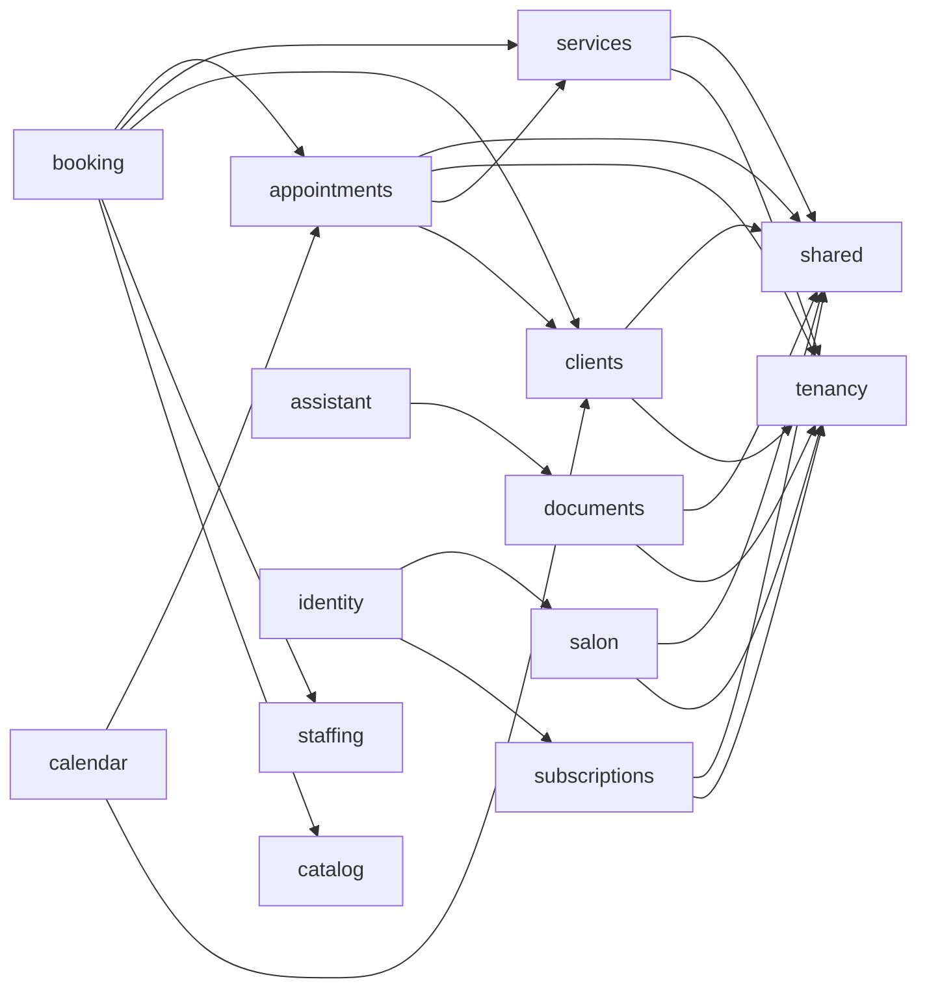

# ADR 0008: Studio module decomposition into DDD bounded contexts

| Field | Decision |
|---|---|
| Status | Accepted |
| Date | 2026-08-04 |
| Scope | `studio` monolithic module split, empty module renames |

## Context

The `modules/studio` module evolved into a monolith holding four distinct DDD
bounded contexts under one package:

- **Service catalog** — Service offerings, categories, prices, artist capabilities
- **Customer CRM** — Staff-managed client profiles, search, history
- **Appointment scheduling** — Lifecycle, collision detection, slot search
- **Business configuration** — Profile, hours, booking policy, notification prefs

Additionally, `studio` hosts two nested capabilities (`documents/` and
`subscriptions/`) with their own DDD layers that should be standalone modules.

Four empty contract-only modules exist with poor naming:

- `workforce` — Intended for staff scheduling, but "workforce" is corporate HR language
- `customer` — Intended for customer self-service, but "customer" overlaps with CRM
- `booking` — Customer self-service booking (name is fine)
- `audit` — Metadata placeholder (name is fine, codified in ADR-0004)

## Decision

### Module renames

| Old name | New name | Rationale |
|---|---|---|
| `workforce` | `staffing` | "Staffing" reflects salon staff scheduling, shifts, and capacity — natural domain language for a service business |
| `customer` | `clients` | "Clients" is the salon's CRM bounded context. The customer self-service bounded context is `booking` |

### Nested capability extraction

| Source | Target module | Rationale |
|---|---|---|
| `studio/documents/` | `documents` | Document upload, processing, chunking, and RAG retrieval is a standalone capability consumed by `assistant` |
| `studio/subscriptions/` | `subscriptions` | Subscription plans, entitlements, and billing are consumed by `identity` (feature flags, plan-based gating) |

### Studio decomposition

| New module | Extracted from `studio` | Bounded context |
|---|---|---|
| `services` | Service, Artist, ArtistCapability domain | Service catalog — what the salon offers and who can deliver it |
| `clients` | Customer domain (was `studio` CRM) | Client CRM — staff-managed profiles, history, loyalty |
| `appointments` | Appointment domain, events, collision detection | Appointment scheduling — lifecycle, slots, status flow |
| `salon` | BusinessProfile, OperatingHours, BookingPolicy, NotificationPreference | Business configuration — tenant's identity, schedule, and rules |

### Remaining modules

- `studio` is dissolved after extraction
- `booking` stays (customer self-service, already declared deps on extracted modules)
- `audit` stays (metadata per ADR-0004)
- `staffing` stays (future staff scheduling)

### Dependency direction

## Consequences

- `modules/studio` is removed; its source files move to `services`, `appointments`, `clients`, `salon`, `documents`, and `subscriptions`
- Java package declarations change: `com.emme.studio.*` → `com.emme.<module>.*`
- Cross-module imports in `identity`, `calendar`, and `assistant` are updated
- `settings.gradle.kts` lists the new modules and removes `studio`
- `applications/emme-platform/build.gradle.kts` adds new module dependencies
- Architecture tests (`ModularityTest`, cross-module dependency tests) are updated
- Existing use cases, requirements, and entity model docs are updated

## Verification

- `./gradlew :applications:emme-platform:test --tests '*ModularityTest'` passes
- `./gradlew :applications:emme-platform:check` passes (all tests, lint, boundary checks)
- No `com.emme.studio` imports remain outside the deleted module
- All 18 cross-module consumers (`identity`, `calendar`, `assistant`) compile against new module APIs
