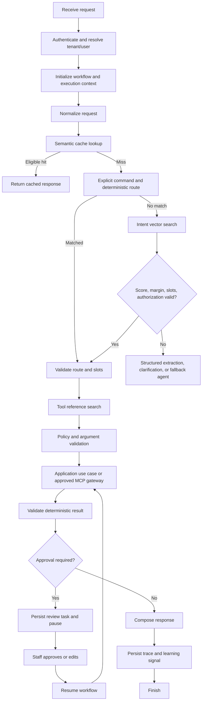

# Functional Specification: Semantic AI Capabilities

| Field | Value |
|---|---|
| Status | Draft |
| Requirements | [Functional requirements](requirements.md) |
| Architecture | [Master design](../superpowers/specs/2026-08-27-ai-platform-semantic-architecture-design.md) |

## 1. Shared request lifecycle



## 2. Semantic classification flow

1. Normalize language without destroying dates, names, or design terminology.
2. Check explicit UI actions and deterministic rules.
3. Generate an embedding using the active model/version.
4. Search global and authorized tenant intent references.
5. Calculate top-1, top-2, margin, required-slot completeness, and permission
   eligibility.
6. Select the route only when its calibrated policy passes.
7. Otherwise abstain and request clarification or use structured extraction.
8. Persist the decision and outcome for evaluation.

The route result is not a probability and cannot authorize a mutation.

## 3. Semantic tool-selection flow

1. Build the allowed tool set from the authenticated context, current intent,
   tenant capabilities, channel, and risk policy.
2. Search references only within that allowed set.
3. Require a calibrated score and margin.
4. Validate required slots and typed arguments.
5. Require confirmation for writes.
6. Execute an application use case or approved MCP adapter.
7. Validate the deterministic result, audit the call, and apply idempotency.

## 4. Semantic cache flow

1. Normalize the request and determine cache scope.
2. Include tenant, user when applicable, channel, locale, and dependency
   versions in the cache query.
3. Search the semantic cache index with the active embedding version.
4. Reject stale, sensitive, personalized, or transactional hits.
5. Return only a valid cache entry; otherwise continue the workflow.
6. After a successful eligible response, enqueue safe cache enrichment.

## 5. Self-improvement flow

```text
completed workflow
→ outcome and feedback
→ eligibility policy
→ PII redaction
→ injection/content screening
→ candidate record
→ asynchronous embedding
→ shadow evaluation
→ canary index
→ monitored promotion or rejection
```

The pipeline uses positive examples only when the result is strongly confirmed.
Staff corrections and misroutes create negative or hard-negative examples.

## 6. Quote/HITL flow

```text
image and message received
→ secure image metadata
→ vision extraction
→ typed design schema validation
→ similar design retrieval
→ tenant quote-template loading
→ deterministic quote calculation
→ confidence/ambiguity gate
→ staff review when required
→ final response
```

Required states:

```text
RECEIVED
EXTRACTING
QUOTE_CALCULATED
NEEDS_STAFF_REVIEW
WAITING_FOR_STAFF
STAFF_APPROVED
STAFF_EDITED
QUOTE_READY
SENT_TO_CLIENT
FAILED
```

## 7. Multi-intent flow

For “analyze this design, tell me the price, and book Friday afternoon”:

```text
decompose intents
→ quote extraction
→ deterministic quote
→ availability lookup in parallel where independent
→ approval if ambiguous
→ ask for confirmation
→ execute booking use case
→ send final response
```

Read-only operations may run in parallel. Mutations are sequenced after
confirmation and authorization.
