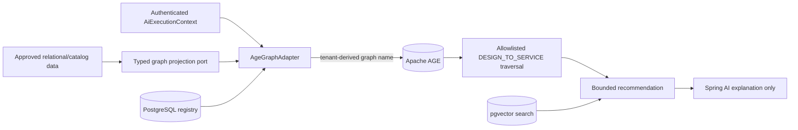

# Technical Specification: Emme AI Platform

| Field | Value |
|---|---|
| Status | Draft |
| Requirements | [Functional](requirements.md), [NFRs](non-functional-requirements.md) |
| Design | [Master design](../superpowers/specs/2026-08-27-ai-platform-semantic-architecture-design.md) |

## 1. Dependency graph

```text
applications/emme-platform
  → modules/assistant
  → modules/ai-platform
  → libraries/ai-contracts
  → module APIs
  → infrastructure adapters

modules/assistant
  → libraries/ai-contracts
  → modules/ai-platform
  → tenancy :: tenant-database
  → catalog-api
  → documents-api
  → appointments-api
  → tenancy-api
  → audit-api

modules/catalog
  → libraries/ai-contracts embedding/vision ports

modules/ai-platform
  → libraries/ai-contracts
  → kernel/shared only
```

The framework-neutral `ai-contracts` library removes the current
`catalog → assistant AI` coupling and prevents an assistant/catalog cycle.
`ai-platform` owns reusable provider and capability adapters without depending
on assistant application code. Assistant remains the composition boundary for
Emme-specific use cases and Spring AI/LangGraph4j workflow definitions.

## 2. Stable application ports

```java
public interface EmbeddingGateway {
  EmbeddingResult embed(EmbeddingRequest request);
  List<EmbeddingResult> embedBatch(List<EmbeddingRequest> requests);
}

public interface ChatGateway {
  ChatResult complete(ChatRequest request);
}

public interface VisionGateway {
  VisionResult analyze(VisionRequest request);
}

public interface SemanticClassifier {
  RouteDecision classify(AiExecutionContext context, NormalizedRequest request);
}

public interface SemanticToolSelector {
  ToolCandidate select(AiExecutionContext context, ToolSelectionRequest request);
}

public interface SemanticCache {
  Optional<CacheHit> find(AiExecutionContext context, CacheLookup lookup);
  void enqueueCandidate(AiExecutionContext context, CacheCandidate candidate);
}

public interface ParallelTaskRunner {
  <T> List<T> runRequired(List<? extends Callable<T>> tasks, Deadline deadline);
  <T> List<TaskOutcome<T>> runOptional(List<? extends Callable<T>> tasks, Deadline deadline);
}

public interface WorkflowCheckpointRepository {
  void save(WorkflowCheckpoint checkpoint);
  Optional<WorkflowCheckpoint> load(AiExecutionContext context, UUID workflowId);
}

public interface LearningSignalRecorder {
  void record(LearningSignal signal);
}
```

Production implementations are injected at the composition root. Domain code
does not instantiate providers, executors, clients, or repositories.

## 3. Spring AI clients and advisors

```text
ExtractionChatClient
  PromptVersionAdvisor
  StructuredOutputValidationAdvisor
  BudgetAdvisor
  TraceAdvisor

RagChatClient
  TenantSecurityAdvisor
  MessageChatMemoryAdvisor
  RetrievalAugmentationAdvisor
  PromptVersionAdvisor
  TraceAdvisor

FallbackAgentChatClient
  TenantSecurityAdvisor
  MessageChatMemoryAdvisor
  RetrievalAugmentationAdvisor
  PromptVersionAdvisor
  BudgetAdvisor
  TraceAdvisor
  one ToolCallingAdvisor
    → ToolSearchToolCallingAdvisor when the Redis tool index is enabled
```

The fallback client receives only the tools allowed for the current context.
Direct semantic tool routes do not need the fallback agent.
When progressive tool search is enabled, Spring AI's tool-search advisor is the
single tool advisor for the client. It indexes only the callbacks returned by
the backend-authorized `SpringAiToolCallbackProvider`; the advisor's session
key is a composite of tenant, principal, conversation, and role fingerprint.
This prevents a persisted Redis tool index from being reused across tenants or
users and avoids Spring AI's multiple-tool-advisor failure. The tool index is
separate from the response-cache index and uses the same configured embedding
model and dimension.

The in-process tool boundary is represented by `AiToolDefinition`,
`AiToolInvocation`, `AiToolExecutionContext`, `AiToolResult`, and
`AiToolGateway`. `AuthorizedAiToolGateway` filters definitions by backend
roles, risk, user confirmation, and staff approval. `SemanticProactiveToolRouter`
passes only read-only, no-confirmation tools to the existing tenant-filtered
semantic selector; low-confidence routes abstain. Tool handlers receive a
backend-created execution context and delegate to application use cases. The
platform currently registers `getSalonServices` as a read-only catalog tool;
booking and other mutations are not eligible for proactive execution.

Mutation invocations additionally use `AiToolIdempotencyStore`. The gateway
derives `toolKey:principalId:context.idempotencyKey` from trusted backend state, checks for
a completed tenant-scoped result, atomically claims the operation when absent,
and persists the authoritative result after the handler succeeds. A completed
replay never invokes the handler again, a concurrent claim is rejected, and a
handler failure releases its claim for retry. PostgreSQL migrations
`022-ai-tool-idempotency.sql` and `023-ai-tool-idempotency-lease.sql` define
the production schema. Claims have a configurable lease bounded to 24 hours;
only expired `IN_PROGRESS` claims can be reclaimed, `SUCCEEDED` rows cannot be
overwritten, and completion clears the lease. The adapter stores only
`IN_PROGRESS` or `SUCCEEDED` records under tenant RLS. The no-op adapter is
available only for compositions without the tenant JDBC boundary; production
composition selects the JDBC implementation. Appointment mutation handlers
remain outside this slice until the existing application commands expose an
idempotency-aware contract.

Durable execution traces use the application-level `AiTraceRecorder` contract.
`TracingChatCompletionPort` records each named chat-provider attempt, including
failed local attempts before a configured fallback succeeds. The authorized
tool gateway records successful, rejected, and failed tool calls after applying
the same backend authorization gates used for execution. The JDBC adapter
derives tenant, principal, conversation, workflow, and trace identifiers from
`AiExecutionContext`; it never accepts those values from model arguments.
Request, response, argument, and error payloads are redacted before storage.
Governed self-improvement uses `LearningCandidate` records from
`libraries:ai-contracts`. Candidate text is bounded and rejected when it still
contains common email, phone, or bearer-token patterns. The platform policy
admits only redacted candidates backed by accepted, validated, successful
outcomes without staff correction or policy violations. Candidates are stored
in PostgreSQL as `PENDING_EVALUATION`; they are never promoted during a
customer request. `LearningCandidateLifecyclePolicy` requires complete offline
datasets, deterministic safety checks, regression and shadow approval, and a
separate canary result before promotion. `JdbcLearningCandidateStateStore`
updates status with tenant and expected-version predicates, so concurrent
workers cannot overwrite one another. The asynchronous evaluator and versioned
embedding-index promotion worker remain a subsequent phase.
Admitted candidates are dispatched through the framework-neutral
`LearningCandidateEvaluationRequester` port. The assistant adapter publishes a
stable `LearningCandidateEvaluationRequested` Spring Modulith event using the
existing durable publication registry, partitioned by the backend tenant. The
event contains only trusted candidate/context identifiers and correlation
metadata; the candidate text and evidence remain in tenant-filtered PostgreSQL
and are loaded by the offline evaluator. Rejected candidates do not dispatch
evaluation work.

The repository also contains an offline Python 3.13 Ragas scaffold at
`tools/ai-evaluation`. It accepts anonymized JSONL samples, redacts common PII
before constructing a Ragas `EvaluationDataset`, and emits advisory metric and
gate results. It deliberately does not call the Java lifecycle service or
promote an embedding index. The Java lifecycle remains the authority for
candidate status; explicit shadow and canary evidence must be supplied by
separate controlled stages.
The evaluator result contract is `LearningCandidateEvaluationReport`; the
`JdbcLearningCandidateEvaluationStore` persists versioned metrics and gate
evidence, and `LearningCandidateEvaluationWorker` applies it only under the
backend-bound AI execution context. A duplicate delivery after a terminal
candidate state is a safe no-op. The transport that supplies reports remains an
internal authenticated asynchronous boundary; no customer-facing endpoint
accepts lifecycle gates.
Token counts and estimated cost are nullable because provider usage metadata is
not guaranteed. Trace writes are best effort and PostgreSQL is authoritative
for the durable records; a no-op recorder is used where JDBC is unavailable.
`TracingEmbeddingModelPort` records embedding attempts without storing vector
values, and `SpringAiNailDesignExtractor` records structured extraction
metadata without storing image bytes.

## 4. Provider adapters

```text
LocalOllamaProvider
LocalMlxOpenAiCompatibleProvider
OxAlphaCloudProvider
MockProvider
```

Provider selection is task-aware and tenant-policy-aware. Embeddings are
versioned independently from chat models. All active vector queries reject
model/version/dimension mismatches.

The Spring AI chat boundary uses named `ChatClient` beans in explicit order.
`ChatProviderChain` catches only `ChatProviderUnavailableException`; the
application falls back to the existing provider-neutral model port after all
configured Spring AI clients are unavailable. The local Ollama client is
feature-gated, and additional provider modules may contribute named clients
without changing application logic. Every configured client receives the
tenant-security and prompt-version advisors at request execution time. No
advisor may derive or override tenant identity from model output.

## 5. LangGraph4j integration

LangGraph4j owns the workflow graph and checkpoint lifecycle. Graph nodes call
application ports. Spring AI is used inside model-facing nodes.

The platform must not combine a LangGraph4j model tool loop with a second Spring
AI tool loop. The recommended ownership is:

```text
LangGraph4j
  → outer workflow, branches, retries, pause/resume

Spring AI ToolCallingAdvisor
  → one fallback-agent model/tool loop

Application use cases
  → authoritative tool execution
```

The service uses a tenant-aware Emme `BaseCheckpointSaver` boundary around a
JDBC adapter. The adapter persists LangGraph checkpoint state in
`ai_workflow_checkpoint`, including the next node required for resume. Both
the wrapper and JDBC adapter require the backend `AiExecutionContext`; the
LangGraph thread ID must equal its workflow ID. The stock LangGraph4j
PostgreSQL saver is not the source of truth because its documented in-memory
cache can return stale state across instances; PostgreSQL remains authoritative.

The quote persistence slice includes JDBC adapters for workflow runs,
extraction results, quote drafts, and review tasks. All queries include the
authenticated tenant predicate. Review writes require the authenticated
reviewer and the expected task version, then append the decision in the same
transaction. The workflow owner (`principal_id`) is deliberately distinct from
the authenticated actor in `AiExecutionContext`: a staff member is authorized
by the application use case to resolve a client-owned workflow. The inbound
HTTP review adapter derives a stable PII-free reviewer UUID from the trusted
JWT issuer/subject, obtains tenant identity from the backend tenant context,
and requires a correlation ID plus idempotency key. The application service
loads the review and workflow under tenant predicates before rebinding the
workflow correlation. The concrete LangGraph resume adapter updates the
approval gate and invokes the persisted graph thread; rejected reviews remain
terminal without resuming the graph.

Redis operational state is exposed through `AiOperationalStatePort` and
`AiLiveEventPublisher`. The implementation is disabled unless
`app.ai.redis.enabled=true` and a `StringRedisTemplate` exists. Keys include
the backend-resolved tenant and workflow/conversation identity. Workflow
status is TTL-bound, lock release uses a compare-and-delete Lua script, and
live events contain only bounded status fields suitable for SSE/WebSocket
delivery. Redis is not used for durable history, quote artifacts, workflow
decisions, appointments, or audit logs.

The optional Spring AI Redis VectorStore projection is separately feature
gated by `app.ai.redis-semantic.enabled`. It projects durable PostgreSQL cache
rows into a Redis 8 vector index for low-latency semantic reads; a hot hit is
always re-confirmed with the tenant/principal-filtered PostgreSQL row before
being returned. `app.ai.redis-semantic.tool-search-enabled` creates a separate
Redis vector index for Spring AI's progressive tool search. Redis failures,
stale entries, and embedding mismatch disable only the acceleration path and
fall back to PostgreSQL or the normal model route. The default configuration
keeps both features disabled.

Semantic intent routing is feature-gated and executes before model fallback.
Its vector decision requires the configured top-1 score and top-1/top-2 margin;
abstention invokes the existing model route. Semantic response caching is
principal-scoped, expiry-bound, and limited to context-free informational chat.
Transactional terms such as booking, availability, price, cancellation,
payment, and account changes bypass the cache deterministically.

The active semantic embedding profile is EmbeddingGemma `768` dimensions. The
database migration that changes the initial schema from `1024` to `768` fails
closed when existing vectors are present, requiring an explicit reindex.

## 6. Optional Apache AGE graph read model

The graph capability is an optional derived read model inside PostgreSQL. It
does not replace relational services, prices, appointments, policies, clients,
quotes, approvals, or pgvector. `libraries:ai-contracts` defines immutable
allowlisted node/relationship types, projections, and curated traversal
queries. `modules:assistant` supplies the tenant-bound JDBC adapter:



The adapter requires the bound backend execution context, derives a graph name
from its tenant UUID, and filters the traversal by that tenant. It uses fixed
AGE queries and enum labels; neither the frontend nor an LLM can supply a graph
name, tenant, Cypher statement, price, availability, or mutation. AGE writes
load the extension and set the AGE search path in the same JDBC transaction.
Projection status is persisted in `ai_age_graph_registry`. If AGE is absent or
stale, retrieval returns no graph recommendation and the authoritative
PostgreSQL/pgvector path continues.

The combined AGE+pgvector database image is opt-in and local-development
friendly. The default Compose image remains the official pgvector runtime, and
the application feature flag defaults to disabled. Event-driven projection of
all catalog aggregates is a separate follow-up until the existing catalog
application boundary publishes the required durable projection events.

## 7. Concurrency

```text
HTTP/worker boundary
  → create AiExecutionContext
  → bind ScopedValue
  → run graph
  → StructuredTaskScope for independent reads
  → Joiner for completion/cancellation
```

Named executors:

```text
applicationTaskExecutor
aiIoExecutor
aiBackgroundExecutor
aiCpuExecutor
aiScheduler
```

`StructuredTaskScope` is isolated behind `ParallelTaskRunner` because it is a
Java 25 preview API. No code globally overrides `ForkJoinPool.commonPool()`.

## 8. Error handling

| Failure | Behavior |
|---|---|
| Missing tenant context | Fail closed |
| Embedding timeout | Use deterministic route or safe fallback; never execute an unvalidated tool |
| Vector-store timeout | Skip semantic cache/tool shortcut and continue safe workflow |
| Low score/margin | Abstain and clarify or use structured fallback |
| Invalid model schema | Bounded repair, then clarify/HITL |
| Model timeout | Provider fallback only when tenant policy permits |
| MCP failure | Retry only safe operations; persist failure and offer safe degradation |
| Checkpoint conflict | Reject stale resume and require fresh state |
| Review version conflict | Return conflict; do not overwrite newer decision |
| Redis outage | Disable temporary acceleration; preserve PostgreSQL authority |
| Mutating retry | Require idempotency key and application-level duplicate protection |

## 9. Test strategy

- Unit: score/margin policy, slot validation, cache eligibility, tool policy,
  Joiner aggregation, context propagation, idempotency, and HITL transitions.
- Integration: PostgreSQL/pgvector, checkpoint persistence, Redis locks and
  vector projections, Spring AI test doubles, MCP callbacks, and outbox events.
- End-to-end: FAQ, availability, booking, quote, ambiguous quote, multi-intent,
  wrong tenant, duplicate booking, provider timeout, MCP failure, and restart
  resume.
- Contract: provider adapters, MCP schemas, embedding dimensions, and event
  payloads.
