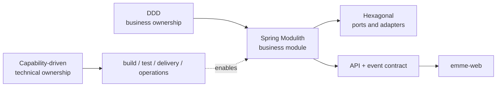
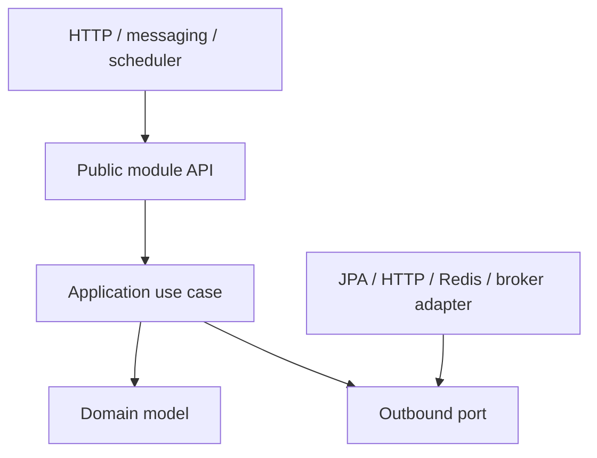

# Architecture Model

> **Naming contract:** Follow the [canonical architecture naming catalog](naming-conventions.md) for package names, filenames, Java/Kotlin types, methods, and tests. Local examples on this page must not introduce a conflicting convention.

## Purpose

EMME uses different architectural lenses for different kinds of cohesion. DDD
defines business ownership, Hexagonal Architecture protects module dependency
direction, and Capability-Driven Design structures build and delivery behavior.



## Lens responsibilities

### DDD — business boundaries

Use DDD to define bounded language, aggregate ownership, invariants, durable
data ownership, domain events, and collaboration between business modules.

Business modules are the primary unit of change. Supporting modules such as
`shared`, `database`, and `observability-support` are technical dependencies,
not substitute business domains.

### Hexagonal architecture — module internals



The core defines the capability it needs. Adapters implement that capability.
The domain does not import Spring, JPA, HTTP clients, JSON, or messaging APIs.

### Capability-Driven Design — technical ownership

Use capability-first organization for build logic and delivery concerns:

```text
container/
deployment/
publishing/
security/
quality/
testing/
```

Each capability owns its configuration, executable tasks, provider ports,
technology adapters, results, tests, and focused documentation. Do not create
global `task/`, `provider/`, or `config/` directories for unrelated concerns.

## Selection rules

| Decision | Primary lens |
|---|---|
| Place a business invariant | DDD |
| Prevent a domain dependency on JPA | Hexagonal architecture |
| Add a new external provider | Hexagonal port + capability-owned adapter |
| Add image scanning or deployment | Capability-Driven Design |
| Define module-to-module behavior | DDD public contract + events |
| Define browser feature ownership | Frontend capability model |

## Non-negotiable boundaries

- Business and technical ownership MUST be explicit.
- Dependencies MUST point inward inside a business module.
- A module MUST expose contracts rather than implementation packages.
- Build capabilities MUST not be forced into the backend module package tree.
- A new layer, interface, module, or package MUST have a real responsibility.
- The modular monolith remains the default until distribution solves a measured
  scaling, ownership, compliance, or isolation problem.

## Verification

- Spring Modulith `ApplicationModules.verify()` checks module dependencies.
- Architecture tests enforce domain and adapter dependency rules.
- Gradle TestKit verifies build capability behavior.
- Contract tests verify service consumers remain compatible.
- Production approval uses the [readiness evidence map](../05-operations/production-readiness.md).
