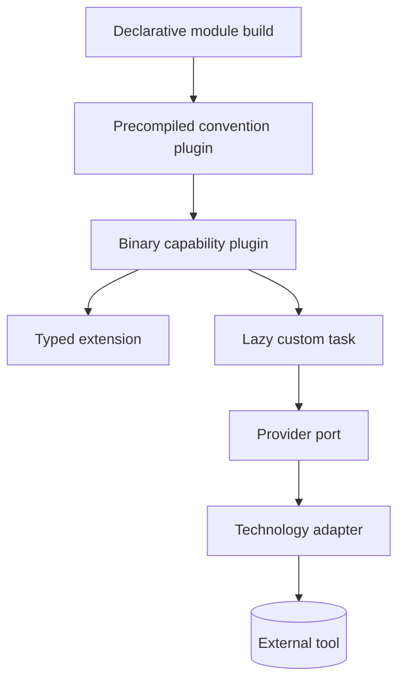
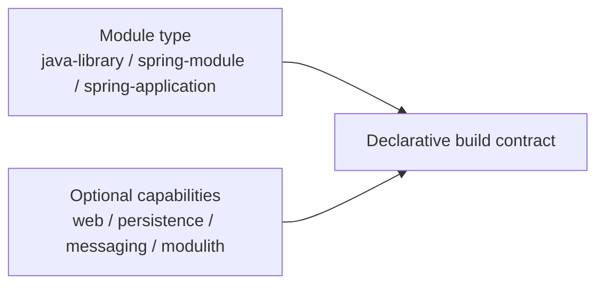
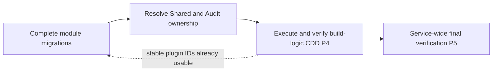

# Capability-Driven Build Logic

> **Naming contract:** Follow the [canonical architecture naming catalog](naming-conventions.md) for package names, filenames, Java/Kotlin types, methods, and tests. Local examples on this page must not introduce a conflicting convention.

## Purpose

`build-logic` contains the reusable build architecture of the platform. It owns project conventions, Gradle capabilities, custom plugins, tasks, lazy providers, external build-tool integrations, quality gates, release behavior, and deployment behavior.

Environment resolution is a separate settings-time included build:

```text
root settings.gradle.kts
        ↓ resolves before project plugins
build-logic-settings/com.emme.environment-settings
        ↓ publishes non-secret immutable context
build-logic/com.emme.environment
        ↓ configures project capabilities
build-logic/com.emme.secrets
```

`build-logic-settings` resolves the canonical environment and an arbitrary
non-secret property map before project plugin resolution. The main
`build-logic` build exposes typed projections and capability-owned tasks. The
settings build stays dependency-light and never resolves secrets.

The settings build deliberately uses a normalized `String` and the environment
property filenames as its contract. It does not duplicate `EnvironmentName`,
`RuntimeKind`, or any delivery model. The main build-logic is the sole owner of
typed build-domain models; the settings build only bootstraps values early.

Individual `build.gradle.kts` files should describe what a project is and which capabilities it needs. They should not repeat how Java, Spring, tests, containers, publishing, or deployment are wired.

```kotlin
plugins {
    id("emme.spring-module")
    id("emme.persistence")
    id("emme.messaging")
}
```

## Architecture

```text
module build.gradle.kts
        ↓ applies
precompiled convention plugin
        ↓ composes
capability plugin
        ↓ exposes/configures
extension + tasks
        ↓ depends on
provider port
        ↓ adapts
Docker / Podman / Trivy / Kubernetes / registry
```



The package organization is capability-first. Do not create global `plugin/`, `task/`, `provider/`, or `extension/` packages when those files belong to one cohesive capability.

## Recommended structure

```text
build-logic-settings/
├── build.gradle.kts
├── settings.gradle.kts
└── src/main/kotlin/com/emme/buildlogic/settings/
    └── EnvironmentSettingsPlugin.kt

build-logic/
├── build.gradle.kts
├── settings.gradle.kts
├── gradle.properties
│
├── config/
│   ├── checkstyle/
│   │   ├── checkstyle.xml
│   │   └── suppressions.xml
│   ├── detekt/
│   │   └── detekt.yml
│   └── license/
│       └── header.txt
│
└── src/
    ├── main/
    │   └── kotlin/
    │       ├── emme.java-base.gradle.kts
    │       ├── emme.java-library.gradle.kts
    │       ├── emme.spring-module.gradle.kts
    │       ├── emme.spring-application.gradle.kts
    │       ├── emme.spring-web.gradle.kts
    │       ├── emme.persistence.gradle.kts
    │       ├── emme.messaging.gradle.kts
    │       ├── emme.modulith.gradle.kts
    │       ├── emme.testing.gradle.kts
    │       ├── emme.integration-testing.gradle.kts
    │       ├── emme.test-fixtures.gradle.kts
    │       ├── emme.quality.gradle.kts
    │       ├── emme.api-compat.gradle.kts
    │       ├── emme.feature-flags.gradle.kts
    │       ├── emme.container.gradle.kts
    │       ├── emme.publishing.gradle.kts
    │       ├── emme.deployment.gradle.kts
    │       └── com/
    │           └── emme/
    │               └── buildlogic/
    │                   ├── core/
    │                   │   ├── DependencyConfiguration.kt
    │                   │   ├── JavaConfiguration.kt
    │                   │   ├── PluginIds.kt
    │                   │   ├── TaskNames.kt
    │                   │   └── TestConfiguration.kt
    │                   │
    │                   ├── model/
    │                   │   ├── ModuleType.kt
    │                   │   ├── QualityGateMode.kt
    │                   │   └── ReleaseChannel.kt
    │                   │
    │                   ├── root/
    │                   │   ├── RootPlugin.kt
    │                   │   └── BuildExtension.kt
    │                   │
    │                   ├── container/
    │                   │   ├── ContainerPlugin.kt
    │                   │   ├── ContainerExtension.kt
    │                   │   ├── ContainerRuntime.kt
    │                   │   ├── task/
    │                   │   │   ├── BuildContainerImageTask.kt
    │                   │   │   ├── PushContainerImageTask.kt
    │                   │   │   └── VerifyContainerImageTask.kt
    │                   │   └── provider/
    │                   │       ├── ContainerRuntimeProvider.kt
    │                   │       ├── ContainerResult.kt
    │                   │       ├── DockerProvider.kt
    │                   │       └── PodmanProvider.kt
    │                   │
    │                   ├── deployment/
    │                   │   ├── DeploymentPlugin.kt
    │                   │   ├── DeploymentExtension.kt
    │                   │   ├── DeploymentTarget.kt
    │                   │   ├── task/
    │                   │   │   ├── DeployTask.kt
    │                   │   │   └── DeploymentStatusTask.kt
    │                   │   └── provider/
    │                   │       ├── DeploymentProvider.kt
    │                   │       ├── DeploymentResult.kt
    │                   │       ├── ComposeProvider.kt
    │                   │       └── KubernetesProvider.kt
    │                   │
    │                   ├── publishing/
    │                   │   ├── PublishingPlugin.kt
    │                   │   ├── PublishingExtension.kt
    │                   │   ├── task/
    │                   │   │   ├── GenerateBuildInfoTask.kt
    │                   │   │   ├── GenerateReleaseManifestTask.kt
    │                   │   │   ├── GenerateSbomTask.kt
    │                   │   │   ├── SignArtifactsTask.kt
    │                   │   │   └── VerifyReleaseVersionTask.kt
    │                   │   └── provider/
    │                   │       ├── PublisherProvider.kt
    │                   │       ├── PublishResult.kt
    │                   │       └── GhcrPublisherProvider.kt
    │                   │
    │                   ├── registry/
    │                   │   ├── RegistryTarget.kt
    │                   │   ├── RegistryProvider.kt
    │                   │   └── RegistryResult.kt
    │                   │
    │                   ├── security/
    │                   │   ├── SecurityPlugin.kt
    │                   │   ├── SecurityExtension.kt
    │                   │   ├── SecurityScanner.kt
    │                   │   ├── task/
    │                   │   │   └── SecurityScanTask.kt
    │                   │   └── provider/
    │                   │       ├── SecurityScannerProvider.kt
    │                   │       ├── SecurityResult.kt
    │                   │       └── TrivyProvider.kt
    │                   │
    │                   ├── quality/
    │                   │   └── QualityExtension.kt
    │                   │
    │                   ├── environment/
    │                   │   ├── EnvironmentPlugin.kt
    │                   │   ├── EnvironmentExtension.kt
    │                   │   ├── EnvironmentContext.kt
    │                   │   ├── EnvironmentName.kt
    │                   │   ├── RuntimeKind.kt
    │                   │   ├── EnvironmentPropertiesValueSource.kt
    │                   │   └── task/
    │                   │       ├── EnvironmentReportTask.kt
    │                   │       └── VerifyEnvironmentTask.kt
    │                   │
    │                   ├── secrets/
    │                   │   ├── SecretsPlugin.kt
    │                   │   ├── SecretsExtension.kt
    │                   │   ├── SecretProviderKind.kt
    │                   │   ├── generator/
    │                   │   │   ├── SecretGenerator.kt
    │                   │   │   └── SecureSecretGenerator.kt
    │                   │   ├── provider/
    │                   │   │   ├── SecretProvider.kt
    │                   │   │   ├── SecretProviderFactory.kt
    │                   │   │   ├── EnvironmentSecretProvider.kt
    │                   │   │   ├── GitHubActionsSecretProvider.kt
    │                   │   │   ├── KubernetesSecretReferenceProvider.kt
    │                   │   │   └── BitwardenSecretProvider.kt
    │                   │   └── task/
    │                   │       ├── VerifySecretsTask.kt
    │                   │       ├── VerifySecretReferencesTask.kt
    │                   │       └── RotateSecretsTask.kt
    │                   │
    │                   └── git/
    │                       ├── GitBranchValueSource.kt
    │                       ├── GitCommitValueSource.kt
    │                       └── GitTagValueSource.kt
    │
    ├── test/
    │   └── kotlin/com/emme/buildlogic/
    │       ├── root/
    │       ├── container/
    │       ├── deployment/
    │       ├── publishing/
    │       └── security/
    │
    └── functionalTest/
        └── kotlin/com/emme/buildlogic/
            ├── FunctionalTestHelpers.kt
            ├── ContainerPluginFunctionalTest.kt
            ├── IntegrationTestingConventionFunctionalTest.kt
            ├── JavaBaseConventionFunctionalTest.kt
            ├── SpringApplicationConventionFunctionalTest.kt
            └── SpringModuleConventionFunctionalTest.kt
```

This is the target architecture, not a requirement that every capability create
every file. A simple convention may remain a single precompiled script. A complex
capability owns only the plugin, extension, tasks, providers, models, results, and
value sources that it actually needs.

The settings plugin is intentionally not part of the main capability build. It
must only publish `com.emme.environment.name` and
`com.emme.environment.values` as non-secret Gradle extra properties. Project
plugins consume that context after plugin resolution. This avoids a plugin
classpath cycle and ensures environment selection is available before project
configuration without making the root plugin a configuration god object.

## Design rules

- Keep `build-logic` as an included build.
- Use precompiled `.gradle.kts` plugins for declarative, composable conventions.
- Use binary Kotlin plugins for complex wiring, custom extensions, task registration, provider selection, or lifecycle coordination.
- Use typed Gradle extensions for public DSL configuration.
- Use custom tasks as execution boundaries with lazy `Property<T>` inputs and outputs.
- Use `ValueSource` and `Provider<T>` for Git, CI, and environment metadata.
- Keep external implementations behind provider ports.
- Keep `core/` small and limited to genuinely shared build primitives.
- Separate module-type plugins from optional capability plugins.
- Test isolated classes with unit tests and real plugin behavior with Gradle TestKit functional tests.

## Environment and secrets capability

The environment capability is the single source for non-secret build and
deployment configuration. Its property map follows this precedence:

```text
capability defaults
    ↓
gradle/environments/<environment>.properties
    ↓
EMME_* process variables
    ↓
gradle.properties
    ↓
-Pname=value (highest)
```

The settings-time included build resolves that map before project plugin
resolution. The main build-logic capability exposes typed values such as
`EnvironmentName`, `DeploymentTarget`, `RuntimeKind`, and `imageTag` while
retaining the map for future capabilities. Secret-like keys are excluded from
the shared map.

The separate `secrets` capability owns provider selection and provider-specific
validation/rotation. `gradle/secrets/manifest.json` contains only logical names,
references, and generation policy. `rotateSecrets` is a dry-run by default;
applying a rotation requires an explicit mode and provider. No secret value is
stored in Gradle properties, task inputs, task outputs, reports, logs, or the
configuration cache.

## Convention categories

| Category | Plugins |
|---|---|
| Foundation | `emme.java-base`, `emme.java-library`, `emme.feature-flags` |
| Testing | `emme.testing`, `emme.integration-testing`, `emme.test-fixtures` |
| Quality | `emme.quality`, `emme.api-compat` |
| Spring | `emme.spring-module`, `emme.spring-application`, `emme.spring-web` |
| Application capabilities | `emme.persistence`, `emme.messaging`, `emme.modulith` |
| Delivery | `emme.container`, `emme.publishing`, `emme.deployment` |

## Plugin composition examples

Plugin composition is the primary mechanism for assembling module type and capability behavior. A plugin should compose smaller plugins instead of reimplementing their conventions.

Module-type conventions and capability conventions have different ownership:

- `emme.java-base`, `emme.java-library`, `emme.spring-module`, and
  `emme.spring-application` establish what the project is.
- `emme.spring-web`, `emme.persistence`, `emme.messaging`, and `emme.modulith`
  add optional behavior and dependencies; they never apply a module type.
- A capability may therefore be applied to a Java or Spring module only when the
  owning build declares the required module type explicitly.



```text
emme.java-base
    ↑
emme.java-library
    ↑
emme.spring-module
    ├── emme.persistence
    ├── emme.messaging
    └── emme.modulith
```

```text
emme.java-base
    ↑
emme.spring-application
    ├── emme.spring-web
    ├── emme.container
    ├── emme.publishing
    └── emme.deployment
```

Avoid an `emme.everything` plugin. Explicit composition keeps module build scripts declarative and makes capability ownership visible.

## Current rollout and completion gate

Capability-Driven Design is already the organizing model of the current
`build-logic` implementation: the repository is an included build, public
conventions are precompiled `.gradle.kts` plugins, complex behavior is owned by
binary Kotlin plugins, and capability packages own their extensions, tasks,
providers, results, and value sources. The `emme.messaging` capability now also
owns the Spring Modulith Kafka dependency used by deployable applications.

The remaining work is hardening and evidence, not a second package-tree rewrite:

1. remove remaining eager `Provider.get()` calls from plugin configuration and
   use typed capability models instead of free-form selector strings;
2. complete provider/task/result extraction where a capability still contains
   technology-specific wiring in its plugin;
3. add Gradle TestKit coverage for deployment, publishing, security, registry,
   provider selection, configuration-cache behavior, and failure diagnostics;
4. audit `core/` and `model/` so every file has more than one legitimate
   capability consumer, otherwise move it into its owning capability;
5. verify plugin IDs, lazy inputs/outputs, configuration-cache compatibility,
   dependency locking, and CI execution across the real applications; and
6. publish the final build-logic verification report and record any intentional
   deviation in an ADR.

### When this gate runs

The hardening pass is the P4 build-platform workstream: after the remaining
backend module migrations and Shared/Audit ownership decisions, but before the
final P5 service-wide architecture, CI, artifact, and release verification
gate. Module migrations can continue before P4 because the stable
convention-plugin IDs and capability boundary already exist; build-logic itself
is not considered complete until the dedicated CDD migration plan is executed.



## Capability template

```text
<capability>/
├── <Capability>Plugin.kt
├── <Capability>Extension.kt            # only when a public DSL is needed
├── <Capability>Model.kt                # only when capability-specific state exists
├── task/
│   └── <Action>Task.kt
└── provider/
    ├── <Capability>Provider.kt
    ├── <Capability>Result.kt
    └── <Technology>Provider.kt
```

Do not force every layer into a simple capability. Files that change together belong together.

## Testing

Unit tests cover models, provider selection, task inputs, and plugin registration. Functional tests use `GradleRunner` with temporary projects to verify plugin IDs, task wiring, extensions, and actual Gradle behavior. Both levels are required for complex capabilities.

## Production build-logic profile

The following rules make the build architecture suitable for a multi-module production repository. They are mandatory unless a module records an ADR explaining the deviation.

### 1. Included-build boundary

`build-logic` is a separate included build, resolved from root settings through `pluginManagement`:

```kotlin
pluginManagement {
    includeBuild("build-logic")
}
```

This keeps build logic independently compiled and testable while allowing every project to consume the same conventions. The root build owns project composition; `build-logic` owns reusable build behavior.

Do not put application code, domain code, secrets, deployment credentials, or environment-specific business decisions in this build.

### 2. Repository implementation

The repository implements the capability-owned structure above. The public
precompiled convention plugin IDs remain stable while the Kotlin implementation
packages are organized by the capability they implement:

```text
build-logic/
├── build.gradle.kts
├── settings.gradle.kts
├── gradle.properties
├── config/
└── src/
    ├── main/kotlin/
    │   ├── emme.java-base.gradle.kts
    │   ├── emme.java-library.gradle.kts
    │   ├── emme.spring-module.gradle.kts
    │   ├── emme.spring-application.gradle.kts
    │   ├── emme.spring-web.gradle.kts
    │   ├── emme.persistence.gradle.kts
    │   ├── emme.messaging.gradle.kts
    │   ├── emme.modulith.gradle.kts
    │   ├── emme.testing.gradle.kts
    │   ├── emme.integration-testing.gradle.kts
    │   ├── emme.test-fixtures.gradle.kts
    │   ├── emme.quality.gradle.kts
    │   ├── emme.api-compat.gradle.kts
    │   ├── emme.feature-flags.gradle.kts
    │   ├── emme.container.gradle.kts
    │   ├── emme.publishing.gradle.kts
    │   ├── emme.deployment.gradle.kts
    │   ├── emme.security.gradle.kts
    │   └── com/emme/buildlogic/
    │       ├── core/           # shared build primitives and dependency access
    │       ├── model/          # genuinely cross-capability concepts
    │       ├── root/            # repository-wide coordination
    │       ├── container/       # container capability
    │       ├── deployment/      # deployment capability
    │       ├── publishing/      # publishing capability
    │       ├── registry/        # registry capability
    │       ├── security/        # security capability
    │       ├── quality/         # quality capability
    │       └── git/             # external Git value sources
    ├── test/kotlin/
    └── functionalTest/kotlin/
```

The package layout is intentionally not type-first. Each capability owns its
plugin, extension, models, tasks, providers, and results. Shared primitives live in
`core/`, and only genuinely cross-capability concepts remain in `model/`. Preserve
plugin IDs and Gradle API compatibility when adding or moving implementation files.

### 3. Core versus capability ownership

`core/` contains only infrastructure-independent primitives reused by several capabilities:

```text
core/
├── DependencyConfiguration.kt
├── JavaConfiguration.kt
├── PluginIds.kt
├── ProviderRegistry.kt
├── TaskNames.kt
└── TestConfiguration.kt
```

Use `core/` for shared constants, lazy configuration helpers, plugin identifiers, and common Java/test setup. Do not put container, deployment, publishing, security, or provider-specific behavior there. A core file with one capability consumer belongs to that capability.

### 4. Convention plugins

Precompiled script plugins answer: **what kind of Gradle project is this, and which reusable conventions does it receive?**

| Plugin | Category | Contract |
|---|---|---|
| `emme.java-base` | Foundation | Java toolchain, compiler, repositories, formatting, common lifecycle |
| `emme.java-library` | Foundation | Library publication and test defaults |
| `emme.spring-module` | Module type | Spring module baseline and Modulith composition |
| `emme.spring-application` | Module type | Boot application packaging and runtime defaults |
| `emme.spring-web` | Capability | Web MVC, validation, and API defaults |
| `emme.persistence` | Capability | JPA/JDBC, migrations, database testing |
| `emme.messaging` | Capability | Messaging client and integration-test defaults |
| `emme.modulith` | Capability | Module verification and event support |
| `emme.testing` | Capability | Unit-test framework and test conventions |
| `emme.integration-testing` | Capability | Real infrastructure test source sets |
| `emme.test-fixtures` | Capability | Reusable test fixture publication |
| `emme.quality` | Capability | Formatting, static analysis, coverage, dependency checks |
| `emme.api-compat` | Capability | API compatibility verification |
| `emme.feature-flags` | Capability | Controlled build feature toggles |
| `emme.container` | Delivery | Image build, verify, and push lifecycle |
| `emme.publishing` | Delivery | SBOM, signing, metadata, and release verification |
| `emme.deployment` | Delivery | Compose/k3d/Kubernetes strategy dispatch |

Convention plugins should remain declarative, composable, small, opinionated, and reusable. They may apply a binary plugin when complex wiring is needed; they should not duplicate its implementation.

### 5. Binary plugins

Binary plugins own complex Gradle behavior:

```text
<Capability>Plugin
├── create typed extension
├── register custom tasks lazily
├── connect task inputs and outputs
├── select provider implementation
├── configure lifecycle wiring
└── expose only the required project DSL
```

Current binary-plugin responsibilities include root coordination, container lifecycle, publishing lifecycle, deployment strategy selection, and security scanning. A binary plugin must not resolve environment values eagerly during configuration or instantiate external command clients inside a task constructor.

### 6. Extensions are DSL configuration

Extensions describe desired build behavior; they do not execute external work.

```kotlin
emmeContainer {
    runtime.set(ContainerRuntime.DOCKER)
    imageName.set("emme-api")
}
```

Extension rules:

- Use Gradle `Property<T>`, `ListProperty<T>`, `SetProperty<T>`, `MapProperty<K, V>`, `RegularFileProperty`, and `DirectoryProperty`.
- Provide safe, documented defaults where the capability has a valid default.
- Validate values at task execution or a dedicated validation task, with actionable messages.
- Never store secrets in an extension or print them in task output.
- Keep extension models stable; changing a public DSL is a build API change.

### 7. Tasks are execution boundaries

Tasks read declared inputs, execute one build operation, and produce declared outputs.

```text
BuildContainerImageTask
PushContainerImageTask
VerifyContainerImageTask
GenerateSbomTask
DeployTask
SecurityScanTask
```

Task rules:

- Declare all inputs and outputs for up-to-date checks and build-cache correctness.
- Resolve providers lazily in `@TaskAction`.
- Use `ExecOperations` or injected services rather than shelling out through ad hoc process calls.
- Return actionable failure messages and preserve safe command diagnostics.
- Make external operations deterministic and idempotent where possible.
- Keep task classes free of project-wide wiring; the plugin owns registration and lifecycle.

### Task naming and command-surface contract

Gradle is the canonical build API. Its task identifiers use camelCase and its
task groups communicate ownership: `environment`, `quality`, `build`,
`native`, `container`, `release`, and `deploy`. The stable task names are
defined centrally in `core/TaskNames.kt`; lifecycle tasks compose existing task
providers rather than duplicating command implementations.

mise is a command facade, not a second build system. Its public names use
colon-separated intent namespaces such as `env:verify`, `quality:all`,
`build:package`, `compose:config`, `kubernetes:render`, and
`release:validate`. Environment and runtime are inputs (`EMME_ENV` and
`EMME_RUNTIME`), never encoded into new task implementations. CI and local
documentation must use the same facade or the corresponding canonical Gradle
task.

The task contract is tested. Adding, removing, or renaming a public task
requires updating the Gradle task contract test, the mise task validator, CI
callers, and this architecture documentation together.

### 8. Providers are ports and adapters

Providers isolate external tools from build logic:

```text
ContainerRuntimeProvider
├── DockerProvider
└── PodmanProvider

DeploymentProvider
├── ComposeProvider
└── KubernetesProvider

SecurityScannerProvider
└── TrivyProvider
```

The task depends on the port, never on Docker, Podman, Trivy, or `kubectl` directly. Implementations translate tool-specific commands, exit codes, and output into capability-owned result types.

```kotlin
interface DeploymentProvider {
    fun deploy(request: DeploymentRequest): DeploymentResult
}

data class DeploymentResult(
    val successful: Boolean,
    val target: String,
    val version: String,
    val message: String,
)
```

Provider rules:

- Keep provider selection in the composition root or binary plugin.
- Normalize external failures into stable result/error models.
- Validate tool availability, authentication, and target before mutating operations.
- Add a fake provider for unit tests and functional tests for task wiring.
- Adding a provider should primarily change one capability directory.

### Registry as a delivery capability

Registries are a replaceable delivery boundary shared by container and publishing capabilities:

```text
RegistryProvider
├── target and credential configuration
├── image/artifact address resolution
├── push/pull/verify operations
└── RegistryResult normalization
```

Registry access must remain behind a provider port. A container task may build an image without knowing whether the registry is GHCR, an internal registry, or another approved target. Publishing selects the registry through composition and records the immutable digest.

### 9. Models, results, and value sources

Capability-specific models stay with their capability:

```text
container/ContainerRuntime.kt
deployment/DeploymentTarget.kt
publishing/ReleaseChannel.kt
```

Only globally meaningful concepts belong in global `model/`. Provider results prevent raw command output from leaking through the build system.

`ValueSource` retrieves external state lazily and reproducibly:

```text
Git / CI / environment metadata
        ↓
ValueSource<T>
        ↓
Provider<T>
        ↓
extension / task input
```

Examples include `GitBranchValueSource`, `GitCommitValueSource`, and `GitTagValueSource`. Value sources must define their parameters, avoid secret values, and remain safe during configuration caching.

### 10. Root plugin

`RootPlugin` is retained as the thin composition root for repository-wide
behavior only:

- aggregate verification and lifecycle tasks;
- project metadata and build information;
- release coordination;
- shared repository checks.

It does not parse environment files, load secrets, select external providers,
or own module-specific configuration. Those responsibilities remain in the
`environment`, `secrets`, and delivery capabilities. Keeping this small root
plugin gives the repository one place for aggregate lifecycle wiring without
turning it into a global configuration object.

It must not become a global configuration object for every module. Projects still apply the module-type and capability plugins they need. Avoid `allprojects {}` and `subprojects {}` as substitutes for explicit composition.

### 11. Module types and capabilities

The build architecture has two axes:

```text
module type       +       optional capabilities
what the project is        what the project can do
```

| Module type | Optional capabilities |
|---|---|
| `emme.java-library` | testing, quality, publishing, test fixtures |
| `emme.spring-module` | persistence, messaging, Modulith, web, integration testing |
| `emme.spring-application` | web, container, publishing, deployment, security |

```kotlin
plugins {
    id("emme.spring-module")
    id("emme.persistence")
    id("emme.messaging")
}
```

Do not encode every possible capability into a module-type plugin. Explicit composition makes the module build script a declaration of intent.

### 12. Naming and dependency rules

| Kind | Convention |
|---|---|
| Precompiled plugin | `emme.<capability>.gradle.kts` |
| Binary plugin | `<Capability>Plugin` |
| Extension | `<Capability>Extension` |
| Task | Verb-oriented: `BuildContainerImageTask`, `GenerateSbomTask` |
| Provider port | `<Capability>Provider` |
| Provider implementation | `<Technology>Provider` |
| Result | `<Capability>Result` |
| Value source | `<ExternalState>ValueSource` |

Preferred dependency direction:

```text
convention plugin
        ↓
binary capability plugin
        ↓
extension + task registration
        ↓
provider port
        ↓
technology adapter
        ↓
external tool
```

The external tool must never become a dependency of a domain or module build script that does not declare the capability.

### 13. Testing and quality gates

```text
src/test/
└── com/emme/buildlogic/
    ├── container/
    ├── deployment/
    ├── publishing/
    ├── security/
    └── <capability>/

src/functionalTest/
├── FunctionalTestHelpers.kt
├── *ConventionFunctionalTest.kt
└── *PluginFunctionalTest.kt
```

Unit tests must cover provider selection, model validation, task inputs, and plugin registration without invoking real tools. Functional tests must use `GradleRunner` and temporary projects to prove:

- plugin IDs resolve from the included build;
- convention plugins compose correctly;
- extensions expose expected defaults and overrides;
- tasks appear with the correct inputs, outputs, and lifecycle dependencies;
- failure behavior is actionable;
- configuration-cache and isolated-project constraints remain compatible where enabled.

Every new external provider needs provider unit tests, a functional wiring test, and a documented local/CI prerequisite. Every custom task needs input/output validation and a failure-path test.

The quality capability is enforced by the included build itself. Spotless formats
Kotlin, Kotlin Gradle scripts, and Java with repository-approved formatters;
Checkstyle validates Java source conventions; and Detekt validates build-logic
Kotlin. The committed Detekt baseline contains only acknowledged legacy findings:
new findings fail the build and must be fixed or explicitly reviewed before the
baseline is changed.

### 14. Capability ownership and change isolation

| Change | Primary location | Expected cross-cutting impact |
|---|---|---|
| Add Podman support | `container/` | Container functional tests |
| Add Kubernetes target | `deployment/` | Deployment strategy tests |
| Add Trivy rule/adapter | `security/` | Security provider tests |
| Add release metadata | `publishing/` | Release manifest and functional tests |
| Add Git metadata | `git/` | Value-source tests |
| Change Java defaults | `core/` / `java-base` | All convention functional tests |

If one capability change requires edits across unrelated global folders, the ownership boundary should be reviewed before implementation.

### Mental model

```text
DDD / Hexagonal                         Build architecture
business capability                     build capability
application service                     Gradle plugin
use case                                Gradle task
port                                    provider abstraction
infrastructure adapter                  tool adapter
PostgreSQL / Kafka                      Docker / Trivy / Kubernetes
```

Both models protect a stable core from replaceable infrastructure. The build system is an application with its own contracts, tests, failure behavior, and composition root.

### 15. Anti-patterns

| Anti-pattern | Production consequence | Corrective rule |
|---|---|---|
| `emme.everything` plugin | Hidden behavior and accidental tool requirements | Compose explicit module type + capabilities |
| Global `allprojects` configuration | Unbounded coupling and surprising task graphs | Use convention plugins |
| `new DockerClient()` inside a task/service | Untestable and hardcoded technology | Inject provider port |
| Eager `System.getenv()` during configuration | Breaks caching and reproducibility | Use `Provider`/`ValueSource` |
| Raw CLI output as public result | Consumers depend on vendor text | Return capability result models |
| Global `model/` or `provider/` dumping ground | Files change for unrelated reasons | Co-locate by capability |
| Empty `task/extension/provider` layers | Ceremony without responsibility | Create layers only when needed |
| Secrets in extensions/logs | Credential leakage | Managed secret input, redacted output |

## Infrastructure architecture coverage

This table distinguishes the current repository baseline from the target architecture. The
target column is the migration destination; it must not be read as evidence that the
capability-owned layout has already been implemented.

| Requested concept | Handbook location | Current repository baseline | Target structure |
|---|---|---|---|
| Included `build-logic` build | This document, sections 1–2 | `settings.gradle.kts`, `build-logic/` | Unchanged included-build boundary |
| Precompiled convention plugins | Sections 4 and 11 | `build-logic/src/main/kotlin/emme.*.gradle.kts` | Same precompiled plugin files |
| Binary Kotlin plugins | Section 5 | `com.emme.buildlogic.<capability>` | Implemented in capability packages |
| Typed extensions | Section 6 | `com.emme.buildlogic.<capability>` | Implemented in capability packages |
| Custom tasks | Section 7 | `com.emme.buildlogic.<capability>.task` | Implemented in capability-owned task packages |
| Provider ports/adapters | Section 8 | `com.emme.buildlogic.<capability>.provider` | Implemented in capability-owned provider packages |
| Result models | Sections 8–9 | `<capability>/provider/*Result.kt` | Implemented beside the owning provider port |
| Capability-specific models | Section 9 | Capability-owned packages | Global `model/` retains only shared concepts |
| Gradle `ValueSource` | Section 9 | `com.emme.buildlogic.git` | Implemented in the owning capability-independent package |
| Root coordination | Section 10 | `root/RootPlugin.kt`, `root/BuildExtension.kt` | Implemented in `root/` |
| Module types versus capabilities | Section 11 | `model/ModuleType`, convention plugin IDs | Shared module types plus explicit capability plugins |
| Capability-first naming | Section 12 | Capability-owned packages | Implemented; convention IDs remain stable |
| Unit and TestKit functional tests | Section 13 | `src/test`, `src/functionalTest` | Tests grouped by capability where ownership is clear |
| Change isolation | Section 14 | Capability-owned files | Capability-owned files that change together |
| Quality controls | Section 15 | Existing task input/output, failure, caching, and secret rules | Same controls enforced during capability migration |

## Completion checklist

- [ ] The module applies only the type and capabilities it requires.
- [ ] Convention plugins are declarative and do not duplicate binary-plugin behavior.
- [ ] Binary plugins own extensions, task registration, provider selection, and lifecycle wiring.
- [ ] Every custom task declares lazy inputs and outputs and has failure-path coverage.
- [ ] External tools are accessed only through provider ports and adapters.
- [ ] Provider results normalize exit codes and output into stable capability models.
- [ ] Git/CI/environment metadata is accessed through `Provider` or `ValueSource`.
- [ ] Unit and Gradle TestKit functional tests pass.
- [ ] Configuration-cache and build-cache behavior is verified where enabled.
- [ ] No credentials or secret values are embedded in build logic or logs.
- [ ] The change is localized to the owning capability unless a shared primitive is genuinely affected.

## Final architecture principles

1. Organize by capability first.
2. Keep convention plugins declarative and binary plugins responsible for complex wiring.
3. Use extensions for configuration, tasks for execution, providers for external tools, and result models for stable outcomes.
4. Keep provider implementations replaceable and capability-specific models local.
5. Separate module type from optional capabilities.
6. Prefer lazy Gradle APIs and configuration-cache-safe providers.
7. Test isolated logic with unit tests and real plugin behavior with Gradle TestKit.
8. Do not create architectural layers without a real responsibility.
9. Keep individual module build scripts declarative.
10. Keep files that change together physically together.
