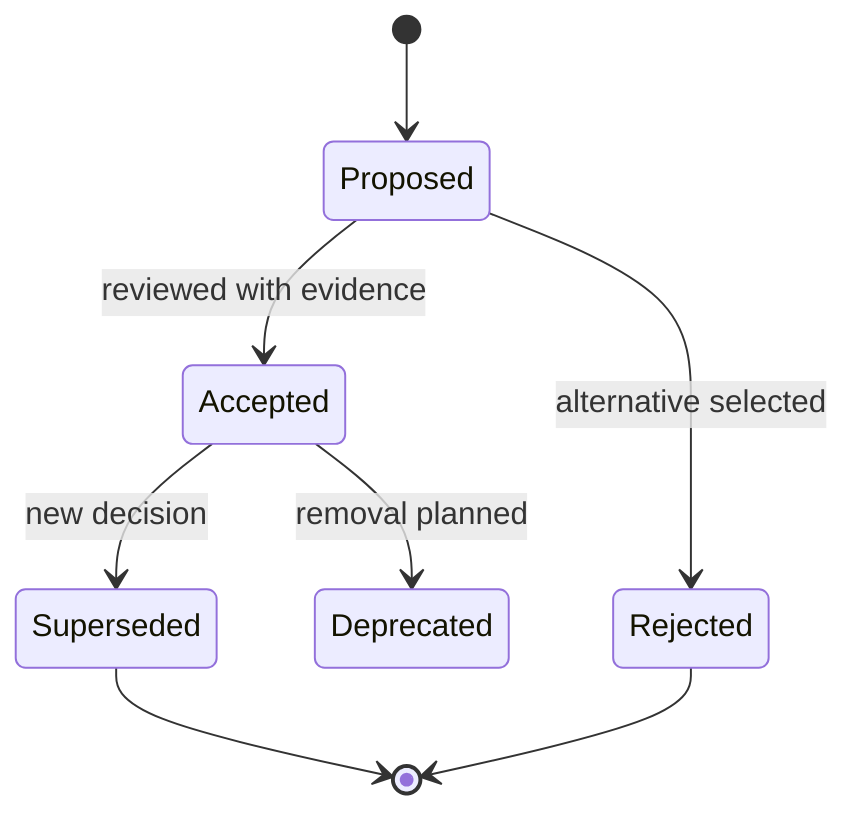

# Documentation and Architecture Decisions

> **Naming contract:** Follow the [canonical architecture naming catalog](naming-conventions.md) for package names, filenames, Java/Kotlin types, methods, and tests. Local examples on this page must not introduce a conflicting convention.

## Document ownership

| Artifact | Answers | Update trigger |
|---|---|---|
| Requirement / use case | What behavior is needed? | Product behavior changes |
| Architecture rule | What constraint repeats? | Engineering policy changes |
| ADR | Why was one consequential option selected? | Significant decision or reversal |
| OpenAPI / event schema | What contract is executable? | Boundary contract changes |
| README / runbook | How is the current system used? | Commands or operations change |
| Generated module diagram | What topology does code implement? | Module structure changes |

Do not use a README as a substitute for an ADR, or an ADR as a runbook.

## ADR lifecycle

An ADR is required for a decision that changes repository/module boundaries,
authentication, data ownership, consistency, event delivery, public
compatibility, deployment sequencing, or a meaningful security/reliability
trade-off.

## ADR minimum content

- Status and date.
- Context and decision drivers.
- Decision and scope.
- Alternatives considered and why they were rejected.
- Consequences, including migration and operational cost.
- Security, privacy, data, and compatibility impact.
- Verification evidence and rollback/supersession condition.

## Diagram policy

Use Mermaid where relationships are clearer than prose:

- `flowchart` for ownership and dependency direction;
- `sequenceDiagram` for request, event, and failure flows;
- `stateDiagram-v2` for lifecycle and recovery;
- `erDiagram` for data ownership.

Every diagram MUST have nearby prose naming the invariant it illustrates. A
diagram is never the only source of a rule.

## Duplication policy

- One file owns each cross-cutting policy.
- Focused pages link to the owner and add only boundary-specific implications.
- Templates link to policies; they do not silently redefine them.
- Generated details are linked, not manually copied.
- Examples are labeled when they are not current code.
- Superseded guidance points to its replacement.

## Review checklist

- [ ] The document has one purpose and a clear owner.
- [ ] Normative language is distinguishable from examples.
- [ ] Commands and paths match this repository.
- [ ] Relative links resolve.
- [ ] Mermaid fences are balanced and diagrams match the prose.
- [ ] No production-grade claim substitutes for evidence.
- [ ] Any exception has an owner, compensating control, and expiry.
