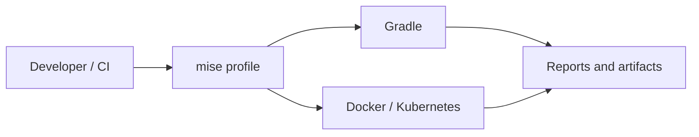
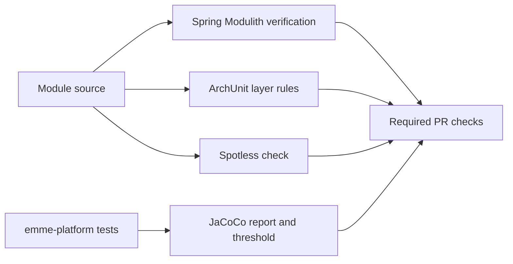

# mise

> **Naming contract:** Follow the [canonical architecture naming catalog](naming-conventions.md) for package names, filenames, Java/Kotlin types, methods, and tests. Local examples on this page must not introduce a conflicting convention.

mise is the developer-facing tool and task entry point for the service
repository. Gradle remains the source of truth for JVM build behavior; mise
provides reproducible tool versions and memorable commands without duplicating
build logic.

## Responsibilities

- Pin or select tool versions for local development and CI.
- Group commands into profiles such as `dev`, `local`, `regression`, and `prod`.
- Expose short tasks that delegate to Gradle, Docker, or Kubernetes tooling.
- Keep environment setup separate from application business logic.

## Task shape

```text
mise task
├── dev:*          # fast feedback: compile, unit tests, frontend dev
├── local:*        # local infrastructure and application startup
├── regression:*   # REST/UI regression suites
├── quality:*      # formatting, static analysis, dependency checks
└── release:*      # version, SBOM, signing, image, and release checks
```



## Rules

1. A mise task should delegate to an existing tool rather than duplicate its implementation.
2. Task names describe intent and use a stable namespace.
3. Environment-specific values come from environment variables or profile configuration, never committed secrets.
4. A command required by CI must have a non-interactive equivalent.
5. Document destructive commands explicitly and require an explicit target.

## Example workflow

```bash
mise install
mise run compile
mise run test
mise run arch-test
mise run build
```

## Formatting, architecture, and coverage commands

The service keeps Gradle as the only implementation of JVM build behavior.
Mise exposes stable names for the gates used by developers and CI:

| Task | Responsibility | Mutates files? |
|---|---|---:|
| `mise run format-apply` | Apply Spotless formatting | Yes |
| `mise run format-check` | Validate Spotless formatting | No |
| `mise run architecture` | Run Spring Modulith and ArchUnit boundary tests | No |
| `mise run coverage` | Run `emme-platform` tests and JaCoCo verification | No |
| `mise run quality` | Run compile, formatting, and static analysis | No |
| `mise run hooks-install` | Configure `.githooks` for this checkout | Configures Git |

`spotlessApply` is deliberately never used as a validation command. A clean
checkout must be provable with `spotlessCheck`, and the canonical application
coverage task must pass its JaCoCo threshold. The repository-wide module tests
remain the source of truth for package boundaries:



The exact task names may evolve, but the namespace and delegation rules are stable architecture.

## Reproducibility and CI contract

### Tool reproducibility

- Pin Java, Gradle, Docker, Kubernetes, and auxiliary tool versions.
- Keep local tool versions aligned with CI and release images.
- Fail clearly when a required tool is missing or outside the supported range.
- Do not install tools from untrusted URLs during a normal build.

### Profile contract

| Profile | Allowed behavior | Required properties |
|---|---|---|
| `dev` | Fast local feedback, mocks permitted | No production credentials |
| `local` | Disposable real infrastructure | Explicit cleanup task |
| `regression` | Full REST/UI confidence | Isolated test data and reports |
| `prod` | Protected release/deployment operations | Approval, immutable artifact, audit trail |

### CI parity

Every task used by CI must be runnable non-interactively from a clean checkout. Every local task that mutates infrastructure must state its target and provide a safe teardown or rollback command.

### mise checklist

- [ ] Tool versions are pinned or centrally constrained.
- [ ] Profiles do not contain secrets.
- [ ] CI tasks are non-interactive and deterministic.
- [ ] Destructive tasks require explicit target confirmation.
- [ ] Task output is actionable and does not print credentials.
- [ ] Local and CI commands delegate to the same Gradle/container entry points.
