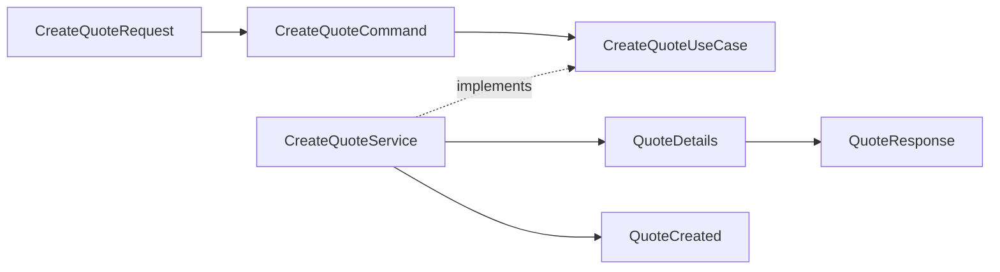

# Architecture Naming Conventions

## Purpose

This document is the canonical naming contract for the Emme service architecture.
It defines how package names, filenames, Java types, methods, Gradle build-logic
types, and tests communicate architectural responsibility before a file is opened.

The [module package structure template](../../templates/module-package-structure-template.md)
defines the complete Spring Modulith module shape. The
[application template](../../templates/modulith-application-template.md) defines
project-level boundaries. This document consolidates their naming rules so every
architecture page can reference one source of truth.

## Authority and precedence

When naming guidance conflicts, apply this order:

1. Existing public API or event compatibility contract.
2. This document's naming matrix.
3. The module package structure template.
4. A capability-specific naming decision recorded in the module plan or ADR.

For an unreleased service or module, compatibility names, aliases, wrappers, and
legacy packages are not allowed. Remove the obsolete shape and update all in-repo
consumers in the same atomic migration. A compatibility layer is allowed only when
an external released consumer, persisted/serialized contract, or explicitly approved
migration window requires it; record that exception in the migration plan or an ADR
with an owner, removal trigger, and verification evidence.

## Universal rules

| Concern | Required convention | Example | Reject |
|---|---|---|---|
| One primary type | One primary top-level type per file | `Quote.java` | `Quote.java` containing unrelated public types |
| Filename | Exactly matches the primary type, including case | `SubmitQuoteService.java` | `submitQuoteService.java`, `QuoteStuff.java` |
| Java package | Lowercase nouns; capability first; no technical layer as the module name | `com.emme.quote.application.service` | `com.emme.service`, `com.emme.util` |
| Kotlin package | Same lowercase capability-first rule | `com.emme.buildlogic.container` | `com.emme.buildlogic.tasks` as a global type bucket |
| Initialisms | Treat initialisms as words in type names | `HttpClient`, `JsonMapper`, `QuoteId`, `Uuid` | `HTTPClient`, `JSONMapper`, `QuoteID`, `UUID` |
| Public data | Prefer immutable records/value types | `QuoteDetails.java` | Mutable public entity |
| Implementation | Name the responsibility or technology | `QuotePersistenceAdapter` | `QuoteRepositoryImpl` |
| Application service | One concrete service implements one matching use-case interface | `SubmitQuoteService implements SubmitQuoteUseCase` | `MembershipService implements AssignMembershipUseCase, RevokeMembershipUseCase` |
| Package metadata | Always use `package-info.java` | `api/event/package-info.java` | `PackageInfo.java` |
| Module name | Business capability or bounded context | `booking`, `identity` | `database`, `web`, `misc` |
| Build capability | Delivery/build capability | `container`, `deployment`, `security` | Global `plugin`, `task`, `provider` buckets |
| Generated code | Keep generated code isolated and follow the generator | `build/generated/...` | Hand-editing generated sources |

### Names that require review

Avoid `Impl`, `Manager`, `Helper`, `Utils`, `Common`, `Base`, `Default`, `Stuff`,
and ambiguous `Dto`. These words hide ownership or responsibility. They are valid
only when they describe a real framework or domain role, such as a framework
`Handler`, a `DefaultClock` selected by composition, or a domain `PermissionManager`
whose management behavior is explicitly defined.

## Package naming matrix

| Package | Owns | Naming shape |
|---|---|---|
| `<module>` | Modulith boundary metadata | `package-info.java` with `@ApplicationModule` |
| `<module>.api` | Public-contract namespace only | Namespace Javadoc; no empty named interface |
| `<module>.api.command` | State-changing intentions | `<Verb><Subject>Command.java` |
| `<module>.api.query` | Read intentions | `<ReadVerb><Subject>Query.java` |
| `<module>.api.result` | Stable application read models | `<Subject><Shape>.java` |
| `<module>.api.usecase` | Inbound public capabilities | `<Verb><Subject>UseCase.java` |
| `<module>.api.event` | Public completed facts | `<Subject><PastParticiple>.java` |
| `<module>.api.exception` | Caller-visible expected failures | `<Subject><Failure>Exception.java` |
| `<module>.api.type` | Small stable public vocabulary | `<Concept><Qualifier>.java` |
| `<module>.application.service` | Use-case orchestration | `<Verb><Subject>Service.java` |
| `<module>.application.port.out` | External capabilities required by application | `<Capability>Port.java`, `<Capability>Entry.java`, `<Aggregate>Repository.java`, `<Fact>Publisher.java` |
| `<module>.application.mapper` | API/domain translation | `<Module>ApplicationMapper.java` |
| `<module>.application.process` | Long-running business workflow | `<BusinessProcess>ProcessManager.java` |
| `<module>.domain.model` | Aggregates, entities, value objects | Business noun or `<Concept>Id.java` |
| `<module>.domain.service` | Stateless business policies/calculations | `<BusinessConcept>Policy.java`, `<BusinessConcept>Calculator.java` |
| `<module>.domain.event` | Internal domain facts | `<Subject><PastParticiple>.java` |
| `<module>.domain.exception` | Invariant violations | `<RuleViolation>Exception.java` |
| `<module>.domain.specification` | Reusable business predicates | `<Subject><Predicate>.java` |
| `<module>.domain.factory` | Complex aggregate construction | `<Aggregate>Factory.java` |
| `<module>.adapter.in.web.controller` | HTTP entry points | `<Resource>Controller.java` |
| `<module>.adapter.in.web.request` | HTTP input wire models | `<Verb><Resource>Request.java` |
| `<module>.adapter.in.web.response` | HTTP output wire models | `<Resource><Shape>Response.java` |
| `<module>.adapter.in.web.mapper` | HTTP/API translation | `<Resource>WebMapper.java` |
| `<module>.adapter.in.web.advice` | HTTP failure translation | `<Module>ExceptionHandler.java` |
| `<module>.adapter.in.web.validation` | HTTP request constraints and cross-field validators | `Valid<Concept>.java`, `<Concept>Validator.java` |
| `<module>.adapter.in.web.filter` | Module-owned request filters | `<Concern>Filter.java` |
| `<module>.adapter.in.messaging.consumer` | Inbound facts/messages | `<Fact>Consumer.java` |
| `<module>.adapter.in.messaging.mapper` | Message/API translation | `<Module>MessageMapper.java` |
| `<module>.adapter.in.scheduler` | Scheduled triggers | `<Action><Subject>Scheduler.java` |
| `<module>.adapter.in.webhook` | Provider callbacks | `<Provider>WebhookController.java` |
| `<module>.adapter.in.batch` | Batch triggers | `<Subject>BatchJob.java` |
| `<module>.adapter.out.persistence.entity` | Database representation | `<Aggregate>Entity.java` |
| `<module>.adapter.out.persistence.aspect` | Persistence-side cross-cutting behavior | `<Concern>Aspect.java` |
| `<module>.adapter.out.persistence.repository` | Spring Data/JDBC mechanics | `SpringData<Aggregate>Repository.java` |
| `<module>.adapter.out.persistence.adapter` | Persistence port implementation | `<Aggregate>PersistenceAdapter.java` |
| `<module>.adapter.out.persistence.mapper` | Domain/entity translation | `<Aggregate>PersistenceMapper.java` |
| `<module>.adapter.out.persistence.projection` | Database read shape | `<ReadShape>Projection.java` |
| `<module>.adapter.out.messaging.publisher` | Concrete event publication | `<Technology><Fact>Publisher.java` |
| `<module>.adapter.out.messaging.mapper` | Event/broker translation | `<Fact>EventMapper.java` |
| `<module>.adapter.out.client.<provider>` | External provider integration | `<Provider>HttpClient.java`, `<Provider>ClientAdapter.java` |
| `<module>.adapter.out.observability` | Module metrics/tracing/audit | `<Module>MetricsAdapter.java`, `<Module>TracingAdapter.java` |
| `<module>.configuration` | Spring composition and typed settings | `<Module>Configuration.java`, `<Capability>Properties.java` |

## Public API type matrix

The same business verb and subject must align across one vertical slice:



| Type | Meaning | Naming pattern | Example |
|---|---|---|---|
| Command | Request to change state | `<Verb><Subject>Command` | `SubmitQuoteCommand` |
| Query | Request to read state | `<ReadVerb><Subject>Query` | `SearchQuotesQuery` |
| Result | Stable answer from the module | `<Subject><Shape>` | `QuoteDetails`, `QuotePage` |
| Use case | Capability exposed by the module | `<Verb><Subject>UseCase` | `SubmitQuoteUseCase` |
| Event | Completed fact | `<Subject><PastParticiple>` | `QuoteSubmitted` |
| Public exception | Expected caller-visible failure | `<Subject><Failure>Exception` | `QuoteNotFoundException` |
| Public type | Stable semantic vocabulary | `<Concept><Qualifier>` | `QuoteId`, `QuoteStatusView` |

### Verb vocabulary

| Intent | Preferred verbs | Avoid |
|---|---|---|
| Create one | `Create` | `Make`, `Handle` |
| Retrieve one | `Get` | `Fetch` unless remote semantics matter |
| Retrieve a collection | `List` | `GetAll` in public APIs |
| Search by criteria | `Search` | `FindEverything` |
| Update state | `Update`, `Change`, or a domain verb | `Process` |
| Delete | `Delete`, `Remove`, or a domain verb | `HandleDelete` |
| State transition | Business verb: `Submit`, `Approve`, `Reject`, `Publish` | `Process` |
| Boolean query | `is`, `has`, `can`, or a business predicate | `check`, `doValidation` |

### Result-shape vocabulary

| Suffix | Use | Example |
|---|---|---|
| `Details` | Full view of one resource | `QuoteDetails` |
| `Summary` | Compact list/search item | `QuoteSummary` |
| `Page` | Paginated collection plus metadata | `QuotePage` |
| `Info` | Existing flat read model or compatibility name | `TenantInfo` |
| `View` | Explicit CQRS/read-view vocabulary | `QuoteStatusView` |
| `Result` | Non-resource operation outcome | `DeploymentResult` |

Do not use `Dto` as a default suffix. Use `Request`, `Response`, `Command`,
`Query`, `Result`, or a business read-model shape according to the owning boundary.

## Java type-kind rules

| Type kind | Use when | Naming | Design rule |
|---|---|---|---|
| `record` | Immutable API/result/request/event/value data | Same as file | Compact constructor validates/copies mutable collections |
| `class` | Behavior, lifecycle, aggregate, adapter, service, controller | Business/role name | Encapsulate state; no public mutable fields |
| `enum` | Closed vocabulary with stable serialized values | `<Concept>` or `<Concept>Status>` | Values use `UPPER_SNAKE_CASE`; define unknown-value strategy for external contracts |
| `interface` | Port or public capability | `<Capability>Port`, `<Verb><Subject>UseCase`, `<Aggregate>Repository` | One cohesive responsibility; no `Impl` counterpart |
| `sealed interface` | Closed variant family requiring exhaustive handling | Business family name | Each permitted subtype has an explicit role name |
| `sealed class` | Closed lifecycle/result hierarchy with shared behavior | Business family name | Keep variants immutable and serializable only at an explicit boundary |
| `@interface` | Reusable framework/test annotation | `<Purpose>` or `<Purpose>Test` | Annotation describes policy, not an implementation detail |
| `abstract class` | Real shared lifecycle with controlled extension | Role name, often `<Role>Support` | Require a documented extension invariant; do not create `Base*` by default |
| `exception` | Business or boundary failure | `<Subject><Failure>Exception` | Preserve internal cause; never expose vendor exception types |

Validation annotations belong on inbound request/message records, not domain
types. Type-level cross-field constraints use a `Valid<Concept>` annotation and
an adjacent `<Concept>Validator`; see the [validation conventions](../01-backend/validation.md).

### Enum naming

| Concern | Convention | Example |
|---|---|---|
| Domain lifecycle | `<Aggregate>Status` | `QuoteStatus` |
| Domain role | `<Subject>Role` | `MembershipRole` |
| Public serialized status | `<Aggregate>StatusView` when it differs from domain | `QuoteStatusView` |
| Build-logic mode | `<Capability><Concern>` | `QualityGateMode`, `ReleaseChannel` |
| Values | `UPPER_SNAKE_CASE` | `IN_PROGRESS`, `READ_ONLY` |

Do not expose persistence enums as API enums. Map them explicitly when the
external contract has different compatibility or security requirements.

## Method, field, and constant naming

| Element | Convention | Example |
|---|---|---|
| Use-case method | Same business verb as interface | `submit(SubmitQuoteCommand command)` |
| Aggregate behavior | Domain state-transition verb | `quote.submit()` |
| Repository port | Domain-oriented persistence method | `findById`, `save`, `existsByCustomerId` |
| Mapper | Directional `to<Type>` | `toCommand`, `toEntity`, `toDetails` |
| Consumer | `on` plus typed fact, or explicit fact verb | `on(QuoteSubmitted event)` |
| Scheduler | Trigger verb; delegate immediately | `expireQuotes()` |
| Provider/client | Remote business operation | `calculatePremium()` |
| Boolean | `is*`, `has*`, `can*`, or business predicate | `isEnabled`, `hasMembership` |
| Java field/parameter | `lowerCamelCase` | `tenantId`, `occurredAt` |
| Constant | `UPPER_SNAKE_CASE` | `DEFAULT_PAGE_SIZE` |
| Test method | Observable behavior | `rejectsSubmissionWhenProfileIsIncomplete()` |

Avoid generic `execute`, `process`, `handle`, and `run` when the business verb is
known. Framework-required method names are the exception.

## Module file-set blueprints

### State-changing use case

```text
api/command/CreateQuoteCommand.java
api/usecase/CreateQuoteUseCase.java
api/result/QuoteDetails.java
application/service/CreateQuoteService.java
adapter/in/web/request/CreateQuoteRequest.java
adapter/in/web/response/QuoteResponse.java
adapter/in/web/mapper/QuoteWebMapper.java
```

### Read use case

```text
api/query/SearchQuotesQuery.java
api/usecase/SearchQuotesUseCase.java
api/result/QuoteSummary.java
api/result/QuotePage.java
application/service/SearchQuotesService.java
application/port/out/SearchQuotesPort.java
adapter/out/persistence/projection/QuoteSummaryProjection.java
adapter/out/persistence/adapter/QuoteSearchPersistenceAdapter.java
```

### Aggregate persistence

```text
application/port/out/QuoteRepository.java
adapter/out/persistence/entity/QuoteEntity.java
adapter/out/persistence/repository/SpringDataQuoteRepository.java
adapter/out/persistence/mapper/QuotePersistenceMapper.java
adapter/out/persistence/adapter/QuotePersistenceAdapter.java
```

### Public event publication

```text
api/event/QuoteSubmitted.java
application/port/out/QuoteEventPublisher.java
adapter/out/messaging/mapper/QuoteEventMapper.java
adapter/out/messaging/publisher/SpringQuoteEventPublisher.java
```

## Build-logic CDD naming matrix

Build logic uses capability-first organization. These names are intentionally
different from business-module names because a Gradle capability is not a domain
module.

| Build-logic location/type | Naming pattern | Example |
|---|---|---|
| Precompiled convention plugin | `emme.<capability>.gradle.kts` | `emme.container.gradle.kts` |
| Binary plugin | `Emme<Capability>Plugin` | `EmmeContainerPlugin` |
| Extension | `Emme<Capability>Extension` | `EmmeContainerExtension` |
| Capability model | `<Capability><Concern>` | `ContainerRuntime` |
| Gradle task | Verb-oriented `<Action><Subject>Task` | `BuildContainerImageTask` |
| Task input/output model | `<Operation>Result` or `<Operation>Spec` | `DeploymentResult` |
| Provider port | `<Capability>Provider` | `DeploymentProvider` |
| Provider implementation | `<Technology><Capability>Provider` | `KubernetesDeploymentProvider` |
| Value source | `<ExternalValue>ValueSource` | `GitCommitValueSource` |
| Shared build primitive | Explicit role name in `core` | `PluginIds`, `TaskNames` |
| Root plugin | `EmmeRootPlugin` | `EmmeRootPlugin` |
| Root extension | `EmmeBuildExtension` | `EmmeBuildExtension` |
| Unit test | `<Type>Test` | `ContainerRuntimeTest` |
| Plugin registration test | `<Capability>PluginTest` | `ContainerPluginTest` |
| TestKit functional test | `<Convention>FunctionalTest` | `SpringModuleConventionFunctionalTest` |

Build-logic names must not use the module API suffixes accidentally. A Gradle
`BuildContainerImageTask` is not a business `CreateContainerCommand`; a
`DockerContainerRuntimeProvider` is not a module outbound port unless it lives in
the business module and implements that module's application contract.

## Test naming matrix

| Scope | Filename | Method style |
|---|---|---|
| Domain unit | `<Type>Test.java` | `rejects...`, `transitions...`, `calculates...` |
| Application service unit | `<Service>Test.java` | `loads...`, `publishes...`, `returns...` |
| Web slice | `<Controller>WebTest.java` | `returns...When...` |
| Module behavior | `<Module>ModuleTest.java` | `should...` or observable behavior |
| Persistence integration | `<Adapter>IT.java` | `persists...`, `routes...`, `enforces...` |
| Provider contract | `<Provider>ContractTest.java` | `maps...`, `rejects...`, `retries...` |
| Event publication | `<Fact>PublicationTest.java` | `publishes...After...` |
| Architecture | `ModularityTest.java`, `<Layer>ArchitectureTest.java` | `verifies...`, `forbids...` |
| End-to-end | `<Outcome>E2ETest.java` | `completes...`, `rejects...` |

Tests describe observable behavior, not implementation calls. Prefer
`rejectsCrossTenantAccess()` over `callsTenantRepositoryFindById()`.

## Names to reject in review

| Reject | Prefer | Why |
|---|---|---|
| `QuoteServiceImpl` | `SubmitQuoteService` | Responsibility is explicit |
| `QuoteManager` | A named use-case service or policy | `Manager` hides behavior |
| `QuoteHelper` | `QuoteApplicationMapper` or a named policy | Ownership is explicit |
| `QuoteUtils` | Value-object behavior or focused component | Prevents unowned logic |
| `CreateQuoteDto` | `CreateQuoteRequest` or `CreateQuoteCommand` | Boundary is explicit |
| `QuoteModel` | `Quote`, `QuoteDetails`, or `QuoteEntity` | Technical role is explicit |
| `ProcessQuoteEvent` | `QuoteSubmitted` | Events are completed facts |
| `GenericRepository` | `QuoteRepository` | Port models an owned capability |
| `BaseController` | Composition/delegation | Avoids hidden inheritance behavior |
| `CommonException` | A specific failure | Failure semantics are explicit |
| `DefaultPricingPort` | `RuleBasedPricingAdapter` | Strategy is explicit |
| `InfrastructureService` | A concrete client/adapter/service name | Infrastructure is not a responsibility |

## Compatibility and migration rules

Renaming a public API type, event, endpoint DTO, persisted enum, or serialized
field is a compatibility change even when the replacement is architecturally
better. Before renaming:

1. Search all source, tests, Gradle metadata, documentation, and consumer repositories.
2. Decide whether the old name needs a compatibility alias, migration window, or event version.
3. Move package ownership and update consumers in one atomic change where possible.
4. Add a convention/architecture test that prevents the old shape from returning.
5. Record the compatibility decision in the module plan or an ADR.
6. Verify behavior, serialization, Modulith boundaries, and generated API docs.

Do not rename only the file while leaving the package, public type, event payload,
or dependency declaration inconsistent.

## Review checklist

- [ ] The package expresses architectural ownership.
- [ ] The filename exactly matches the primary type.
- [ ] The type name expresses business purpose and technical boundary.
- [ ] Commands, queries, results, use cases, and events align by verb and subject.
- [ ] Events are immutable completed facts in past tense.
- [ ] API results are not HTTP responses, JPA entities, or provider DTOs.
- [ ] Ports use capabilities; adapters identify technology or strategy.
- [ ] Repositories are aggregate/read-capability specific; no generic repository exists.
- [ ] Controllers, consumers, schedulers, and filters are thin entry points.
- [ ] Configuration names wiring or typed settings, not business behavior.
- [ ] Enums and records have explicit boundary/serialization semantics.
- [ ] Tests use the correct scope suffix and verify behavior.
- [ ] Public renames have compatibility evidence.
- [ ] Build-logic names follow capability-first CDD rules, not module-layer buckets.

## Related architecture pages

Every architecture page should link back to this catalog. Use the page-specific
rules below together with this document:

| Architecture area | Primary local naming page |
|---|---|
| Module boundaries and package ownership | [Backend module](../01-backend/module.md) |
| Public contracts | [Backend API](../01-backend/api.md) |
| Application services and ports | [Application](../01-backend/application.md) |
| Domain types and policies | [Domain](../01-backend/domain.md) |
| Controllers and inbound adapters | [Controller](../01-backend/controller.md) |
| Repositories and persistence adapters | [Repository](../01-backend/repository.md) |
| External integrations | [Infrastructure](../01-backend/infrastructure.md) |
| Events and consumers | [Events](../01-backend/events.md) |
| Gradle build capabilities | [Build logic](build-logic.md) |
