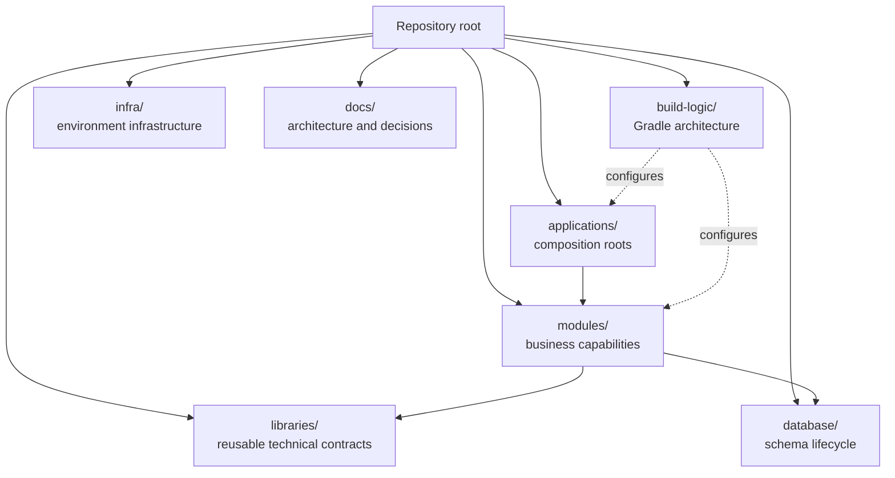

# Project Layout

> **Naming contract:** Follow the [canonical architecture naming catalog](naming-conventions.md) for package names, filenames, Java/Kotlin types, methods, and tests. Local examples on this page must not introduce a conflicting convention.

## Purpose

The service repository is a modular monolith with independently understandable
business modules, shared libraries, deployable applications, and an included
Gradle build-logic build. The browser application lives in the sibling
`emme-web` repository. Frontend architecture and browser delivery guidance are
owned by that repository; this repository owns the service contract consumed by
the web application.

## Baseline layout

```text
emme/
├── applications/                 # deployable Spring Boot applications
│   ├── studio-api/
│   └── emme-platform/
├── modules/                      # business capabilities / bounded contexts
│   ├── shared/
│   ├── tenancy/
│   ├── identity/
│   ├── studio/
│   ├── booking/
│   └── .../
├── libraries/                    # focused reusable libraries and contracts
│   ├── functional/
│   ├── kernel/
│   ├── testing/
│   └── test-containers/
├── platform/                     # dependency and platform alignment
├── database/                     # migrations and database lifecycle
├── build-logic/                  # reusable Gradle architecture
├── infra/                        # local and environment infrastructure
├── docs/                         # architecture, requirements, ADRs, and plans
├── settings.gradle.kts
├── build.gradle.kts
└── mise.toml
```



## Ownership rules

| Location | Owns | Must not become |
|---|---|---|
| `modules/<capability>` | Business behavior and module boundary | A generic shared utility bucket |
| `libraries/<purpose>` | Reusable code with one clear reason to exist | A copy of the whole module |
| `applications/<app>` | Composition root and deployable runtime | A second business module |
| `build-logic` | Build conventions and delivery automation | Application behavior |
| `database` | Schema lifecycle and migration ownership | Ad hoc SQL in every module |
| `docs/architecture` | Stable architectural guidance | Temporary task notes |

## Dependency direction

```text
applications
    ↓
modules ─────→ libraries / contracts
    ↓
infrastructure adapters
    ↓
external systems
```

Business modules may depend on stable libraries and explicit contracts. A module must not reach into another module's internals simply because the classes are visible on the classpath.

## Change rule

Files that change together should live together. Adding a deployment target should primarily change `build-logic` deployment capability. Adding a new business behavior should primarily change its owning module. If a change crosses several ownership areas, define the contract and document the reason.

## Repository guardrails

### Ownership and lifecycle

Every top-level area has an owner, a lifecycle, and a verification command:

| Area | Owner | Lifecycle evidence |
|---|---|---|
| `applications/` | Application team | Smoke test, health check, deployment manifest |
| `modules/` | Business capability team | Module test, API/event contract, architecture verification |
| `libraries/` | Platform team | Compatibility test, dependency policy, published API review |
| `build-logic/` | Build/platform team | Unit + Gradle TestKit functional tests |
| `database/` | Data/platform team | Migration validation and rollback compatibility |
| `infra/` | Operations/platform team | Plan/diff, security scan, environment verification |
| `docs/` | Architecture owners | ADR/spec review and link validation |

### Configuration and secrets

- Commit safe defaults and examples, never credentials or private keys.
- Validate required configuration at the application boundary before serving traffic.
- Keep build-time, deploy-time, and runtime configuration distinct.
- Use managed secret storage and least-privilege service identities.
- Redact credentials, tokens, tenant secrets, and personal data from logs and test reports.

### Environment separation

```text
local  → fast feedback and disposable infrastructure
ci     → deterministic verification and isolated credentials
stage  → production-like integration and rollout rehearsal
prod   → protected release, observability, backup, and rollback controls
```

The same artifact should move between environments; only configuration and approved external dependencies should vary.

### Repository definition of done

- [ ] The change has one clear owning area.
- [ ] Cross-area changes have an explicit contract or ADR.
- [ ] Required verification commands are documented and run in CI.
- [ ] No secrets or environment-specific business behavior are committed.
- [ ] New projects are added to settings, build conventions, CI, and documentation together.
