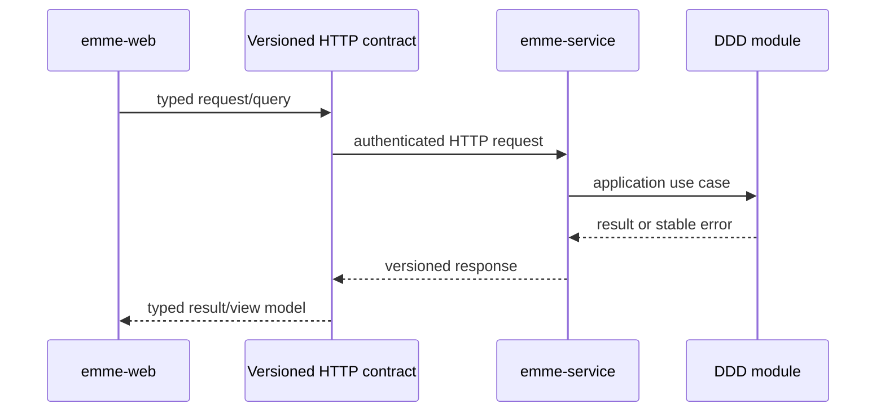

# Repository Split

> **Naming contract:** Follow the [canonical architecture naming catalog](naming-conventions.md) for package names, filenames, Java/Kotlin types, methods, and tests. Local examples on this page must not introduce a conflicting convention.

## Decision

EMME is developed as two sibling repositories:

```text
workspace/
├── emme-service/
└── emme-web/
```

This follows the same independent-repository model used by the Clara
full-stack challenge. Each repository has its own root manifest, lock/build
tool, CI, documentation entry point, and release boundary.

## Ownership

| Repository | Owns | Does not own |
|---|---|---|
| `emme-service` | Domain modules, application services, persistence, auth, tenancy, HTTP contracts, events, Gradle build-logic, backend deployment | React components, browser state, frontend package workspace |
| `emme-web` | React application, frontend capability modules, shared TypeScript packages, browser E2E, static web image | Domain entities, database access, backend authorization, private provider credentials |

## Contract boundary

The service is the source of truth for HTTP and event contracts. The web
repository consumes those contracts through its typed client and adapters.



The repositories may be released independently, but a breaking contract
requires a coordinated compatibility window and consumer migration.

## Container image contract

Repository ownership and product identity are separate concerns. Kubernetes
labels may continue to use `emme-modulith` as the product identity, while
release images use the public repository owner and the deployable application
name:

| Artifact | Canonical image |
|---|---|
| Main service application (`emme-platform`) | `ghcr.io/migangdelzar/emme-service` |
| Web application | `ghcr.io/migangdelzar/emme-web` |

There is one backend application image contract. The service repository owns
`ghcr.io/migangdelzar/emme-service`; deployment and release automation must not
publish or consume a second backend application image.

Environment overlays may replace these images with local registry names, but
production manifests must promote an immutable tag or digest from the
canonical registry. The service repository owns backend image build and
deployment wiring; the web repository owns the frontend image source and
build context.

## Migration policy

- The original `emme-modulith` repository remains the historical migration
  source until both repositories have passed independent CI.
- The first commits in the split repositories are clean snapshots rather than
  rewritten monorepo history. This avoids carrying unrelated files or
  historical credential paths across repository boundaries.
- Generated output, local agent configuration, runtime secret files, and the
  tracked local Keycloak realm are excluded from both snapshots.
- The split is reversible: the original monorepo remains available until the
  new repositories are adopted as the release sources.
