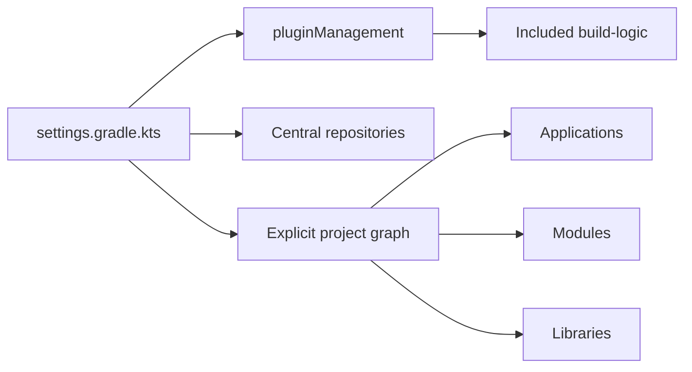

# Gradle Settings

`settings.gradle.kts` is the repository composition root. It defines plugin resolution, dependency repositories, project identity, included builds, and the set of Gradle projects.

## Required responsibilities

- Include `build-logic` as an included build through `pluginManagement`.
- Define repositories centrally and prevent project-level repository drift.
- Set the root project name.
- Include applications, modules, libraries, platform, and database projects explicitly.
- Keep project discovery deterministic.

## Reference shape

```kotlin
pluginManagement {
    includeBuild("build-logic")
    repositories {
        gradlePluginPortal()
        mavenCentral()
    }
}

dependencyResolutionManagement {
    repositoriesMode.set(RepositoriesMode.FAIL_ON_PROJECT_REPOS)
    repositories { mavenCentral() }
}

rootProject.name = "emme"

include(":platform")
include(":applications:studio-api")
include(":modules:booking")
include(":libraries:kernel")
include(":database")
```



## Rules

1. Do not use `subprojects {}` or `allprojects {}` for behavior that belongs to a capability plugin.
2. Add a project here only when it has a clear ownership boundary and build lifecycle.
3. Keep module names aligned with their capability and package names.
4. Keep root-level build orchestration small; project-specific behavior belongs in convention or binary plugins.
5. When settings behavior becomes non-trivial, isolate it in a `build-logic-settings` included build rather than growing `settings.gradle.kts` indefinitely.

## Verification

```bash
./gradlew projects
./gradlew buildEnvironment
```

These commands should show the expected project tree and resolve plugins from `build-logic` without project-local repository declarations.

## Resolution and inclusion guardrails

### Plugin and dependency resolution

- Resolve plugins from approved repositories only.
- Keep repository declarations centralized and fail on project-local repositories.
- Pin or centrally manage versions through the version catalog/platform.
- Use dependency locking or an equivalent reproducibility mechanism for production builds.
- Review new plugins for provenance, maintenance, licenses, and transitive dependencies.

### Project inclusion policy

Add a Gradle project only when it has:

1. a clear owner and responsibility;
2. a stable dependency boundary;
3. a build convention or explicit reason to differ;
4. tests and lifecycle tasks;
5. a documented deployment or publication role when applicable.

Avoid dynamically discovering directories. Explicit includes make the project graph reviewable and prevent an accidental folder from becoming a build participant.

### Root-settings anti-patterns

Do not place the following in `settings.gradle.kts`:

- business logic or application configuration;
- credentials or environment-specific deployment commands;
- broad `allprojects`/`subprojects` behavior that belongs in a convention plugin;
- hidden project inclusion based on local machine state;
- dependency versions duplicated across modules.

### Settings verification checklist

- [ ] `build-logic` is included through `pluginManagement`.
- [ ] Repositories are centralized and project repositories fail the build.
- [ ] All projects are explicitly included and have an owner.
- [ ] Version catalogs/platform constraints are the source of dependency versions.
- [ ] Dependency locking or reproducible resolution is enabled for release builds.
- [ ] `./gradlew projects` and `./gradlew buildEnvironment` pass in a clean checkout.
