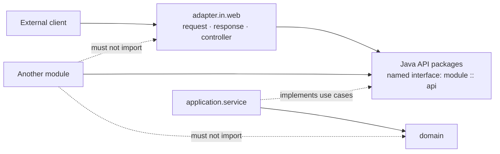
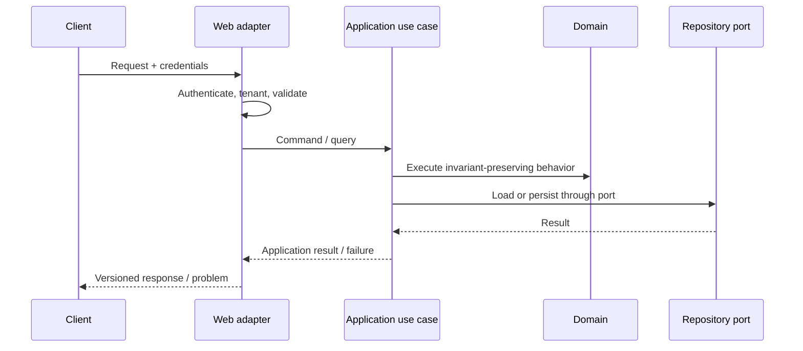

# Module API and HTTP Boundary

## Purpose

The word API describes two different contracts that must remain separate:

1. The `<module>.api.*` Java packages form the public module contract and are exported through the `<module> :: api` named interface.
2. `adapter.in.web` is the external HTTP contract presented to clients.

The module API contains commands, queries, results, use-case interfaces, events, expected exceptions, and stable public types. The web adapter translates HTTP requests into that contract and module results into stable HTTP responses. Neither boundary owns business decisions.



## Module API structure

```text
api/
├── command/      # please do this
├── query/        # please tell me this
├── result/       # here is the module answer
├── usecase/      # this capability is available
├── event/        # this already happened
├── exception/    # this expected operation failed
└── type/         # stable public vocabulary
```

Every materialized child package has its own responsibility-focused `package-info.java` and joins the logical `module :: api` named interface. Whenever `api.event` exists, it also joins `module :: events`; every `api.type` used in an event signature joins that same interface. The complete comments and filename rules are copy-ready in the [module source catalog](../../templates/module-package-structure-template.md#appendix-a-copy-ready-module-source-catalog).

## HTTP adapter flow

```text
HTTP request
  ↓ authentication / tenant context / validation
web controller
  ↓ command or query
application use case
  ↓ domain behavior + ports
result / error
  ↓ response mapping
HTTP response
```



## Module API rules

- Expose use-case interfaces, not application service implementations.
- Keep commands, queries, results, events, exceptions, and types immutable and implementation-neutral.
- Do not expose aggregates, JPA entities, provider DTOs, controllers, or raw infrastructure failures.
- Name commands imperatively, events in past tense, and result shapes consistently.
- Treat a named-interface change as a compatibility change.

## HTTP API rules

- Version public routes deliberately, for example `/api/v1/...`.
- Validate syntax and boundary constraints at the edge.
- Resolve authentication and tenant context before entering application behavior.
- Use request and response DTOs; do not expose persistence entities.
- Return consistent error envelopes with a correlation identifier.
- Keep pagination, filtering, idempotency, and concurrency semantics explicit.
- Document public endpoints through OpenAPI or equivalent generated API documentation.

## Error mapping

| Condition | HTTP result |
|---|---:|
| Invalid request shape | `400` |
| Missing or invalid authentication | `401` |
| Authenticated but not allowed | `403` |
| Resource not found within authorized scope | `404` |
| Business rule conflict | `409` |
| Domain validation failure | `422` |
| Unexpected failure | `500` with no internal detail |

The exact status may be specialized by the API contract, but the mapping must be stable and tested.

## API evolution and security

### Versioning and compatibility

- Version externally consumed routes and schemas deliberately.
- Prefer additive changes; deprecate before removal.
- Do not expose JPA entities, domain aggregates, provider responses, or internal exceptions.
- Define field nullability, default behavior, enum evolution, pagination, sorting, and maximum page size.
- Use consumer-driven or schema contract tests for APIs with independent consumers.

### Security and tenancy

- Authenticate before application use-case execution.
- Authorize the requested action at the application boundary, not only at the controller annotation.
- Resolve tenant context from trusted identity/session context; do not trust a body field alone.
- Enforce tenant scope in repositories and integration queries as defense in depth.
- Apply rate limits, request-size limits, and abuse controls to public or expensive endpoints.

### Mutation safety

For state-changing endpoints, document:

```text
authorization → validation → idempotency key → transaction → response
```

Define duplicate-submit behavior, optimistic-concurrency behavior, and whether the response represents committed state or an accepted asynchronous command.

### API checklist

- [ ] Every public Java type lives in the correct `api.*` kind and follows the canonical filename pattern.
- [ ] Every materialized API-kind package declares the intended Spring Modulith named interface.
- [ ] Other modules import only named module API contracts, never web or implementation packages.
- [ ] OpenAPI/schema documentation matches implementation.
- [ ] Authentication, authorization, and tenant tests cover positive and negative paths.
- [ ] Error responses use a stable problem/error code and correlation ID.
- [ ] Pagination and request limits prevent unbounded work.
- [ ] Mutation idempotency and concurrency semantics are documented.
- [ ] Compatibility tests protect existing consumers.

For project-level release gates, use the [application template](../../templates/modulith-application-template.md). For module-level approval, use the [module template](../../templates/module-package-structure-template.md).
