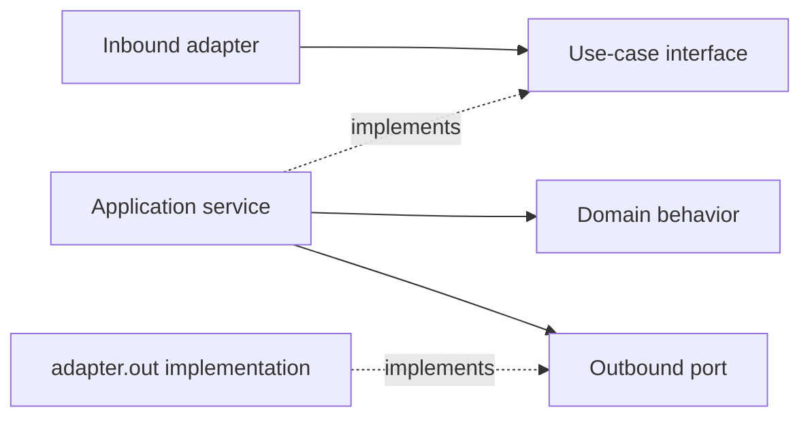
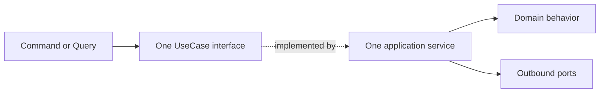

# Application Layer

> **Naming contract:** Follow the [canonical architecture naming catalog](../00-project/naming-conventions.md) for package names, filenames, Java/Kotlin types, methods, and tests. Local examples on this page must not introduce a conflicting convention.

## Purpose

The application layer orchestrates use cases. It coordinates domain objects, transactions, authorization checks, ports, and event publication without implementing transport or vendor details.

## Responsibilities

- Implement use-case interfaces from `api.usecase` and consume inputs from `api.command` or `api.query`.
- Return stable models from `api.result` and translate public/internal failures deliberately.
- Establish transaction boundaries.
- Load and save aggregates through repository ports.
- Invoke domain behavior rather than duplicating domain rules.
- Coordinate synchronous calls and publish completed facts after successful state transitions; durable listeners execute after commit while their publication records are created atomically in the producer transaction.
- Return application results or typed failures suitable for adapters.

## Dependency direction

```text
adapter.in / another module
          ↓
api.usecase
          ↑ implemented by
application.service
          ↓
domain model + application.port.out
          ↑ implemented by
adapter.out
```



The first arrow represents a runtime call. The dashed implementation arrows represent compile-time dependency: the application service imports its API interface, and the outbound adapter imports the port it implements. Interfaces do not import their implementations.

## Example shape

```java
final class CreateAppointmentService implements CreateAppointmentUseCase {

    private final AppointmentRepository appointments;
    private final AvailabilityPolicy availability;

    CreateAppointmentService(
            AppointmentRepository appointments,
            AvailabilityPolicy availability
    ) {
        this.appointments = appointments;
        this.availability = availability;
    }

    @Override
    public AppointmentDetails create(CreateAppointmentCommand command) {
        var appointment = Appointment.schedule(
                command.customerId(),
                command.slot(),
                availability
        );
        appointments.save(appointment);
        return AppointmentApplicationMapper.toDetails(appointment);
    }
}
```

The service lives in `application.service` and implements `CreateAppointmentUseCase` from `api.usecase`. The command and result live in `api.command` and `api.result`; the repository and availability dependencies are technology-neutral interfaces in `application.port.out`.

Application services should be small. If a service needs many unrelated dependencies, split the use case or move the invariant to the domain model.

### One use case, one application service

Every public use-case interface has exactly one concrete application-service
implementation, and every application service implements exactly one use-case
interface:



Do not create a module-wide façade such as `MembershipService` implementing
assign, read, and revoke use cases, or `FeatureFlagService` implementing query
and mutation use cases. Give each operation a focused class such as
`AssignMembershipService`, `GetCurrentUserMembershipsService`, and
`RevokeMembershipService`.

This rule is for cohesion and SOLID responsibilities, not because multiple
use-case implementations inherently create circular dependencies. Circular
dependencies are resolved with application-owned ports, inbound events, or
dedicated collaborators; bundling use cases only hides the dependency graph.
Shared behavior belongs in a named mapper, policy, evaluator, or other
non-use-case collaborator.

## Use-case guardrails

### Use-case contract

Each use case documents:

| Item | Question |
|---|---|
| Actor | Who may invoke it? |
| Preconditions | What must already be true? |
| Transaction | Which state changes are atomic? |
| Consistency | What is synchronous versus after-commit? |
| Idempotency | What happens on retry or duplicate delivery? |
| Failure | Which business/technical failures are expected? |
| Observability | What metric, trace, log, and audit signal is emitted? |

### Rules

- Keep transaction annotations at the application boundary and make propagation explicit.
- Perform authorization and tenant checks before loading or mutating protected data.
- Keep external calls outside the primary transaction unless the coupling is intentional and bounded.
- Map infrastructure failures into stable application failures; never leak vendor exceptions.
- Use ports for repositories, clocks, IDs, event publishers, and external providers.
- Keep application services deterministic where possible by injecting time, identity, and provider dependencies.
- Do not use application services as a dumping ground for domain invariants or transport mapping.
- Name one service after one use case (`SubmitQuoteService`), never after the whole module (`QuoteService`) or an implementation suffix (`QuoteServiceImpl`).
- Implement exactly one `api.usecase` interface per application service; do not use multi-use-case façade services.

### Application checklist

- [ ] Every public use case has an explicit input/output/error contract.
- [ ] Every service implements the matching `api.usecase` interface and uses the same verb/subject in its filename.
- [ ] No application service implements more than one use-case interface; shared behavior is extracted to a named collaborator.
- [ ] Transaction and consistency behavior is covered by tests.
- [ ] Authorization and tenant scope are enforced before protected operations.
- [ ] Duplicate commands/events are safe or explicitly rejected.
- [ ] Ports are small, injectable, and technology-neutral.
- [ ] Metrics and audit events identify operation, outcome, tenant, and correlation.

The full transaction, security, resilience, and operational approval contract lives in the [module template](../../templates/module-package-structure-template.md).
