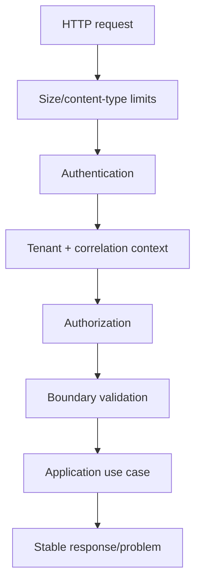

# Controllers

> **Naming contract:** Follow the [canonical architecture naming catalog](../00-project/naming-conventions.md) for package names, filenames, Java/Kotlin types, methods, and tests. Local examples on this page must not introduce a conflicting convention.

## Purpose

Controllers are thin inbound adapters. They handle protocol concerns and delegate to application use cases.

## Controller contract

```text
request DTO
  → validate and authorize
  → map to command/query
  → invoke one use case
  → map result/error to response
```

## Rules

- One controller belongs to one module.
- Controllers do not contain transaction orchestration or domain invariants.
- Controllers do not access repositories directly.
- Use explicit request/response types and stable JSON field names.
- Include tenant and correlation context in the request pipeline, not in every business method signature unless the domain requires it.
- Test successful, validation, authorization, not-found, and conflict responses.

## Example package

```text
com.emme.booking.adapter.in.web/
├── controller/
│   └── BookingController.java
├── request/
│   └── CreateBookingRequest.java
├── response/
│   └── BookingResponse.java
├── mapper/
│   └── BookingWebMapper.java
└── advice/
    └── BookingExceptionHandler.java
```

Each materialized package also contains the corresponding `package-info.java` from the [module source catalog](../../templates/module-package-structure-template.md#appendix-a-copy-ready-module-source-catalog).

## Inbound request pipeline

```text
request size/content-type limits
    ↓
authentication
    ↓
tenant and correlation context
    ↓
authorization
    ↓
transport validation
    ↓
request → command/query mapping
    ↓
application use case
    ↓
stable response/error mapping
```



The pipeline must reject malformed, unauthenticated, unauthorized, cross-tenant, and over-sized requests before expensive domain or infrastructure work.

## Error and observability rules

- Prefer RFC 9457-style problem responses or the repository's equivalent stable error envelope.
- Return an error code safe for clients; keep internal exception messages out of production responses.
- Include a correlation ID and support-safe timestamp in failures.
- Log the operation and outcome once at the boundary, with sensitive fields redacted.
- Emit audit events for security-relevant or regulated state transitions.
- Do not log access tokens, cookies, secrets, full request bodies, or personal data by default.

## Controller checklist

- [ ] No domain rules or repository calls exist in the controller.
- [ ] Authentication, tenant context, and authorization behavior are tested.
- [ ] Validation limits prevent unbounded input or work.
- [ ] Error mapping is stable and documented.
- [ ] Request/response DTOs are version-safe and do not expose internal models.
- [ ] Filenames identify their transport role (`*Request`, `*Response`, `*Controller`, `*WebMapper`) without leaking those types into the module API.
- [ ] Logs and audit signals are structured and redacted.

The controller is an adapter. The [API guide](api.md) owns versioning and error semantics; the [module template](../../templates/module-package-structure-template.md) owns the complete security and operational approval contract.
