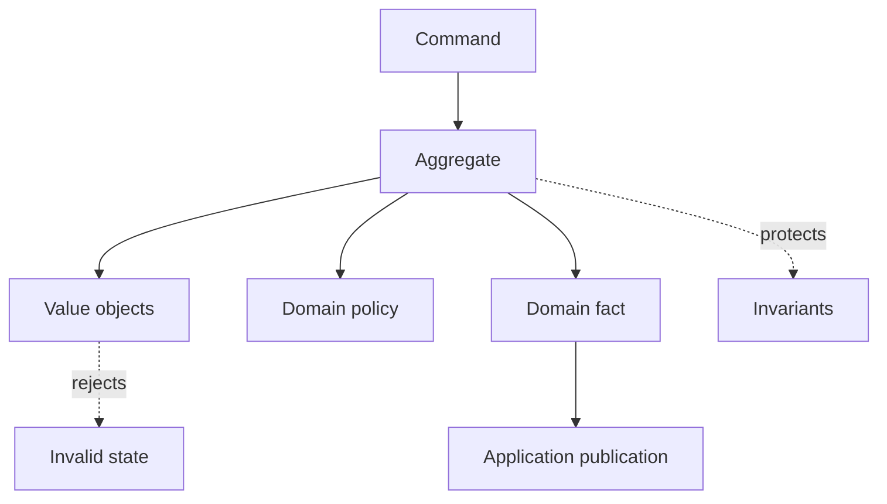

# Domain Layer

> **Naming contract:** Follow the [canonical architecture naming catalog](../00-project/naming-conventions.md) for package names, filenames, Java/Kotlin types, methods, and tests. Local examples on this page must not introduce a conflicting convention.

## Purpose

The domain layer owns business language, invariants, policies, and state transitions. It should not depend on Spring MVC, JPA annotations where avoidable, vendor SDKs, or deployment details.

## Tactical building blocks

| Building block | Use |
|---|---|
| Entity | Identity-based business object with behavior |
| Value object | Immutable concept defined by its values |
| Aggregate | Consistency boundary with one entry point |
| Domain service | Rule that does not naturally belong to one entity |
| Domain event | Fact that a meaningful state transition occurred |
| Specification | Reusable, composable business predicate |

## Rules

- Aggregates protect invariants at their boundary.
- Value objects validate themselves and do not expose invalid state.
- Internal `domain.event` facts use past-tense names and contain only the data the owning domain needs; they carry no cross-module compatibility promise.
- Domain code must not call repositories, HTTP clients, message brokers, or environment APIs directly.
- Repository and provider interfaces required by use cases live in `application.port.out`; the domain remains unaware of persistence orchestration.
- Persistence mappings may be separate from domain models when JPA concerns would distort the model.

## Simplicity rule

Do not create a rich domain model for simple CRUD with no meaningful invariants. Use the smallest structure that keeps business rules explicit and testable.

## Domain purity and invariants

### Invariants and boundaries

- Every invariant states which aggregate or value object protects it.
- Aggregate boundaries are consistency boundaries, not merely database table groupings.
- Domain methods expose valid state transitions; callers cannot bypass them through setters.
- Value objects reject invalid representations at construction.
- Domain services are stateless and do not hide infrastructure calls.
- Application orchestration deliberately maps an internal domain fact to `api.event` when another module needs it, adding stable identifiers, occurrence time, tenant, correlation, and compatibility metadata required by that public contract.
- Domain filenames use ubiquitous-language nouns (`Quote`, `Premium`) or explicit business roles (`QuotePricingPolicy`), not technical suffixes such as `Model`, `Bean`, or `Impl`.

### Purity policy

The domain must not depend on Spring, JPA, HTTP, messaging SDKs, JSON serialization, environment variables, logging frameworks, or infrastructure ports. Application services inject clocks, ID generators, repositories, and external-fact ports, resolve those values, and pass pure values into domain behavior. A domain-owned policy interface is acceptable only when it expresses a true business strategy; it remains in `domain.service` and has no technology semantics.

### Domain test policy

Domain tests should run without a Spring context, database, network, or container. Cover:

- valid and invalid state transitions;
- boundary values and value-object validation;
- authorization-relevant invariants where domain-owned;
- tenant/resource ownership rules;
- event emission for meaningful transitions;
- deterministic behavior under fixed clock/ID providers.

### Domain checklist

- [ ] Invariants are protected by aggregates/value objects.
- [ ] Domain code is framework and infrastructure independent.
- [ ] No anemic entities are used where behavior is required.
- [ ] Internal domain events are immutable, past-tense, and not imported by another module.
- [ ] Pure unit tests cover business rules without Spring.

The module template defines the full production-readiness contract; this page governs domain purity and invariant ownership.
