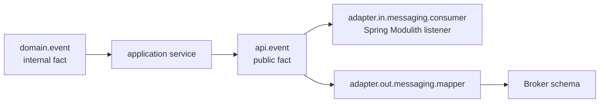
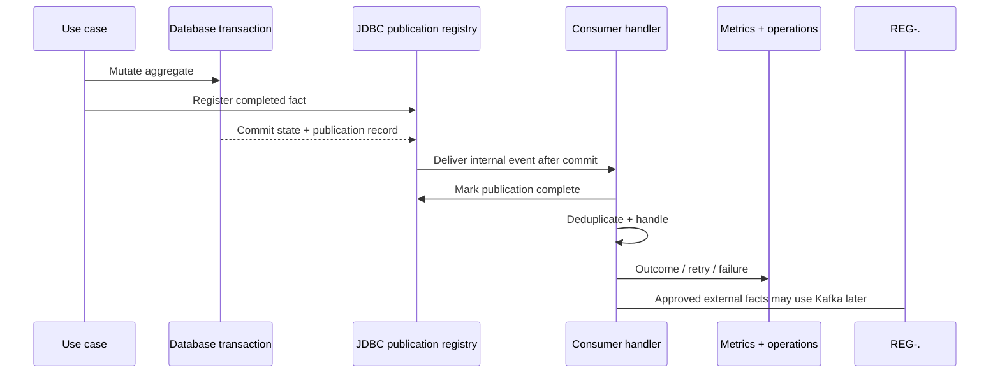

# Backend Events

> **Naming contract:** Follow the [canonical architecture naming catalog](../00-project/naming-conventions.md) for package names, filenames, Java/Kotlin types, methods, and tests. Local examples on this page must not introduce a conflicting convention.

## Purpose

Events communicate completed facts across module boundaries. Event meaning and delivery mode are separate decisions: delivery may be synchronous in-memory, asynchronous local, or durable Kafka streaming after commit. An event is not a substitute for a synchronous decision the caller needs immediately.

## Decision rule

```text
Must the caller know the result now?       → synchronous API
Is this a completed fact with independent reactions? → event
Does the consumer need independent retry?  → durable asynchronous event delivery
Is the event only an internal implementation detail? → keep it internal
```

## Internal versus public events

| Package | Audience | Contract |
|---|---|---|
| `domain.event` | The owning module only | Internal domain fact; may change with the model |
| `api.event` | Other modules | Stable public fact; joins `module :: api` and, whenever this package exists, the narrower `module :: events` named interface |
| `adapter.in.messaging.consumer` | Receiving module | Local Modulith listener or external broker consumer that delegates to a receiving use case |
| `adapter.out.messaging.*` | Broker/provider boundary | Versioned transport schema and publication mechanics |

Translate deliberately between these forms. Do not publish a domain event, aggregate, JPA entity, or broker DTO merely because its current fields resemble the public event.



## EMME default: Spring Modulith, Kafka deferred

EMME uses Spring Modulith's JDBC event publication registry as the durable
internal publication boundary. The reusable Kafka capability remains available
for a separately approved external consumer, but the initial runtime does not
bind Kafka provider configuration and no current business event is annotated
with `@Externalized`.

When a future external boundary is approved, `@Externalized` declares the
logical Kafka topic and tenant partition key:

```java
@Externalized("emme.studio.appointment-created::#{#this.tenantId()}")
public record AppointmentCreatedEvent(/* immutable public fields */) {}
```

Spring Modulith uses the logical target before `::` as the Kafka topic and the
expression after `::` as the Kafka message key. Tenant-scoped events therefore
preserve per-tenant ordering while allowing independent partitions. Topic names,
keys, payload versions, ownership, retention, and consumers are part of the
event contract.

### Current event catalog

| Owner | Public event | Topic | Partition key | Delivery | Current consumer boundary |
|---|---|---|---|---|---|
| `tenancy` | `TenantCreated` | — | — | Local Modulith only | Identity provisioning |
| `tenancy` | `TenantActivated` | — | — | Local Modulith only | Subscription and identity provisioning |
| `studio` | `AppointmentCreatedEvent` | — | — | Local Modulith only | Identity membership, Calendar |
| `studio` | `AppointmentCancelledEvent` | — | — | Local Modulith only | Calendar |
| `studio` | `AppointmentRescheduledEvent` | — | — | Local Modulith only | Calendar |
| `calendar` | `CalendarSyncRequested` | — | — | Local Modulith only | Calendar Google adapter |
| `notification` | `NotificationDelivered` | — | — | Local application event | Studio dashboard |
| `assistant` | `LearningCandidateEvaluationRequested` | — | — | Local Modulith only | Offline evaluation workflow |
| `studio` | `DashboardEvent` | — | — | Web/SSE projection only | Browser subscribers |

All current business events are internal facts. They are durable through the
Spring Modulith JDBC publication registry and consumed in-process; none is an
active Kafka contract. A future event may be externalized only when an
independently deployed consumer, replay requirement, partitioning need, or
other approved delivery boundary exists. An event must not acquire
`@Externalized` merely because it lives under `api/event`.

### Durable after-commit flow

```text
aggregate state change
        ↓ publish/register completed fact inside producer transaction
state + publication/outbox record commit atomically
        ↓
registry/dispatcher delivers after commit
        ↓
consumer handles idempotently and marks completion
```



## Event rules

- Name events in the past tense: `AppointmentScheduled`.
- Create and publish the fact only after the in-memory state transition succeeds. When durable delivery is required, publish while the producer transaction is active so state and the publication/outbox record commit atomically; execute the durable consumer after commit.
- Select and document synchronous in-memory, asynchronous best-effort, or durable asynchronous delivery independently from the event's meaning.
- Include stable identifiers, tenant identity, occurrence time, and correlation metadata as required.
- Consumers on retryable/at-least-once paths must be idempotent and tolerate duplicate delivery.
- Version payloads when compatibility requires it; do not silently change event meaning.
- Keep event handlers thin and delegate to application use cases.
- Test publication, retry, duplicate delivery, and failure observability.
- Name consumers after the received fact (`AppointmentScheduledConsumer`) and publishers after the concrete technology (`KafkaAppointmentEventPublisher`).
- Do not inject `KafkaTemplate` into domain or application services. Kafka belongs to the infrastructure/composition boundary; application services publish through `ApplicationEventPublisher` or an application-owned event port.
- Do not annotate every event automatically. `@Externalized` is an explicit public-streaming decision, not a replacement for local Modulith listeners.

Spring application-event publication is synchronous by default. `@ApplicationModuleListener` is Spring Modulith's shortcut for asynchronous transactional consumption; with the configured persistent registry, listener entries are recorded in the original business transaction and remain recoverable. Kafka externalization is a retained, explicitly deferred capability for independently consumable facts; it is not the default MVP transport. See the [official event reference](https://docs.spring.io/spring-modulith/reference/events.html).

## Event contract and delivery

Every published event documents:

| Field | Requirement |
|---|---|
| Event name/version | Stable past-tense name and compatibility policy |
| Event ID | Unique identifier for deduplication |
| Aggregate ID | Stable source identity |
| Tenant ID | Included when the event is tenant-scoped |
| Occurred/causation time | UTC timestamp and causal correlation |
| Schema | Immutable payload, additive evolution preferred |
| Classification | Data sensitivity and allowed destinations |
| Consumer behavior | Retry, idempotency, ordering, and failure policy |

### Publication reliability

- Publish/register after the primary in-memory state transition but before the producer transaction commits when atomic state + publication recording is required.
- Use the JDBC publication registry plus Kafka externalizer when a committed state change must not lose its event; never publish only after commit and assume registration is atomic.
- Treat asynchronous consumers as independently failing operations.
- Configure retry limits, backoff, stale-publication handling, and replay/resubmission procedures.
- Keep handlers idempotent and bounded; do not hold the producer transaction open for slow work.
- Monitor publication backlog, failure count, processing age, and terminal failures.

### Event security and governance

- Do not publish secrets, access tokens, unnecessary personal data, or persistence entities.
- Validate external event signatures, schema, tenant scope, and replay keys.
- Version incompatible changes and support old consumers during rollout.
- Record event ownership and retention requirements.

### Event checklist

- [x] Producer and consumers have explicit contracts.
- [x] Publication timing and durability are documented.
- [x] Duplicate, out-of-order, retry, and poison-message behavior is covered by
  idempotent application boundaries and the documented operational policy.
- [x] Event payloads are classified and redacted appropriately.
- [x] Metrics, trace/causation IDs, and operational replay procedures exist;
  broker-outage chaos remains a deployment-environment acceptance test.

### Deferred Kafka activation checklist

- [x] Default local, test, production, and CI paths do not require Kafka configuration or broker credentials.
- [x] The reusable Kafka capability and explicit test profile remain available for a future approved boundary.
- [x] The deferred integration test uses only a test-local `@Externalized` event and a stable tenant key.
- [ ] Approve an independently deployed consumer or equivalent delivery boundary before externalizing a business event.
- [ ] Re-enable production provider configuration, topic ownership, and live broker/replay evidence for that approved boundary.

Use the [application template](../../templates/modulith-application-template.md) for project-wide event governance and the [module template](../../templates/module-package-structure-template.md) for module approval evidence.
