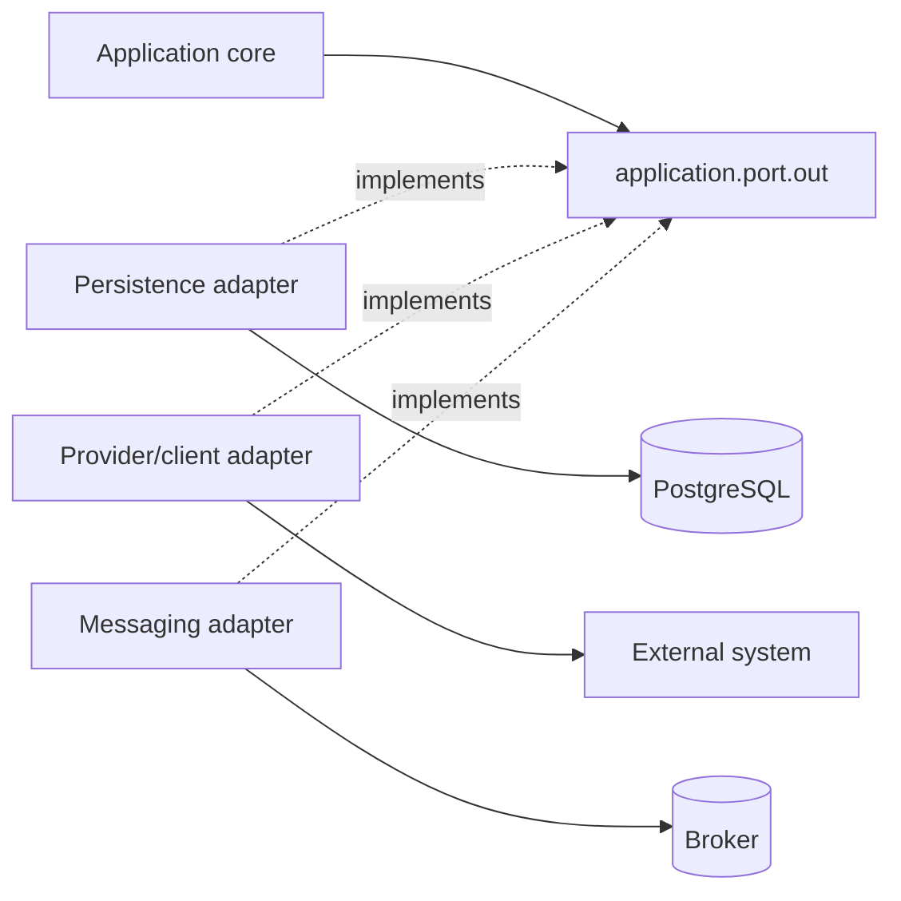
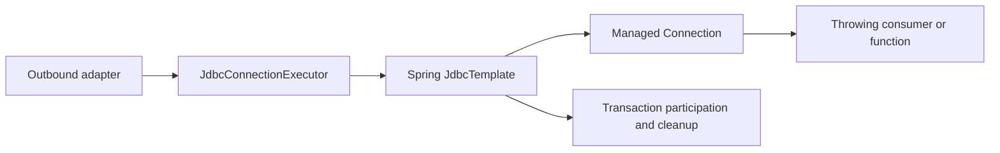

# Outbound Adapters and Configuration

> **Naming contract:** Follow the [canonical architecture naming catalog](../00-project/naming-conventions.md) for package names, filenames, Java/Kotlin types, methods, and tests. Local examples on this page must not introduce a conflicting convention.

## Purpose

Infrastructure is a concern, not a top-level package in the canonical module layout. Technical implementations live under `adapter.out`; Spring composition lives under `configuration`. Together they contain persistence, messaging, provider, framework, and operational integrations while keeping technology outside the application/domain core.

## Typical ownership

```text
adapter/out/
├── persistence/
│   ├── entity/        # JPA/database representations
│   ├── repository/    # Spring Data/JDBC mechanics
│   ├── adapter/       # implements application repository port
│   ├── mapper/        # domain ↔ persistence
│   └── projection/    # bounded read models
├── messaging/
│   ├── publisher/
│   └── mapper/
├── provider/
│   └── <provider>/    # capability provider adapter and provider-specific DTOs
├── client/
│   └── <external-system>/ # transport-only client and wire DTOs
└── observability/     # module-specific metrics/tracing adapters

configuration/         # Spring wiring and typed configuration
```



## Adapter rules

- Implement stable ports defined in `application.port.out`; domain code does not own infrastructure ports.
- Translate vendor errors into application-specific failures.
- Keep credentials and endpoint configuration outside code.
- Make retries, timeouts, idempotency, and circuit behavior explicit.
- Do not leak JPA entities, SDK models, or raw provider responses across the module boundary.
- Use testcontainers or contract tests for infrastructure behavior that an in-memory fake cannot prove.

## Composition

The module's `configuration` package is the composition root that wires concrete adapters. Dependency injection is the default; services depend on application-owned ports rather than instantiate providers internally. `@ApplicationModule` remains in the module-root `package-info.java`, not in `configuration`.

### Bootstrap infrastructure example

Technical metadata used to initialize infrastructure still follows the same
port/adapter boundary:

```text
application/port/out/DatabaseRegistryPort.java
application/port/out/DatabaseRegistryEntry.java
        ▲
        │ implements
adapter/out/client/database/DatabaseRegistryAdapter.java
adapter/out/client/database/TenantDatabasePoolProvider.java
adapter/out/client/database/TenantRoutingDataSource.java
```

`DatabaseRegistryEntry` is an immutable port model. The JPA
`DatabaseRegistry` entity and direct JDBC details remain inside outbound
adapters; a future HTTP registry implementation can replace the JDBC adapter
without changing pool management or application-facing contracts.

## Managed JDBC connection execution

Connection-scoped JDBC work uses the Shared `JdbcConnectionExecutor` capability.
It is an infrastructure executor, not a business `ConnectionService`: it owns
only the delegation to Spring's connection lifecycle and the translation of
callback failures.

```java
connections.consumeWithConnection(
    connection -> {
      try (Statement statement = connection.createStatement()) {
        statement.execute(sql);
      }
    });

List<Row> rows =
    connections.withConnection(
        (ThrowingSqlConnectionFunction<List<Row>, SQLException>)
            connection -> loadRows(connection));
```



The callback contracts are intentionally generic:

```java
@FunctionalInterface
public interface ThrowingSqlConnectionFunction<R, E extends Throwable> {
  R apply(Connection connection) throws E;
}

@FunctionalInterface
public interface ThrowingSqlConnectionConsumer<E extends Throwable> {
  void accept(Connection connection) throws E;
}
```

Use the function form when a result is produced and
`consumeWithConnection` when the operation is side-effecting. A `Supplier` is
not part of this API because it hides the connection from the callback; a
connection-scoped operation should state its dependency explicitly.

`JdbcConnectionExecutor` delegates acquisition, transaction participation,
thread binding, and cleanup to `JdbcTemplate`. Callers must never invoke
`DataSource#getConnection()`, close the supplied connection, cache it, or pass
it beyond the callback scope. Checked callback failures are wrapped in the
typed `JdbcConnectionExecutionException` with the original cause preserved;
fatal `Error` instances are rethrown unchanged. Java does not permit generic
`Throwable` subclasses, so the generic failure type belongs on the callback
interfaces rather than on the exception class.

## Adapter guardrails

### Persistence

- Keep persistence models and repositories inside the outbound boundary.
- Enforce tenant scope and transaction semantics at the adapter/database boundary.
- Define indexes, query limits, pagination, locking, and migration compatibility for production paths.
- Verify database-specific behavior with real PostgreSQL integration tests.

### External providers

- Configure connect/read timeouts, bounded retries, backoff, circuit behavior, and rate limits.
- Validate provider responses and map provider error codes into stable application failures.
- Redact request/response data according to classification.
- Use idempotency keys for provider mutations and persist correlation/provider IDs.
- Provide a fake for unit tests and a contract/sandbox test where the provider is business-critical.

### Configuration and security

- Bind typed configuration and validate it at startup.
- Keep credentials in managed secret stores and rotate without source changes.
- Use least-privilege database and provider identities.
- Do not make network calls or read mutable environment state in static initializers.

### Naming

- Application ports use capability names such as `PricingPort` or `QuoteRepository`.
- Concrete adapters state the technology or strategy: `PricingClientAdapter`, `QuotePersistenceAdapter`, `KafkaQuoteEventPublisher`.
- Framework repositories are visibly technical: `SpringDataQuoteRepository`.
- Persistence-side AOP belongs under `adapter.out.persistence.aspect` and is named for the concern, for example `TenantContextAspect`; it must not become a domain or application dependency.
- Provider request/response types remain inside that provider's package.
- Use `adapter.out.provider.<provider>` when the concrete type implements a
  capability provider port, for example `GroqModelProvider` or
  `TwilioSmsProvider`.
- Use `adapter.out.client.<external-system>` only for transport-focused
  wrappers and wire contracts, for example `PricingHttpClient` and
  `PricingResponse`. A provider adapter may compose such a client.
- Do not use `InfrastructureService`, `RepositoryImpl`, or `DefaultClient`; these names hide the actual adapter role.

### Infrastructure checklist

- [ ] Every adapter implements a port owned by an inner layer.
- [ ] Persistence and provider failure modes have explicit mappings.
- [ ] Timeouts, retries, circuit behavior, and idempotency are tested.
- [ ] Tenant and data-classification controls are enforced and redacted in logs.
- [ ] Real-boundary integration tests cover production-specific behavior.

For module-wide security, tenancy, migration, resilience, and operational approval, use the [module template](../../templates/module-package-structure-template.md).
