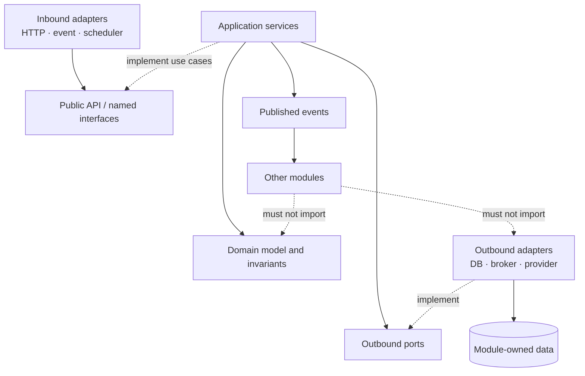

# Backend Module

## Purpose

A backend module owns one cohesive business capability or bounded context. It owns its language, rules, data, public contracts, events, and operational behavior while hiding implementation details.

For the [complete module filesystem](../../templates/module-package-structure-template.md#complete-module-filesystem-reference), package meanings, copy-ready `package-info.java` catalog, filename conventions, approved optional extensions, and approval controls, use the [Spring Modulith module template](../../templates/module-package-structure-template.md). This page is the orientation guide; the template is the future-module source of truth.

## Two architecture models

The backend module model and the Gradle build-logic model are complementary, not
interchangeable:

| Area | Architecture | Organizing unit |
|---|---|---|
| Business modules | DDD + Hexagonal Architecture | Bounded business capability |
| Gradle `build-logic` | Capability-Driven Design | Reusable build capability |

Backend modules use `api`, `application`, `domain`, `adapter`, and `configuration`
to protect business rules and module contracts. Gradle build-logic uses convention
plugins, binary plugins, extensions, tasks, providers, and `ValueSource`s grouped
under capabilities such as `container`, `deployment`, `publishing`, `security`, and
`quality`. The module template must not be copied mechanically into `build-logic`.

See [Capability-Driven Build Logic](../00-project/build-logic.md) for the Gradle
architecture and its final target tree.

## Module boundary



## Module shape

```text
modules/<capability>/
├── build.gradle.kts
└── src/main/java/com/emme/<capability>/
    ├── package-info.java                   # @ApplicationModule
    ├── api/                                # public contract, grouped by kind
    │   ├── command/
    │   ├── query/
    │   ├── result/
    │   ├── usecase/
    │   ├── event/
    │   ├── exception/
    │   └── type/
    ├── application/
    │   ├── service/
    │   ├── port/out/
    │   └── mapper/
    ├── domain/
    │   ├── model/
    │   ├── service/
    │   ├── event/
    │   ├── exception/
    │   └── specification/
    ├── adapter/
    │   ├── in/                            # web, messaging, scheduler
    │   └── out/                           # persistence, messaging, client, observability
    └── configuration/                     # framework wiring only
```

Every materialized package has a small `package-info.java` explaining what belongs there, what is forbidden, and whether it is public. Not every module needs every branch: a package exists because it owns a real responsibility, not because the complete template has a box for it.

## Package responsibility map

| Package | Responsibility | Primary question |
|---|---|---|
| `api.command` | State-changing intentions | What does a caller ask the module to do? |
| `api.query` | Read intentions | What information does a caller request? |
| `api.result` | Public read models | What stable answer does the module return? |
| `api.usecase` | Inbound ports | Which operations does the module expose? |
| `api.event` | Completed public facts | What already happened? |
| `api.exception` | Expected public failures | Which failures may callers handle? |
| `api.type` | Stable public vocabulary | Which small value types cross the boundary? |
| `application.service` | Use-case orchestration | How are the workflow steps coordinated? |
| `application.port.out` | Outbound ports | Which external capability does the application require? |
| `application.mapper` | Application translations | How are API and domain models converted? |
| `domain.model` | Aggregates, entities, value objects | What business state and behavior exist? |
| `domain.service` | Cross-object business policies | Which rule does not belong to one model? |
| `domain.event` | Internal domain facts | What meaningful fact occurred inside the module? |
| `domain.exception` | Invariant violations | Which business rule rejected the operation? |
| `domain.specification` | Reusable predicates | Does an object satisfy a composable rule? |
| `adapter.in` | Entry points | What external mechanism invokes the module? |
| `adapter.out` | Technology implementations | How is an application port implemented? |
| `configuration` | Framework composition | How are the concrete beans wired? |

The short vocabulary is intentional:

```text
Command  = please do this
Query    = please tell me this
Result   = here is the answer
Use case = this capability is available
Event    = this already happened
Exception = this operation failed
Type     = this concept has stable public meaning
```

### Public-interface rule

Each materialized `api.*` kind joins one logical `module :: api` named interface. Whenever `api.event` exists, it also exposes `module :: events`, allowing event-only consumers without granting access to commands or use cases. Any `api.type` referenced by those events also joins `events`, keeping the event contract closed over its signatures. `@ApplicationModule` remains at the module root; implementation packages are never named interfaces.

### Naming rule

Names form a readable vertical slice:

```text
CreateQuoteRequest
  → CreateQuoteCommand
  → CreateQuoteUseCase
  ← CreateQuoteService
  → QuoteDetails
  → QuoteResponse
  → QuoteCreated
```

Use the template's [file and type naming catalog](../../templates/module-package-structure-template.md#a2-file-and-type-naming-catalog) rather than generic names such as `QuoteServiceImpl`, `QuoteManager`, or `CreateQuoteDto`.

## Module type plus capabilities

```kotlin
plugins {
    id("emme.spring-module")       // what the project is
    id("emme.persistence")         // optional capability
    id("emme.messaging")           // optional capability
    id("emme.test-fixtures")       // optional test capability
}
```

The module type defines the runtime shape. Capabilities add behavior. The build file should describe intent; `build-logic` owns implementation.

## Creation sequence

1. Name the capability and its non-responsibilities.
2. Assign business/data/operational ownership.
3. Define public APIs, events, data ownership, and allowed dependencies.
4. Materialize only the package branches required by the first vertical slice and add their `package-info.java` files.
5. Name each file through the template's package-to-filename matrix.
6. Choose synchronous calls versus completed-fact events, then select each event's delivery mode independently.
7. Implement domain, application, and adapters behind ports.
8. Verify boundaries, contracts, persistence, security, failure behavior, and recovery.

## Verification map

| Verify | Evidence |
|---|---|
| Boundary | `ApplicationModules.verify()` and ArchUnit |
| Domain | Framework-free unit tests |
| Application | Use-case tests with fake ports |
| Persistence | Real database integration tests |
| Events | Publication/retry/idempotency tests |
| Operations | SLO, dashboards, alerts, runbook, rollback |
