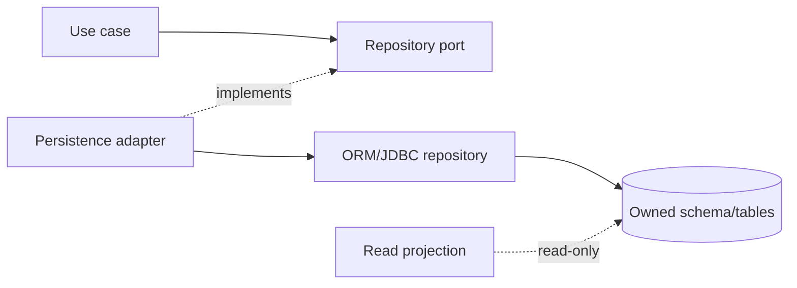

# Repositories

## Purpose

A repository is a persistence port for an aggregate or domain query. It hides storage mechanics from application and domain code.

## Port and adapter

```java
public interface AppointmentRepository {
    Optional<Appointment> findById(AppointmentId id);
    void save(Appointment appointment);
}
```

```text
application.port.out repository port
          ↓ implemented by
adapter.out.persistence.adapter
```



## Rules

- Model methods around business use cases, not generic database operations.
- Keep aggregate writes transactional and consistent.
- Do not return JPA entities to controllers or other modules.
- Keep query projections separate from aggregate mutation when read performance or shape differs.
- Enforce tenant scope at the persistence boundary as a defense in depth measure.
- Verify provider-specific behavior with real database integration tests.

## Canonical file family

```text
application/port/out/QuoteRepository.java
application/port/out/SearchQuotesPort.java                    # only for a dedicated read use case
adapter/out/persistence/entity/QuoteEntity.java
adapter/out/persistence/repository/SpringDataQuoteRepository.java
adapter/out/persistence/mapper/QuotePersistenceMapper.java
adapter/out/persistence/adapter/QuotePersistenceAdapter.java
adapter/out/persistence/adapter/QuoteSearchPersistenceAdapter.java
adapter/out/persistence/projection/QuoteSummaryProjection.java   # only when needed
```

The port uses business vocabulary. Concrete files state persistence technology or adapter role. Do not name the implementation `QuoteRepositoryImpl`; that hides the boundary and collides conceptually with the application-owned port.

Read projections remain private to the persistence adapter. A query application service calls `SearchQuotesPort`; `QuoteSearchPersistenceAdapter` executes/maps `QuoteSummaryProjection` and returns the public/application result. The service never imports the database projection directly.

## Cross-module access

Another module must not call a repository in this module. It consumes an API contract or event. If a shared read model is required, define its owner and contract explicitly.

## Data-access guardrails

### Query and mutation separation

- Aggregate repositories load/save consistency boundaries and must not become unrestricted query utilities.
- Read projections may optimize list/search/report use cases but cannot mutate aggregates.
- Every list query has pagination, ordering, and maximum work limits.
- Queries specify tenant scope, authorization scope, and expected consistency.

### Concurrency and transactions

- Document optimistic/pessimistic locking for competing state changes.
- Map unique-constraint and stale-version failures to stable conflict outcomes.
- Keep transaction ownership in the application use case; repository methods participate in it.
- Verify isolation, locking, tenant filters, and migration behavior against the production database engine.

### Repository checklist

- [ ] No cross-module repository/table access exists.
- [ ] Tenant/resource scope is enforced at the data boundary.
- [ ] Writes protect aggregate invariants and concurrency semantics.
- [ ] Reads are bounded and have indexes appropriate to production traffic.
- [ ] Database-specific integration tests run in CI.
- [ ] Migration, backup, retention, and deletion behavior are documented.

Repository rules are one part of the module-wide data, migration, security, and recovery contract in the [module template](../../templates/module-package-structure-template.md).
