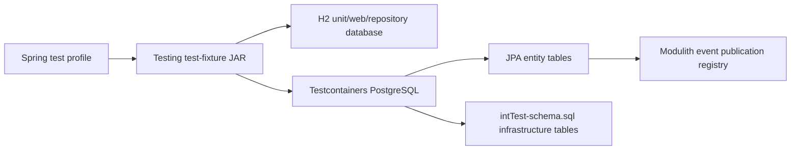

# Backend Test Configuration and Profile Ownership

Test configuration is shared infrastructure. A module must not copy a generic
Spring profile merely because its integration-test source set needs it.

## Canonical ownership

All reusable test profiles and schema helpers belong to the testing fixtures
library:

```text
libraries/testing/src/testFixtures/resources/
├── application-test.yml              # full module tests with H2
├── application-web.yml               # full web tests with H2
├── application-repository.yml        # repository tests with H2
├── application-resttest.yml          # explicit H2 REST profile
├── application-integration-test.yml  # PostgreSQL/Testcontainers profile
└── intTest-schema.sql                 # shared non-JPA integration schema
```

Every module's integration-test source set depends on
`testFixtures(project(":libraries:testing"))`, so Spring can load these
resources from the shared fixture JAR.

## Profile rules

| Profile | Infrastructure | Owner | Activation |
|---|---|---|---|
| `test` | H2 + JPA | `libraries/testing` | `@ActiveProfiles("test")` |
| `web` | H2 + full Spring web context | `libraries/testing` | `@ActiveProfiles("web")` |
| `repository` | H2 + repository context | `libraries/testing` | `@ActiveProfiles("repository")` |
| `resttest` | H2 + explicit REST test context | `libraries/testing` | Explicit opt-in only |
| `integration-test` | PostgreSQL + Testcontainers | `libraries/testing` | `@PostgresIntegrationTest` |

Module-specific configuration is allowed only when a test has a real module
requirement that cannot be represented by the shared baseline. Such an override
must be named `application-<profile>.yml`, contain only the delta, and be
covered by the owning module's test.

## E2E identity injection

The service uses one Gradle `e2eTest` source set and one execution task. User
identity is selected declaratively with a JUnit 5 extension; provider mode or
deployment target must not create a second Java test flow.

```java
@ExtendWith(E2eUserExtension.class)
@WithUser(role = Roles.TENANT_OWNER, tokenEnvironmentVariable = "E2E_OWNER_TOKEN")
class TenantApiTest {

  @Test
  void listsTenantData(UserSession session) {
    session.tenants().list();
  }
}
```

Use repeatable `@WithUser` declarations when a scenario requires distinct
identities. Inject the immutable `E2eUsers` record and select sessions by
position. Each session owns its bearer token and sends the canonical
`API-Version: 1.0` header.

```java
@WithUser(tokenEnvironmentVariable = "E2E_OWNER_TOKEN")
@WithUser(role = Roles.TENANT_STAFF, tokenEnvironmentVariable = "E2E_STAFF_TOKEN")
void enforcesTenantBoundary(E2eUsers users) {
  users.first().tenants().list();
  users.get(1).customers().list();
}
```

`PER_METHOD` is the default and gives each test isolation. `PER_CLASS` is
allowed only for read-only suites and must be declared at class scope. Method
declarations override class declarations, and all repeated declarations in one
test must use the same lifecycle. `E2E_ACCESS_TOKEN` is the default token; indexed tokens
`E2E_ACCESS_TOKEN_1`, `E2E_ACCESS_TOKEN_2`, or explicit annotation variables
enable multiple identities without exposing credentials in test code.

Configuration properties follow the same rule as application contracts:
immutable Java `record` types are preferred for stable, constructor-bound
settings; mutable bean properties remain only where legacy setter binding or
incremental migration requires them. Spring profiles remain the mechanism for
selecting infrastructure (`test`, `web`, `repository`, `integration-test`, and
`e2e`); records do not replace profiles.

## Database ownership



JPA owns entity tables. The shared SQL helper owns only infrastructure tables
that have no JPA entity. Event publication configuration must use the current
Spring Modulith property namespace:

```yaml
spring:
  modulith:
    events:
      jdbc:
        schema-initialization:
          enabled: true
```

Do not use the removed flat `jdbc-schema-initialization` property and do not
reintroduce module-local copies of shared profiles.

## Verification

The profile consolidation is verified by compiling every integration-test
source set and packaging the shared fixture JAR:

```text
./gradlew :libraries:testing:testFixturesJar \
  :modules:assistant:integrationTestClasses \
  :modules:calendar:integrationTestClasses \
  :modules:catalog:integrationTestClasses \
  :modules:identity:integrationTestClasses \
  :modules:notification:integrationTestClasses \
  :modules:payment:integrationTestClasses \
  :modules:studio:integrationTestClasses \
  :modules:tenancy:integrationTestClasses
```

The service-wide CI gate remains authoritative for formatting, compilation,
tests, Checkstyle, and integration-test classpath wiring.
