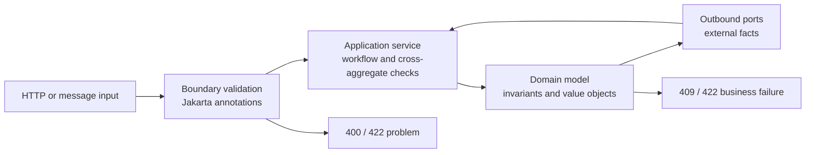

# Backend Validation Conventions

> **Canonical policy:** Java modules use Jakarta Bean Validation for transport
> and configuration boundaries, explicit domain code for business invariants,
> and application services for checks that require other aggregates or systems.
> Do not introduce a second validation model merely because a rule is fluent in
> another language or framework.

## Purpose

Validation is a boundary responsibility, not one undifferentiated concern. The
same word can describe a malformed HTTP field, an invalid aggregate state, or a
failed uniqueness check. Those failures have different owners, lifecycles, and
HTTP semantics.



The ownership rule is:

| Validation kind | Question | Owner | Typical result |
|---|---|---|---|
| Transport shape | Is this JSON/message structurally valid? | `adapter.in.*` request/message record | `400 Bad Request` |
| Cross-field input | Are related input fields compatible? | `adapter.in.*.validation` custom constraint | `400 Bad Request` |
| Configuration | Is application configuration usable? | `configuration` typed properties + startup validation | Startup failure |
| Domain invariant | Can this aggregate/value object enter this state? | `domain.model`, `domain.service`, or `domain.specification` | Domain failure, normally `409` or `422` |
| Application rule | Is the operation allowed given other aggregates or current workflow state? | `application.service` | `404`, `409`, or `422` |
| External/provider rule | Did an external system reject the operation? | `adapter.out` mapped to an application/domain failure | Contract-specific failure |

Do not move a rule to an easier layer if that layer does not own the truth.
Boundary validation improves feedback; it never replaces domain validation.

## Configuration properties: record-first and constraint-driven

Use an immutable Java `record` for constructor-bound configuration whenever the
property group is stable and does not require framework mutation after binding.
Use a mutable `@ConfigurationProperties` class only when the current binder,
framework integration, or an explicitly tracked migration still requires
setters. Record that exception in the module plan and remove it when the
dependency is ready.

Validation is selective, not decorative. Annotate a property when its invariant
is known at startup and the value is required for the active mode:

| Property shape | Preferred rule | Example | Do not do this |
|---|---|---|---|
| Required text | `@NotBlank` | provider name, consumer group | `@NotBlank` on an optional credential for a disabled provider |
| Required reference | `@NotNull` | required nested configuration | `@NotNull` on a primitive (`boolean`, `int`, `long`) |
| Positive count | `@Positive` or `@Min(1)` | retry count, pool size | Accept zero and fail later in a client or pool |
| Bounded count | `@Min` + `@Max` | page size, pool limit | Use arbitrary limits without documenting the operational reason |
| URI/identifier format | A stable URI/format constraint | endpoint or UUID text | Validate provider-specific syntax with a generic regex |
| Conditional configuration | Type-level constraint or startup validator | enabled provider requires credentials | Put cross-field checks in controllers or domain objects |
| Secret | Presence/length only when enabled | API key or admin password | Log, normalize, or expose the secret in a result |

Nested records must use `@Valid` where the binding/validation path requires
cascading. Optional provider blocks may remain nullable when the provider is not
selected; a conditional validator or provider-specific startup check should
enforce their required fields only when that provider is active. Defaults are
appropriate for local/test-safe values, never as a substitute for production
secrets or secure transport.

The repository therefore does not convert every properties class blindly:
records are preferred for immutable binding, while constraints express real
startup invariants. This keeps disabled integrations usable in tests and local
development without weakening validation for an enabled production integration.

## Terminology: “fluent validation” in Java

`FluentValidation` is primarily the name of a .NET library. The Java baseline
for this repository is **Jakarta Bean Validation**, implemented by the Spring
Boot validation starter/provider, which expresses common constraints with
annotations and supports custom `ConstraintValidator` implementations. Jakarta
Validation 3.1 explicitly clarifies support for Java records and defines the
`Constraint`/`ConstraintValidator` extension model ([specification](https://jakarta.ee/specifications/bean-validation/3.1/),
[ConstraintValidator API](https://jakarta.ee/specifications/bean-validation/3.1/apidocs/jakarta/validation/constraintvalidator)).

Use the following decision rule:

| Need | Preferred Java approach | Avoid |
|---|---|---|
| Required scalar input | `@NotNull`, `@NotBlank`, `@NotEmpty` | Manual checks duplicated in controllers |
| Bounds or shape | `@Size`, `@Pattern`, numeric/date constraints | Regexes hidden in service methods |
| Nested input | `@Valid` on the containing component/parameter | Validating nested records only by convention |
| Cross-field input | Type-level custom annotation + `ConstraintValidator` | `@ScriptAssert`, controller `if` blocks, synthetic `isValid()` fields |
| Pure canonicalization | Null-safe compact constructor or mapper | Mutating a request after validation |
| Business invariant | Aggregate/value-object method or factory | Jakarta annotations in `domain` |
| Multi-aggregate/external check | Application service and injected port | A request validator calling a repository |

Do not add a third-party fluent-validation framework to the baseline unless a
separate ADR proves that Jakarta constraints and a small custom validator cannot
express the required contract.

## Request records are the default boundary type

Use immutable Java records for HTTP and message input when the input is a data
contract without lifecycle behavior. Put Jakarta annotations on record
components and trigger validation at the adapter entry point.

```java
package com.emme.quote.adapter.in.web.request;

import jakarta.validation.constraints.NotBlank;
import jakarta.validation.constraints.NotNull;
import jakarta.validation.constraints.Positive;
import jakarta.validation.constraints.Size;
import java.math.BigDecimal;
import java.util.UUID;

/** HTTP input for creating a quote. */
public record CreateQuoteRequest(
    @NotNull UUID customerId,
    @NotBlank @Size(max = 120) String applicantName,
    @NotNull @Positive BigDecimal coverageAmount
) {}
```

The controller must opt into validation explicitly:

```java
@PostMapping
ResponseEntity<QuoteResponse> create(
    @Valid @RequestBody CreateQuoteRequest request
) {
  CreateQuoteCommand command = mapper.toCommand(request);
  QuoteDetails result = createQuoteUseCase.create(command);
  return ResponseEntity.status(HttpStatus.CREATED).body(mapper.toResponse(result));
}
```

### Annotation selection

| Type/constraint | Use | Important detail |
|---|---|---|
| `@NotNull` | Required reference value | Does not reject `""` or whitespace |
| `@NotBlank` | Required text | Rejects `null`, empty, and whitespace-only text |
| `@NotEmpty` | Required collection/map/array or non-empty text | Does not reject whitespace-only text |
| `@Size` | String, collection, map, or array length | Does not reject `null`; combine with a nullness constraint when required |
| `@Pattern` | String format | Does not reject `null`; keep business parsing out of the regex |
| `@Positive` / `@PositiveOrZero` | Numeric values | Use `BigDecimal`/`BigInteger` for money and precise quantities |
| `@DecimalMin` / `@DecimalMax` | Inclusive/exclusive decimal bounds | Prefer explicit boundary semantics |
| `@Past` / `@PastOrPresent` / `@Future` / `@FutureOrPresent` | Temporal input | Inject `Clock` for domain decisions; do not use validation as business policy |
| `@Email` | Basic email syntax | Treat it as syntax, not proof that an address exists |
| `@Valid` | Cascaded validation | Required for nested records and collections of records |

Rules:

- Combine `@NotBlank` with `@Size` or `@Pattern` when text is required and
  bounded/formatted.
- Do not put `@NotNull` on primitives; a primitive cannot be null. Use the
  appropriate primitive constraint or a wrapper when absence has meaning.
- Keep messages as stable message keys, for example
  `message = "{quote.create.applicant-name.required}"`, when the API supports
  localized responses. Never expose provider exception text as the public
  contract.
- Prefer separate `Create...Request`, `Update...Request`, and
  `Search...Request` records instead of validation groups on one overloaded
  DTO. Use groups only when the same wire type is genuinely the same contract
  with distinct validation phases.
- Request records are not commands, domain objects, entities, or response DTOs.
  Map them explicitly in `adapter.in.web.mapper` or the corresponding inbound
  adapter.

## Compact constructors and normalization

A record compact constructor may perform deterministic representation
normalization that is part of the transport contract, such as trimming a search
term. It must not contain authorization, repository calls, external calls, or
business state transitions.

```java
public record SearchQuotesRequest(
    @NotBlank @Size(max = 100) String query
) {
  public SearchQuotesRequest {
    query = query == null ? null : query.trim();
  }
}
```

The null-safe assignment is intentional: Bean Validation should report a
missing value as a field violation instead of the constructor throwing an
unmapped `NullPointerException`. If normalization would alter business meaning,
perform it in the mapper or application service and make the decision explicit.

Do not use compact constructors as a replacement for `@NotBlank`, `@Size`, or
cross-field constraints. Do not throw domain exceptions from a transport record.

## Cross-field and conditional validation

Use a type-level custom constraint when validity depends on more than one input
component. Keep the annotation and validator in the inbound adapter because the
rule describes the input contract, not the domain model.

```text
adapter/in/web/validation/
├── package-info.java
├── ValidQuoteDateRange.java
└── QuoteDateRangeValidator.java
```

```java
@Documented
@Constraint(validatedBy = QuoteDateRangeValidator.class)
@Target(ElementType.TYPE)
@Retention(RetentionPolicy.RUNTIME)
public @interface ValidQuoteDateRange {
  String message() default "{quote.date-range.invalid}";
  Class<?>[] groups() default {};
  Class<? extends Payload>[] payload() default {};
}
```

```java
@ValidQuoteDateRange
public record SearchQuotesRequest(
    Instant startsAt,
    Instant endsAt
) {}
```

The validator must be stateless and thread-safe. It should report the affected
property path when possible, avoid I/O, and leave aggregate/business decisions
to the domain/application layers. For a rule that must be shared by HTTP,
messaging, and batch inputs, prefer a pure domain policy or a shared application
validator over copying an adapter-only constraint.

### Validation package naming

| Package | Responsibility | Filename pattern |
|---|---|---|
| `adapter.in.web.validation` | HTTP request constraints and validators | `Valid<Concept>.java`, `<Concept>Validator.java` |
| `adapter.in.messaging.validation` | Message-envelope/input constraints | `Valid<Concept>.java`, `<Concept>Validator.java` |
| `configuration` | Startup/configuration validation | `<Capability>Properties.java` |
| `domain.specification` | Reusable business predicates | `<Subject><Predicate>.java` |
| `domain.exception` | Business-rule failures | `<RuleViolation>Exception.java` |

Never create a generic top-level `validation`, `validators`, or `utils` package.
Validation belongs to the boundary or capability that owns the rule.

## Domain and application validation

Domain validation must remain framework-independent:

```java
public final class Quote {
  public void submit() {
    if (!hasRequiredProfile()) {
      throw new IncompleteQuoteException();
    }
    if (status != QuoteStatus.DRAFT) {
      throw new InvalidStateTransitionException(status, QuoteStatus.SUBMITTED);
    }
    status = QuoteStatus.SUBMITTED;
  }
}
```

Use domain constructors/factories/value objects for representations that can
never be valid, and aggregate methods for state transitions. Do not import
`jakarta.validation`, Spring, JPA, HTTP, or message-broker types into `domain`.

Application services own checks requiring current state outside one aggregate:

```text
request annotations
    ↓
application service
    ├── load aggregate through port
    ├── check authorization/idempotency/workflow state
    ├── invoke domain behavior
    └── persist and publish completed fact
```

A request annotation can reject an invalid UUID or an empty name. It cannot
decide whether a customer belongs to the tenant, whether a quote is unique, or
whether an external pricing decision is still valid.

## Error contract and internationalization

Validation errors are client-facing contract data. Map them to the repository's
stable Problem Details/error envelope and include:

| Field | Requirement |
|---|---|
| `type` | Stable documentation URI or error category |
| `code` | Machine-readable validation code, not a localized sentence |
| `field` | JSON/property path when the violation is field-specific |
| `message` | Localized display text resolved from a message key |
| `correlationId` | Request correlation identifier |
| `violations` | Deterministically ordered field/type violations |

Use message bundles owned by the service/application, for example:

```text
src/main/resources/i18n/validation/messages.properties
src/main/resources/i18n/validation/messages_es.properties
```

If the repository chooses Spring Boot's default validation bundle location,
record that choice in the application template and keep the same key naming
policy. Do not put user-facing translations in Java annotations as the only
source of truth. A message key may be declared in an annotation; its localized
text belongs in the bundle.

Expected mapping:

| Failure | HTTP status | Retry |
|---|---:|---|
| Malformed JSON/type mismatch | `400` | No |
| Bean Validation violation | `400` | No |
| Domain invariant violation | `422` or `409` by contract | No |
| Cross-aggregate conflict | `409` | No, unless the operation is explicitly retry-safe |
| External transient failure | `502`, `503`, or `504` | According to resilience policy |

Do not retry malformed input, validation failures, authorization failures, or
permanent business conflicts.

## Testing requirements

Every materialized request record needs focused validation evidence. Prefer both
the fast validator test and one controller/web test for the final HTTP mapping.

| Test | Filename | Proves |
|---|---|---|
| Record constraints | `<Request>ValidationTest.java` | Required, format, bounds, nested, and null behavior |
| Custom constraint | `<Concept>ValidatorTest.java` | Cross-field rule and property paths without Spring context |
| HTTP boundary | `<Controller>WebTest.java` | `@Valid` is wired and errors map to the public envelope |
| Domain rule | `<Aggregate>Test.java` | Invalid business state is rejected without framework dependencies |
| Configuration | `<Capability>PropertiesTest.java` | Startup values are bounded and normalized |

Minimum cases:

- valid input;
- `null`, blank, and whitespace-only values where relevant;
- lower and upper bounds, including one value outside each bound;
- malformed format and unknown enum values;
- nested record and collection validation;
- every cross-field branch;
- deterministic localized error key and field path;
- no validation rule bypass through another inbound adapter.

## Review checklist

- [ ] Every inbound request/message record uses the narrowest appropriate Jakarta constraint.
- [ ] Every controller/message entry point explicitly triggers cascaded validation.
- [ ] Cross-field rules use a stateless custom constraint or an owning domain/application policy.
- [ ] Request records contain no I/O, authorization, transaction, or business transitions.
- [ ] Domain invariants are enforced again inside aggregates/value objects.
- [ ] Application checks use injected ports and are not hidden in validators.
- [ ] Constraint messages use stable keys and localized bundles where required.
- [ ] Validation failures map to stable problem codes and deterministic field paths.
- [ ] Focused validation and boundary tests exist for every materialized input contract.
- [ ] No generic `validation`, `validators`, `utils`, or third-party fluent-validation package was added without an ADR.

## Related guidance

- [Module package structure template](../../templates/module-package-structure-template.md)
- [API and HTTP boundary](api.md)
- [Controllers](controller.md)
- [Domain layer](domain.md)
- [Architecture naming conventions](../00-project/naming-conventions.md)
