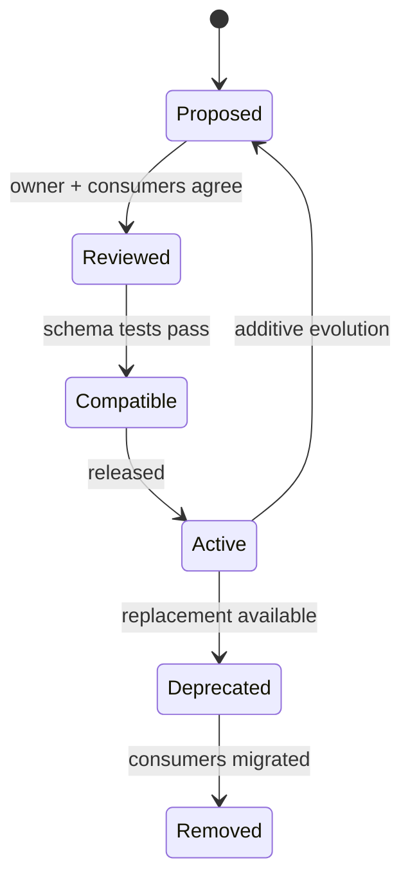

# Contracts

## Purpose

Contracts are the smallest stable representation of a boundary. They allow independent change inside a provider while keeping consumers decoupled from implementation details.

## Contract types

```text
<module>/api/
├── command/
├── query/
├── result/
├── usecase/
├── event/
├── exception/
└── type/
```

Contracts may describe:

- synchronous module APIs;
- immutable DTOs and value representations;
- public `api.event` contracts and broker-specific event schemas;
- frontend/backend OpenAPI schemas.

The owning module is the default contract home. Extract `libraries/contracts/<capability>/` only when a real build/deployment boundary requires an independently consumable artifact; extraction must preserve the same ownership and package-kind semantics.

## Rules

- Keep contracts dependency-light and framework-neutral where possible.
- Keep an in-process module contract in the owner’s `api.*` packages and expose it through Spring Modulith named interfaces.
- Publish a focused contract library only for independently built/deployed consumers that cannot depend on the owning module artifact.
- Do not include repositories, persistence entities, Spring configuration, or vendor models.
- Prefer additive evolution; deprecate before removing fields or operations.
- Use explicit versioning for incompatible changes.
- Delete a contract when its owning capability is removed, after consumers migrate.

## Dependency graph

```text
consumer module ──→ owner :: api
event consumer ───→ owner :: events   # canonical whenever owner has api.event
owner module ─────→ internal implementation
```

This is dependency inversion at the module boundary.



## Contract lifecycle

```text
design owner and consumers
    ↓
schema/API/event review
    ↓
compatibility tests
    ↓
additive implementation
    ↓
observed rollout
    ↓
deprecate → migrate consumers → remove
```

### Contract rules

- A contract has one owning team and a named compatibility policy.
- Stable identifiers, timestamps, tenant context, and correlation metadata are modeled deliberately.
- Use semantic versioning or the repository's equivalent version policy for externally consumed schemas.
- Add fields compatibly; do not change meaning while keeping the same name.
- Treat enum additions, nullability changes, pagination changes, and error-code changes as compatibility decisions.
- Keep extracted contract libraries dependency-light and free of Spring, persistence, and vendor SDK types.
- Publish only the smallest surface consumers need; use the canonical `api` and narrower `events` named interfaces. Add a public SPI only through an explicit package-extension decision.

### Contract testing

- Producer tests validate schema and backward compatibility.
- Consumer tests validate assumptions about fields, errors, and ordering.
- Event tests validate duplicate delivery, version handling, and classification.
- Frontend/backend contract tests run before E2E and before release publication.

### Contract checklist

- [ ] Owner, consumers, version, classification, and deprecation policy are documented.
- [ ] No persistence entities or provider models leak into the contract.
- [ ] Compatibility tests run in CI.
- [ ] Breaking changes have migration and rollback sequencing.
- [ ] Deprecated fields/events have an owner and removal date.
