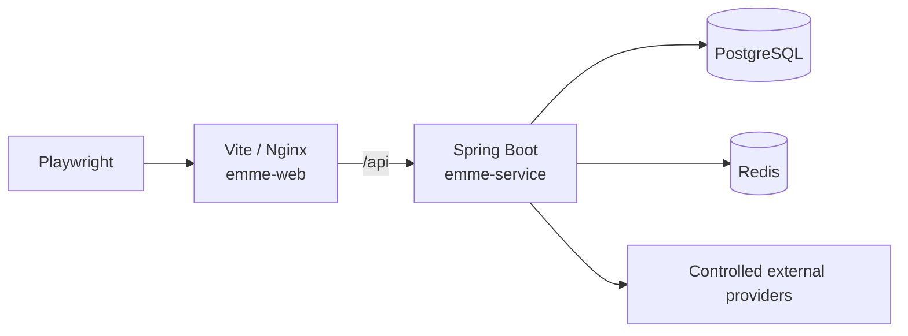
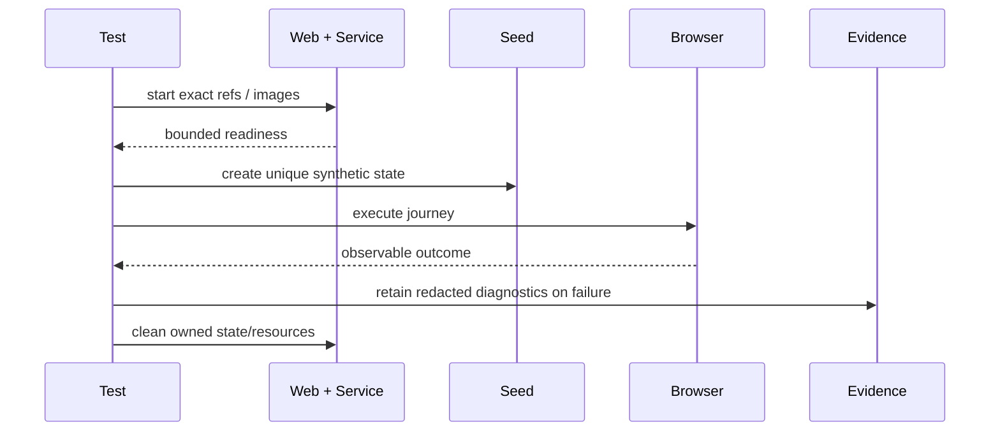

# End-to-End Architecture

> **Naming contract:** Follow the [canonical architecture naming catalog](../00-project/naming-conventions.md) for package names, filenames, Java/Kotlin types, methods, and tests. Local examples on this page must not introduce a conflicting convention.

## Purpose

End-to-end tests prove a small set of critical journeys across the independent
web and service repositories. They do not replace domain, adapter, contract, or
component tests.

## Real-stack topology

The test report MUST identify whether the browser used the Vite development
server or the production Nginx image.

## Journey selection

Reserve E2E for behavior that crosses boundaries:

- authentication, tenant selection, refresh, and logout;
- create/update/list flows that prove durable service state;
- authorization denial and tenant-isolation behavior;
- dependency timeout or degraded-service behavior;
- responsive, accessibility, PWA, and offline-shell behavior where relevant.

Pure calculations, reducers, mappers, and error translation belong in narrower
tests.

## Lifecycle

## Isolation and evidence

- Use unique synthetic users, tenants, and records.
- Prefer supported seed APIs over direct database writes.
- Cleanup MUST run on pass, failure, and cancellation.
- Waits MUST be condition-based and bounded; no arbitrary sleeps.
- Capture exact web/service commits or image digests.
- Retain trace, screenshot, console/network details, logs, and correlation IDs
  only when useful, with bounded retention and redaction.
- Never commit HAR recordings, tokens, cookies, production data, or local paths.

## Verification checklist

- [ ] The journey cannot be proven more cheaply by a lower test lane.
- [ ] The topology matches the claimed boundary.
- [ ] State is synthetic, isolated, and cleaned.
- [ ] Exact repository/image references are recorded.
- [ ] Readiness and retries are deterministic and bounded.
- [ ] Failure evidence is actionable and privacy-safe.
