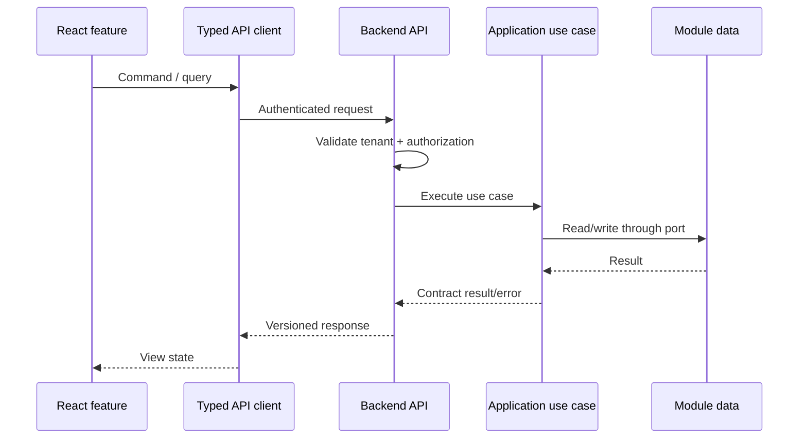

# Frontend–Backend Integration

> **Naming contract:** Follow the [canonical architecture naming catalog](../00-project/naming-conventions.md) for package names, filenames, Java/Kotlin types, methods, and tests. Local examples on this page must not introduce a conflicting convention.

## Purpose

The frontend and backend are independently structured applications joined by explicit HTTP contracts. The frontend owns presentation and interaction; the backend owns authorization, tenancy, validation, and business truth.

## Request flow

```text
React feature
   ↓ typed API client
HTTP /api
   ↓ auth + tenant context
controller
   ↓ application use case
domain + infrastructure
```



## Contract rules

- Use the version-neutral `/api` route shape with the `API-Version: 1.0`
  request header. Do not use `/api/v1` compatibility paths in this unreleased
  system.
- Generate or centrally maintain request/response types where practical.
- Treat backend validation and authorization as authoritative.
- Define loading, empty, validation, conflict, unauthorized, and unavailable states in the frontend.
- Propagate the backend `X-Correlation-Id` response header into support-safe
  diagnostics and tracing context.
- Keep backend error codes stable enough for frontend behavior; keep human messages replaceable.
- Select localized human messages with `Accept-Language`; branch UI behavior on
  the stable RFC 9457 `code` property, never on translated text.
- Add contract tests for high-value endpoints and E2E tests for critical journeys.

## Local development

- Vite proxies API requests to the local backend.
- The backend exposes a documented health endpoint.
- Authentication and tenant fixtures are deterministic for tests.
- CORS, cookie, and token behavior is tested in the same shape used by local development.

## Integration guardrails

### API contract

- Keep OpenAPI/schema definitions versioned with the backend contract owner.
- Generate client types where practical, then adapt them to feature view models.
- Detect breaking schema changes in CI before deployment.
- Define maximum request/response sizes, pagination, timeout, and rate-limit behavior.

### Authentication and tenancy

- Use the repository-approved OAuth/session/token flow; never invent a parallel browser credential store.
- Propagate tenant identity from trusted claims/session context, not arbitrary client fields.
- Define behavior for expired tokens, revoked sessions, tenant switching, and insufficient permissions.
- Keep CORS, CSRF, cookie, and header policy consistent across local, CI, stage, and production.

### Failure and consistency

```text
frontend request
  → timeout / cancellation
  → typed success or stable error code
  → retry only safe/idempotent operations
  → user-visible recovery or support correlation
```

Document whether a successful mutation means committed state, accepted asynchronous work, or an intermediate status. The frontend must not display success when the backend has only accepted a request for later processing.

### Integration checklist

- [ ] Schema/client compatibility is checked before release.
- [ ] Auth, tenant, CORS/CSRF, and session expiry are tested end to end.
- [ ] Error codes map to explicit UI states.
- [ ] Retry/cancellation behavior does not duplicate mutations.
- [ ] Correlation IDs and safe diagnostics cross the boundary.
- [ ] The client sends `API-Version` and no longer emits `/api/v1` paths.
- [ ] Critical journeys run against production-like infrastructure.
