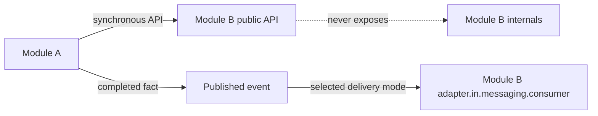

# Module Communication

> **Naming contract:** Follow the [canonical architecture naming catalog](../00-project/naming-conventions.md) for package names, filenames, Java/Kotlin types, methods, and tests. Local examples on this page must not introduce a conflicting convention.

## Purpose

Modules communicate through stable, intentional boundaries. The default choice is the smallest mechanism that preserves correctness and ownership.

## Communication choices

| Need | Mechanism | Example |
|---|---|---|
| Immediate decision/result | Synchronous module API | Check tenant entitlement before booking |
| Independent reaction | Public `api.event` fact plus an explicit delivery mode | Appointment scheduled → notification |
| Stable shared vocabulary | Owning module's `api.type` / `api.event` | `TenantInfo`, `AppointmentCreated` |
| Internal implementation detail | Private module call | Aggregate to repository port |

## Rules

- Define the contract at the boundary owner.
- Consumers depend on contracts, not implementations.
- Avoid cycles. If two modules need each other synchronously, revisit ownership or introduce a contract/event.
- Keep synchronous calls bounded and observable.
- Make event consumers idempotent and retryable.
- Do not publish persistence entities or vendor SDK types.
- Test both the producer contract and consumer behavior.

## Direction

```text
module A application
        ↓ calls
module B public API / contract

module A state change
        ↓ publishes/registers completed fact
producer transaction commits state + durable publication record
        ↓ delivers after commit when durable mode is selected
module B adapter.in.messaging.consumer
```



## Communication policy

Before introducing a dependency, record:

| Question | Required answer |
|---|---|
| Ownership | Which module owns the decision and data? |
| Timing | Must the caller receive the answer before commit? |
| Consistency | Strong, read-your-write, eventual, or compensating? |
| Failure | What happens when the target is unavailable? |
| Retry | Can the call/event be repeated safely? |
| Contract | Which named interface/schema/version is consumed? |
| Observability | How are correlation, latency, failures, and backlog measured? |
| Security | How are identity, tenant scope, and data classification preserved? |

### Forbidden communication

- direct access to another module's repository, entity, database table, or adapter;
- sharing mutable domain objects across module boundaries;
- synchronous chains that create cycles or hold long transactions open;
- events that contain secrets, persistence entities, or unnecessary personal data;
- unversioned payload changes that silently break consumers.

### Communication checklist

- [ ] Dependency is represented by a public contract or event.
- [ ] Module graph remains acyclic and explicitly allowed.
- [ ] Tenant, actor, correlation, and causation context are preserved.
- [ ] Timeout/retry/idempotency behavior is tested.
- [ ] Event consumers handle duplicate, delayed, and failed delivery.
- [ ] Contract compatibility is verified in CI.
