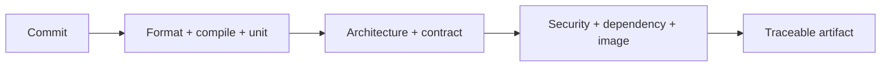
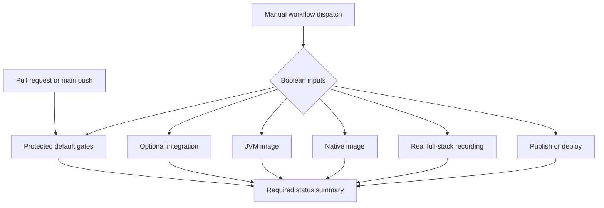
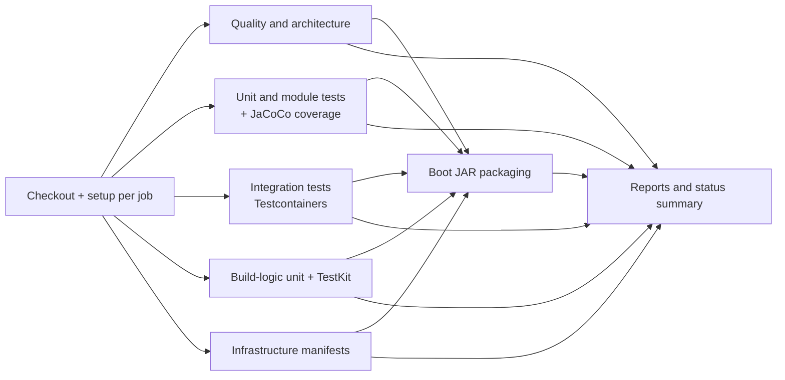
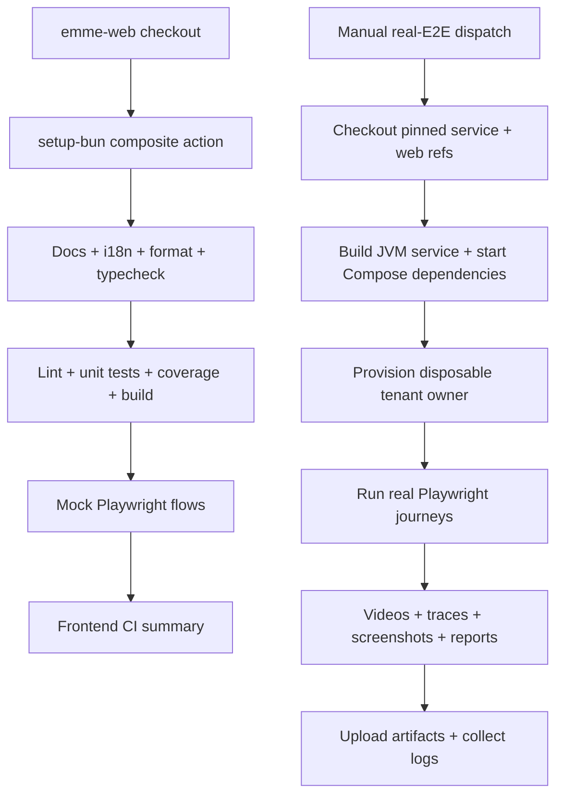

# Continuous Integration

> **Naming contract:** Follow the [canonical architecture naming catalog](../00-project/naming-conventions.md) for package names, filenames, Java/Kotlin types, methods, and tests. Local examples on this page must not introduce a conflicting convention.

## Purpose

CI provides fast feedback first, then progressively more expensive confidence checks. It must validate the same boundaries described in this handbook.

## Pipeline stages

```text
format / compile
       ↓
unit tests
       ↓
architecture + contract tests
       ↓
integration tests
       ↓
security / dependency / image checks
       ↓
release artifact
```



## Execution architecture

The pipeline has two dimensions: the event selects the default verification
mode, and an explicit manual dispatch selects expensive or environment-specific
work. Inputs select jobs; they never disable checks inside a selected job.



### Backend job graph

The backend verification families use isolated GitHub runners and therefore
start in parallel. Boot packaging is deliberately downstream because it is an
artifact-producing operation that consumes the results of every blocking gate.



The graph intentionally does not place every job behind `quality`. A dependency
is added only when a job consumes another job's output or requires ordering.
Jobs keep their own checkout and toolchain setup because GitHub-hosted runners
are isolated; repository-local composite actions remove setup drift without
pretending that a runner's installed state is shared.

### Frontend and real E2E graph

Frontend quality remains one job because installation, formatting, typechecking,
tests, coverage, build, and mock browser flows share one workspace. Real E2E is
separate and manual-only because it owns a disposable full-stack runtime and
large recording artifacts.



### Reuse boundary

The reuse boundary is intentionally explicit:

| GitHub Actions mechanism | Use in Emme | Equivalent Jenkins concept |
|---|---|---|
| Local composite action | `setup-gradle`, `setup-bun` | Focused shared-library step |
| `workflow_call` reusable workflow | Future stable complete job graph | Shared pipeline/template |
| Versioned `emme-actions` repository | Future cross-repository stable actions | Organization-level library |

Local actions are preferred while the service and web contracts are evolving.
When a cross-repository action is stable, publish it from a private,
versioned `emme-actions` repository and consume a release tag or immutable
commit SHA. Do not centralize a two-line setup step in a reusable workflow just
to hide it; use a composite action for that boundary.

## Repository workflows

| Workflow | Trigger | Required evidence |
|---|---|---|
| `ci-backend.yml` | Pushes and pull requests targeting `main` | Markdown validation, static Gradle quality, platform tests, module-boundary tests, both bootable JARs |
| `ci-module-boundaries.yml` | Pushes and pull requests | Spring Modulith and ArchUnit verification |
| `security-scan.yml` | Pushes, pull requests, weekly schedule, and manual dispatch | Gitleaks always; OWASP Dependency-Check when `NVD_API_KEY` is configured; manual `require_nvd=true` runs fail closed |
| `dependency-review.yml` | Manual dispatch until GitHub Dependency Graph is enabled | High-severity dependency changes are rejected when supported |

The backend quality job runs Gradle `ci` with application test tasks excluded so
formatting, compilation, Spotless, Checkstyle, and project checks provide fast
feedback. Dedicated jobs then run the existing platform test suite and module
boundary suite. Build-logic has its own job for unit tests, Detekt, Spotless,
plugin validation, and Gradle TestKit functional tests. Integration tests that
require external infrastructure remain explicit release or environment jobs.

## Rules

- Fail fast on formatting, compilation, and unit-test failures.
- Keep unit tests independent from Docker and external services.
- Run integration tests against real infrastructure where compatibility matters.
- Run Gradle TestKit functional tests for build-logic changes.
- Cache dependencies safely but do not cache secrets or mutable release artifacts.
- Publish test reports, coverage, architecture violations, and security findings as CI artifacts.
- Keep release jobs protected by branch, approval, and environment policy.

## Change-aware execution

CI may select focused jobs based on changed paths, but the protected branch must retain a complete verification path. Build-logic changes should exercise all affected convention and functional tests.

## CI controls

### Required gates

| Gate | Blocks merge/release when |
|---|---|
| Formatting/type/build | Source cannot be compiled or standardized |
| Unit/module tests | Business or module behavior fails |
| Architecture | Cycles, internal imports, or forbidden dependencies appear |
| Contract | API/event compatibility breaks |
| Integration | Real database/provider behavior fails |
| Frontend quality | Build, accessibility, or critical component tests fail |
| Security | Policy-defined vulnerabilities or secret leaks appear |
| Artifact | SBOM, provenance, image, or version verification fails |

### Supply-chain controls

- Pin actions/plugins/dependencies where supported and review updates.
- Use least-privilege CI tokens and separate read/build/publish permissions.
- Do not expose production secrets to pull-request jobs.
- Produce signed, traceable artifacts with commit and dependency metadata.
- Keep dependency and build caches scoped, integrity-checked, and free of secrets.
- Keep local Gradle verification metadata and OWASP dependency analysis blocking;
  the optional GitHub dependency-review workflow must be enabled by repository
  administration before it is restored as an automatic pull-request gate.
- Configure the repository `NVD_API_KEY` secret before making OWASP analysis a
  required pull-request check. Without it, the dependency job is intentionally
  skipped instead of timing out against the public NVD rate limit.
- Run `Security Scan` manually with `require_nvd=true` after configuring the
  secret to prove that the NVD-backed dependency gate is active.

### Test execution policy

- Parallelize isolated tests but isolate databases, tenants, ports, and files.
- Retry only infrastructure-transient failures and report the original failure.
- Quarantine flaky tests with owner and expiry; do not hide them permanently.
- Publish reports, traces, coverage, architecture diagrams, SBOMs, and security findings.

### CI checklist

- [ ] Clean checkout builds without local-only state.
- [ ] All required gates run for protected branches.
- [ ] Build-logic changes run TestKit functional coverage.
- [ ] Pull-request jobs cannot access production secrets.
- [ ] Artifacts are immutable, traceable, and retained according to policy.
- [ ] Failures provide actionable logs and diagnostic artifacts.
