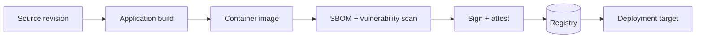

# Containers

## Purpose

Containerization packages a deployable application and its runtime configuration into a reproducible artifact. Container behavior belongs to delivery capability, not to business modules.

## Build flow

```text
application build
    ↓
boot artifact
    ↓
container image build
    ↓
image verification / SBOM
    ↓
registry publish
```



## Rules

- Build images from reproducible, pinned base images.
- Use a multi-stage build when it materially reduces the runtime image.
- Run as a non-root user where supported.
- Keep secrets out of images and build logs.
- Add image labels for version, commit, source, and build time.
- Scan image contents and dependencies before release.
- Keep the runtime image minimal and include only required artifacts.

## Build-logic integration

`emme.container` should expose a typed extension, register lazy tasks such as `buildContainerImage`, `verifyContainerImage`, and `pushContainerImage`, and select Docker/Podman through a provider abstraction. The module build script declares the capability; the plugin owns the wiring.

## Container hardening

### Image supply chain

- Pin base images by digest or approved immutable version.
- Generate SBOM and provenance for every release image.
- Scan OS packages, application dependencies, licenses, and configuration.
- Fail release on policy-defined critical findings; record accepted exceptions with expiry and owner.
- Sign images and verify signatures before deployment where supported.
- Use a private registry with least-privilege push/pull identities.

### Runtime hardening

- Run as non-root with a read-only filesystem where possible.
- Drop unnecessary Linux capabilities and use a minimal runtime image.
- Define CPU/memory requests and limits and a graceful shutdown period.
- Provide health/readiness behavior that reflects dependency state without leaking secrets.
- Keep configuration and secrets outside the image.
- Emit version, commit, source, and build metadata for runtime diagnostics.

### Container checklist

- [ ] Build is reproducible and uses approved immutable inputs.
- [ ] Image is minimal, non-root, and has no embedded secrets.
- [ ] SBOM, vulnerability scan, signature, and provenance are generated.
- [ ] Health/readiness, resource, and shutdown behavior are verified.
- [ ] Image digest is recorded in the release manifest.
