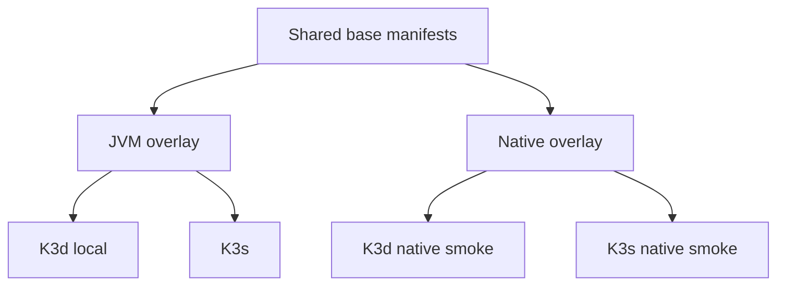
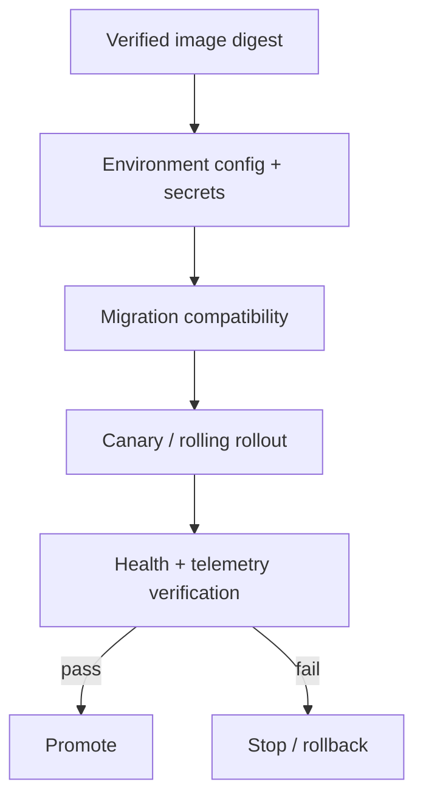

# Deployment

> **Naming contract:** Follow the [canonical architecture naming catalog](../00-project/naming-conventions.md) for package names, filenames, Java/Kotlin types, methods, and tests. Local examples on this page must not introduce a conflicting convention.

## Purpose

Deployment moves a verified image and its configuration to a target environment. Target-specific commands are isolated behind a deployment provider or strategy.

## Targets

```text
DeploymentProvider
├── ComposeProvider       # local development
├── K3dProvider           # local Kubernetes-like CI environment
└── KubernetesProvider    # staging / production
```

## JVM and native runtime overlays

Compose and Kubernetes use the same selection rule: shared infrastructure is
defined once, and the deployment command selects exactly one runtime image.

| Target | JVM | Native |
|---|---|---|
| Docker Compose | `deployment/compose/compose.yml` + `compose.jvm.yml` | `deployment/compose/compose.yml` + `compose.native.yml` |
| K3d local | `infra/kubernetes/overlays/dev` | `infra/kubernetes/overlays/dev-native` |
| K3s | `infra/kubernetes/overlays/prod` | `infra/kubernetes/overlays/prod-native` |



The JVM overlays are the default rollback path. Native overlays remove JVM
runtime flags and select a separately built native image. Do not apply both
runtime overlays to one environment.

```bash
# Render before applying; no cluster mutation occurs.
kubectl kustomize infra/kubernetes/overlays/dev >/dev/null
kubectl kustomize infra/kubernetes/overlays/dev-native >/dev/null
kubectl kustomize infra/kubernetes/overlays/prod >/dev/null
kubectl kustomize infra/kubernetes/overlays/prod-native >/dev/null
```

## Flow

```text
release manifest
    ↓ selects target
deployment provider
    ↓ applies configuration
environment
    ↓ verifies
health / rollout status
```



## Rules

- Make the target explicit through a typed property or environment configuration.
- Do not put target-specific commands in business modules.
- Keep deployment operations idempotent where possible.
- Verify health, rollout, and version after deployment.
- Support a dry run or diff operation for environments that allow it.
- Treat migrations and application rollout ordering as an explicit release concern.
- Keep rollback instructions adjacent to deployment instructions.

The existing deployment strategy pattern is recorded in [ADR-0002](../../adr/0002-deployment-strategy-pattern.md).

## Deployment controls

### Environment and rollout

```text
verify artifact
    ↓
validate configuration/secrets
    ↓
apply migration compatibility plan
    ↓
deploy canary/rolling target
    ↓
verify health, metrics, logs, and version
    ↓
promote or rollback
```

- The same immutable image digest is promoted between environments.
- Environment configuration and secrets are managed separately from the image.
- Rollouts define readiness, liveness, startup, resource, and termination behavior.
- Database migrations are backward-compatible with the old and new application during rollout.
- Feature flags provide safe activation for high-risk behavior.
- Deployment status includes version, image digest, migration state, and health evidence.

### Security and access

- Use least-privilege deployment identities and separate credentials per environment.
- Protect production deployment with approval, audit trail, and branch/tag policy.
- Scan manifests and infrastructure configuration before applying them.
- Do not print secret values during rendering, diff, or rollout.

### Rollback and recovery

Every deployment has a tested rollback path. If a migration is not backward-compatible, use an expand/contract migration sequence and document the recovery operation separately; never assume application rollback can undo a destructive schema change.

### Deployment checklist

- [ ] Immutable artifact and digest are verified.
- [ ] Target, configuration, secret references, and access identity are explicit.
- [ ] Migration compatibility and rollback are documented.
- [ ] Health/rollout verification gates promotion.
- [ ] Failure automatically stops promotion and exposes support diagnostics.
- [ ] Rollback/redeploy procedure has been rehearsed.
