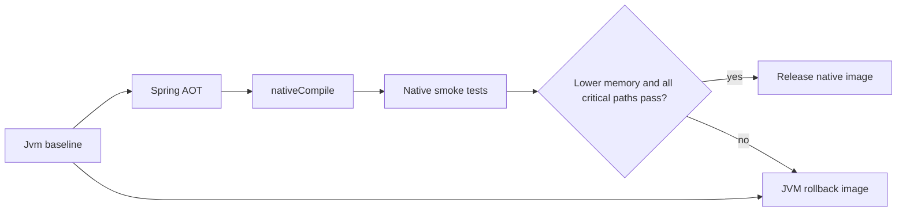

# Native images

> **Naming contract:** Native-image build behavior belongs to the delivery
> capability and follows the [build-logic CDD guide](../00-project/build-logic.md).

## Purpose

GraalVM Native Image is an optional delivery optimization for deployable
applications. It is not a business-module concern and it must never be enabled
implicitly by `emme.spring-application` or by a library module.

The JVM container remains the rollback artifact until the native image passes
the same critical smoke suite and demonstrates a lower measured memory profile
under equivalent limits.

## Opt-in convention

Apply the capability only at the deployable application edge. Emme keeps this
opt-in so normal JVM development and CI remain fast:

```kotlin
plugins {
    id("emme.spring-application")
    id("emme.native-image")
}
```

`emme.native-image` owns the GraalVM Native Build Tools plugin, disables native
fallback binaries, and groups the generated tasks under `native-image`.
Modules remain unaware of GraalVM and continue to use their normal Java,
Spring, testing, and persistence conventions.

## Build flow



The primary local task is:

```text
./gradlew :applications:emme-platform:nativeCompile -Pemme.native-image=true
```

The application build also accepts `-Pemme.native-image=true` as the explicit
opt-in switch. Without that property the native plugin is not applied and the
JVM path remains the default artifact.

The container path uses Spring Boot's `bootBuildImage` with the GraalVM Native
Build Tools plugin applied. A Docker daemon or Buildpacks-compatible builder is
required for an OCI image; a local JDK must provide GraalVM Native Image for
direct `nativeCompile`.

## Production controls

- Build on the target architecture; Native Image does not cross-compile.
- Keep `--no-fallback` semantics so an accidental JVM fallback cannot ship as a
  native artifact.
- Pin the Native Build Tools plugin and builder image through the version
  catalog and dependency verification metadata.
- Keep secrets, database credentials, and provider configuration external to the
  image.
- Verify Spring reflection, JPA, Jackson, Liquibase, OAuth, and resource hints
  during the native spike.
- Compare startup time, RSS, image size, health/readiness, authentication,
  tenant isolation, customer, catalog, and appointment flows with the JVM
  baseline.
- Retain the JVM image and migration rollback instructions until the native
  measurements are accepted.

## Verification status

The opt-in convention and TestKit task registration are verified locally. The
native executable and OCI image remain deployment-environment evidence because
this workspace currently has a standard JDK and no available Docker daemon or
GraalVM Native Image toolchain.

Official references: [Spring Boot native images](https://docs.spring.io/spring-boot/how-to/native-image/developing-your-first-application.html),
[Spring Boot OCI images](https://docs.spring.io/spring-boot/gradle-plugin/packaging-oci-image.html),
and [GraalVM Native Build Tools](https://graalvm.github.io/native-build-tools/latest/gradle-plugin.html).
