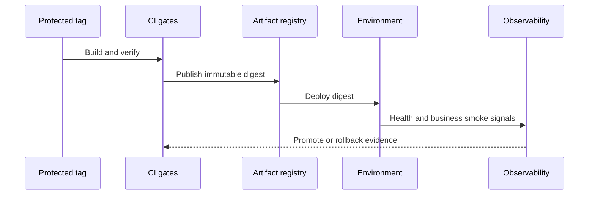

# Release

## Purpose

Release turns a verified source revision into traceable, deployable artifacts. It is a capability composed from versioning, build metadata, publishing, security, and deployment.

## Release flow

```text
source revision
    ↓ verify branch/tag/version
build artifacts
    ↓ generate metadata and SBOM
sign and publish
    ↓ deploy selected artifact
verify rollout
    ↓ record release
```



## Required metadata

- immutable source commit;
- semantic or repository-approved version;
- build timestamp;
- artifact and image digests;
- dependency/SBOM output;
- provenance and signature where supported;
- deployment environment and result.

## Rules

- Release from a known commit or protected tag.
- Never overwrite an immutable release artifact.
- Separate snapshot/development channels from production releases.
- Verify version consistency across application, image, and release manifest.
- Make publishing and deployment retry-safe.
- Keep rollback to the previous verified artifact explicit.
- Record release failures with enough context to diagnose without re-running blindly.

`emme.publishing` owns artifact metadata, SBOM, signing, and release verification. `emme.deployment` owns target execution. The application declares these capabilities only when it is deployable.

## Release controls

### Release governance

- Release from a protected tag or verified commit with approved source status.
- Require review/approval appropriate to environment and change risk.
- Keep release notes, migration notes, known limitations, and rollback instructions.
- Record artifact digest, dependency/SBOM reference, provenance, signer, and deployment result.
- Never reuse a version or mutate an immutable artifact.

### Compatibility sequencing

```text
add compatible code/schema
    ↓
deploy new code
    ↓
backfill/migrate safely
    ↓
enable feature
    ↓
remove deprecated behavior after consumer migration
```

Release compatibility includes database schemas, event payloads, API clients, frontend bundles, configuration, and infrastructure manifests.

### Release checklist

- [ ] Source revision and version are verified.
- [ ] All CI gates and approvals pass.
- [ ] Artifact/image digest, SBOM, signature, and provenance are recorded.
- [ ] Migration and contract compatibility are verified.
- [ ] Deployment target and rollback artifact are known.
- [ ] Post-deployment health, telemetry, and business smoke checks pass.
- [ ] Release record and incident/support contacts are complete.
