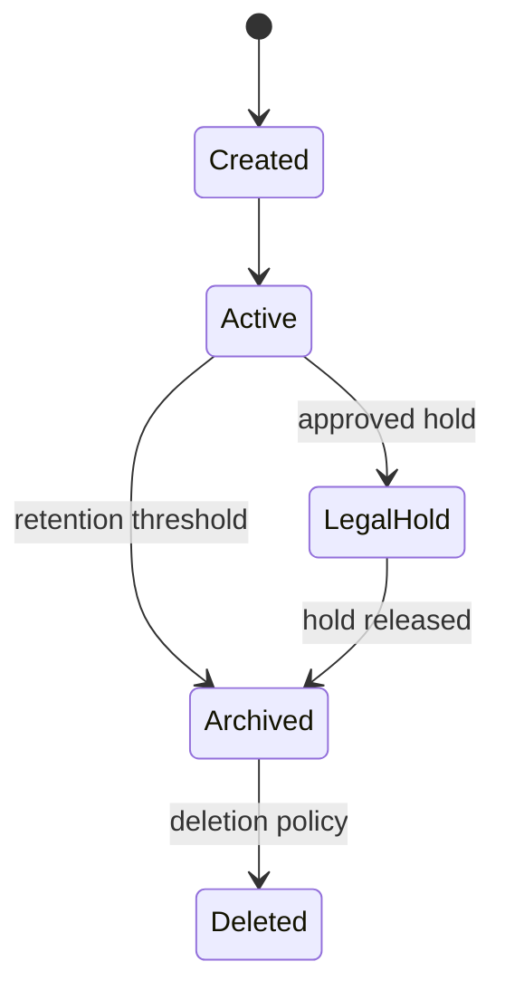

# Data Lifecycle and Recovery

> **Naming contract:** Follow the [canonical architecture naming catalog](../00-project/naming-conventions.md) for package names, filenames, Java/Kotlin types, methods, and tests. Local examples on this page must not introduce a conflicting convention.

## Ownership

Each durable datum has one owning module and an explicit lifecycle:

## Required decisions

For every sensitive or business-critical data class document:

- owner and authoritative store;
- classification and minimum fields;
- retention and deletion trigger;
- legal hold behavior;
- encryption and access policy;
- backup scope and restore point objective;
- recovery point and recovery time objectives;
- migration and rollback behavior.

## Recovery rules

- Backups MUST be encrypted, access-controlled, monitored, and restorable.
- A backup that has not been restored in an exercise is not evidence of recovery.
- Restore procedures MUST preserve tenant isolation and migration compatibility.
- Destructive migrations require expand/contract sequencing or an approved
  recovery alternative.
- Deletion MUST cover primary data, indexes, caches, search projections, exports,
  logs, and backups according to policy.

## Evidence

- [ ] Restore exercise completed with measured RPO/RTO.
- [ ] Tenant isolation verified after restore.
- [ ] Retention and deletion jobs are observable and idempotent.
- [ ] Migration rollback or forward-recovery procedure is documented.
