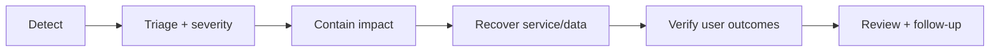

# Incident Readiness

> **Naming contract:** Follow the [canonical architecture naming catalog](../00-project/naming-conventions.md) for package names, filenames, Java/Kotlin types, methods, and tests. Local examples on this page must not introduce a conflicting convention.

## Purpose

Incidents require an executable response, not only dashboards.

## Every runbook must include

- symptom and alert source;
- impact and affected capabilities;
- safe first actions and prohibited actions;
- dashboards, logs, traces, and commands;
- owner/escalation path;
- rollback, failover, replay, or quarantine procedure;
- verification of customer-visible recovery;
- communication and evidence-retention requirements.

## Severity

| Severity | Meaning | Response |
|---|---|---|
| SEV-1 | Broad outage, data loss, or active security exposure | Immediate incident command and executive escalation |
| SEV-2 | Material capability degradation or tenant impact | Owning team response with frequent updates |
| SEV-3 | Limited impact or workaround exists | Normal response and planned remediation |

Severity is based on impact, not implementation difficulty.

## Security incidents

Credential exposure requires immediate revocation/rotation, scope assessment,
evidence preservation, and history remediation where applicable. Never paste
secret values into an incident document.
