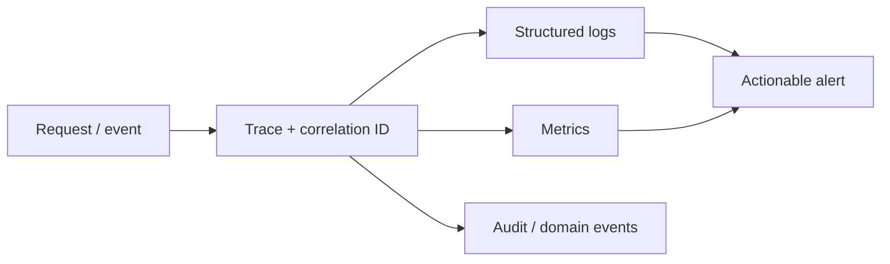

# Observability

> **Naming contract:** Follow the [canonical architecture naming catalog](../00-project/naming-conventions.md) for package names, filenames, Java/Kotlin types, methods, and tests. Local examples on this page must not introduce a conflicting convention.

## Purpose

Observability makes behavior, failure, and ownership diagnosable without exposing
secrets or customer data.

## Required signals

| Boundary | Signals |
|---|---|
| HTTP | rate, status class, latency, timeout, route, tenant-safe dimensions |
| Module | use-case outcome, domain rejection, event publication state |
| Persistence | query latency, pool saturation, transaction failures, migration state |
| External provider | timeout, refusal, retry, circuit state, provider outcome |
| Runtime | CPU, memory, restarts, readiness, deployment version |
| Security | auth failures, authorization denials, rate-limit pressure |

## Rules

- Logs MUST be structured and correlated.
- Metrics labels MUST be bounded; never use customer IDs or free-form input.
- Traces MUST redact authorization headers, cookies, tokens, and sensitive payloads.
- Audit records MUST capture actor, action, target, outcome, and time without
  retaining secret material.
- Alerts MUST include owner, severity, threshold, runbook, and deduplication key.
- Telemetry failure MUST NOT make a successful business operation appear failed.

## Verification

- [ ] A failed request can be followed across adapter and module boundaries.
- [ ] A deployment exposes version and commit metadata.
- [ ] Sensitive fields are absent from logs, traces, metrics, and error responses.
- [ ] Alerts have been tested with representative failures.
