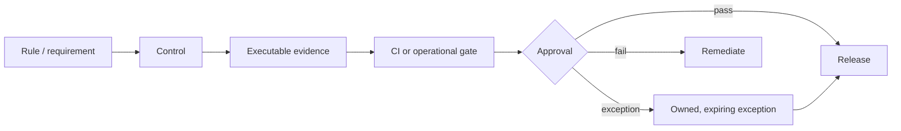

# Production Readiness Evidence

This page is the canonical approval map. It points to detailed policies instead
of repeating them.

## Approval matrix

| Area | Required evidence | Canonical rule |
|---|---|---|
| Architecture | Modulith verification, dependency review, ADRs | [Architecture model](../00-project/architecture-model.md) |
| Behavior | Unit, integration, contract, and critical E2E results | [Testing policy](../../testing.md) |
| Security | Authorization negatives, scans, redaction review | [Security](../../security.md) |
| Contracts | OpenAPI/event compatibility and consumer review | [Contracts](../03-integration/contracts.md) |
| Delivery | Immutable image, SBOM, scan, provenance, rollback | [Container](../04-delivery/container.md) |
| Operations | SLO, telemetry, runbooks, restore evidence | [Operations](.) |
| Data | Migration compatibility, backup/restore, retention | [Data lifecycle](data-lifecycle-and-recovery.md) |

## Exception policy

An exception MUST include owner, reason, affected scope, risk, compensating
control, expiry date, and follow-up issue. “Production grade” is not an
assertion; it is the presence of evidence for each applicable row.

## Release checklist

- [ ] Requirements and compatibility impact reviewed.
- [ ] Architecture and security gates pass.
- [ ] Tests and contract checks pass.
- [ ] Immutable artifacts and image digests are recorded.
- [ ] Configuration and secret references are validated without exposing values.
- [ ] Migration, rollout, health, telemetry, and rollback evidence exists.
- [ ] Open incidents and exceptions are accepted by named owners.
