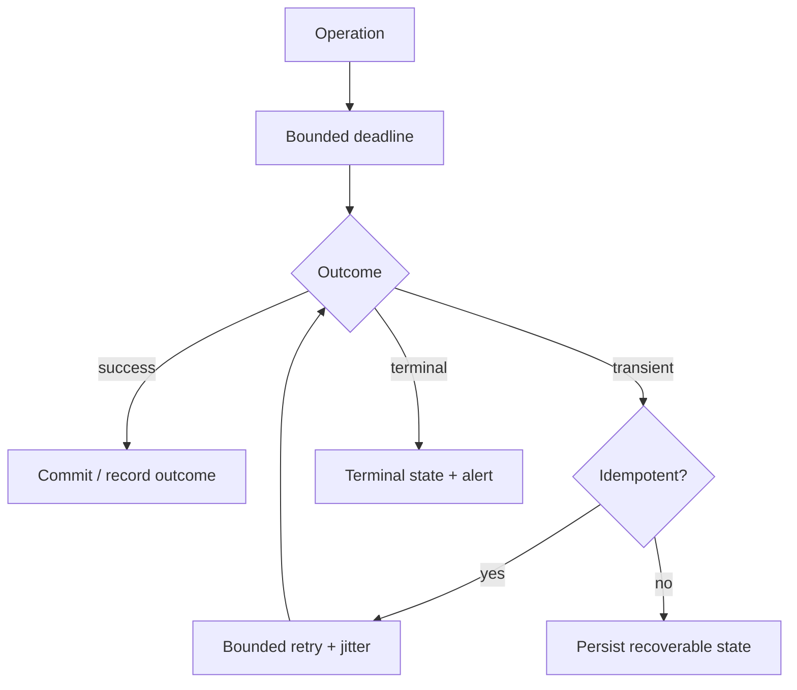

# Reliability and Failure Policy

> **Naming contract:** Follow the [canonical architecture naming catalog](../00-project/naming-conventions.md) for package names, filenames, Java/Kotlin types, methods, and tests. Local examples on this page must not introduce a conflicting convention.

## Dependency policy

| Dependency | Business effect on failure | Default behavior |
|---|---|---|
| PostgreSQL | Durable state unavailable | Fail protected reads/writes; never claim success |
| Redis | Cache/session/rate-limit behavior varies | Bypass only where correctness permits; fail closed for security state |
| Broker/event publication | Async delivery pending | Persist recoverable publication state and alert |
| External HTTP provider | External effect unavailable | Bounded timeout; preserve retryable state and idempotency |
| Telemetry | Diagnosis degraded | Continue safely with bounded local logging |
| Frontend network | User cannot reach API | Show degraded/offline state; never claim mutation success |

## Resilience flow

## Rules

- Set connect, request, and total deadlines from the caller's budget.
- Retry only transient failures and only when the operation is safe to repeat.
- Bound retry count, elapsed time, concurrency, queue depth, and payload size.
- Prevent retry amplification across browser, API, adapter, and messaging layers.
- Use persisted idempotency for external effects that can be duplicated.
- Optimistic locking failures are business conflicts, not generic server errors.
- Model stale, partial, and degraded states explicitly.
- Trust forwarded client-IP headers only when the immediate peer belongs to an
  explicitly configured proxy network; otherwise use the socket peer address.
  See [ADR-0003](../../adr/0003-identity-login-rate-limit-client-ip.md).

## Verification

- [ ] Timeout, refusal, malformed response, and recovery tests exist.
- [ ] Duplicate mutation/submission behavior is covered.
- [ ] Restart behavior around in-flight operations is tested.
- [ ] Runbooks describe replay, quarantine, and dependency restoration.
