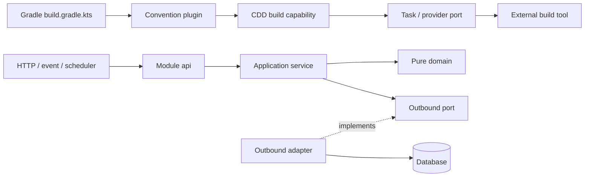

# Service Architecture Migration Specification

| Field | Value |
|---|---|
| Status | Approved implementation baseline |
| Scope | `emme-service` architecture, infrastructure, and module-boundary hardening |
| Related handbook | [`docs/architecture/`](../) |
| Canonical module template | [`docs/templates/module-package-structure-template.md`](../../templates/module-package-structure-template.md) |
| Build-logic model | Capability-Driven Build Logic (CDD) |
| Date | 2026-07-31 |

## Objective

Bring the separated service repository to the architecture already defined by the
Modulith handbook while preserving behavior:

- business modules use DDD + Hexagonal Architecture;
- `api/` is the only cross-module contract surface;
- persistence types live in `adapter/out/persistence`;
- build logic remains capability-first and declarative at module call sites;
- infrastructure manifests are statically verifiable and production-safe;
- module-boundary tests are executable gates rather than documentation only.

The migration is incremental. A module is migrated through a real vertical slice,
then its architecture test and focused tests become the evidence for the next slice.
The full module template is a target shape, not a reason to create empty packages.

## Architecture decisions

### Business modules and build logic are different models



Business modules do not receive `plugin/`, `task/`, or `provider/` packages. Gradle
build logic does not receive `domain/`, `application/`, or `adapter/` packages.
Both models protect boundaries, but their organizing units are different.

### Migration order

1. Restore deterministic CI prerequisites (dependency verification and dependency
   graph integration).
2. Migrate the catalog pilot’s persistence boundary.
3. Replace identity’s cross-module implementation imports with public APIs/events.
4. Keep the architecture tests strict and update their messages to the canonical
   package names.
5. Audit deployment manifests and record safe follow-up work separately from code
   migrations.

## Module migration contract

For each migrated module:

- `domain` has no Spring, JPA, HTTP, broker, or persistence imports;
- `application.service` implements `api.usecase` and coordinates workflows;
- `application.port.out` contains application-owned interfaces;
- `adapter.in` contains transport entry points;
- `adapter.out` contains technology-specific implementations;
- public events live in `api.event` and use past-tense names;
- `package-info.java` documents each materialized package;
- the module’s focused unit/integration tests and `ModularityTest` pass.

## Infrastructure baseline

The service owns runtime manifests, database migration execution, observability
rules, and release-facing container configuration. Every infrastructure change must
be checked with the appropriate static validator (`kustomize build`, Terraform
format/validate, or container build) and must not introduce plaintext production
credentials. Local development credentials remain explicitly scoped to the local
overlay.

## Web i18n boundary

The web application owns translated strings and locale preference. The service owns
stable error codes and machine-readable problem details. A backend response must not
require a specific UI language; the frontend maps an error code to a localized
message. Locale detection follows this precedence:

```text
explicit persisted preference -> browser language preferences -> en-US fallback
```

The locale catalog must have identical leaf keys for every supported locale and the
test-id catalog must remain independent from translated text.

## Success criteria

- `./gradlew ci -x test -x integrationTest -x e2eTest --no-daemon --no-configuration-cache`
  passes in the service repository.
- `./gradlew :applications:studio-api:test --tests com.emme.ModularityTest
  --tests com.emme.LayerConventionTest --no-daemon --no-configuration-cache` passes.
- Catalog persistence classes are under `adapter/out/persistence/entity` and domain
  classes are framework-independent.
- Identity consumes only tenancy API types and studio public events.
- `bun run quality` passes in the web repository, including catalog validation and
  locale behavior tests.
- Infrastructure validation is documented and executable where tooling is available.

## Deliberate non-goals

- Do not rename every legacy module in one change.
- Do not expose JPA entities as a replacement public API.
- Do not translate backend error messages by duplicating UI catalogs in Java.
- Do not weaken architecture tests to make legacy packages pass.
- Do not enable production deployment or mutate external cloud resources as part of
  this migration.
