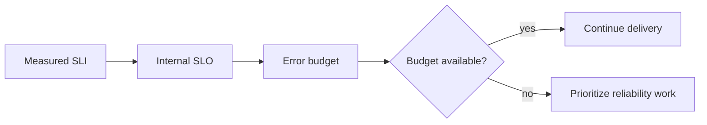

# Service Levels

> **Naming contract:** Follow the [canonical architecture naming catalog](../00-project/naming-conventions.md) for package names, filenames, Java/Kotlin types, methods, and tests. Local examples on this page must not introduce a conflicting convention.

## Purpose

Service levels turn reliability expectations into measurable objectives and
release decisions. They are not promises until an owner, measurement source,
window, and response policy exist.

## Initial objectives

These are baseline targets for the primary service path and MUST be confirmed
against observed traffic before being treated as an external commitment.

| Signal | Baseline target | Measurement |
|---|---:|---|
| API availability | ≥ 99.9% monthly | Successful health and request probes |
| Readiness time | < 60 seconds after deploy | Deployment telemetry |
| API p95 latency | < 500 ms for bounded reads | HTTP server metrics |
| Mutation error rate | < 1% excluding client validation | Structured outcome metrics |
| Recovery objective | Documented per data class | Recovery exercise evidence |

## Rules

- Every SLO MUST name its query, window, owner, and exclusion policy.
- Client errors MUST NOT be hidden inside availability metrics.
- A new critical journey requires an SLI or an explicit rationale for why one is
  unnecessary.
- Error-budget exhaustion pauses risky delivery until the owner approves a plan.
- Targets are reviewed after production traffic and incident evidence exist.
