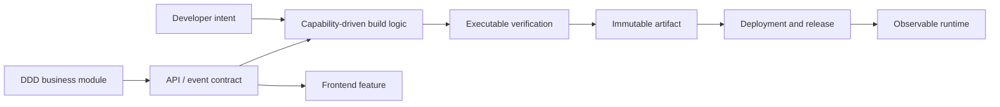

# EMME Architecture Handbook

This handbook is the reusable architecture baseline for EMME service projects.
It describes how the backend repository is organized, how DDD/Hexagonal modules
communicate, how the web repository integrates through contracts, and how build
capabilities are composed.

The current project is split into two sibling repositories:

```text
workspace/
├── emme-service/  # Spring Modulith backend and contract owner
└── emme-web/      # React/Vite browser application
```

> [!IMPORTANT]
> Read the handbook pages for orientation. Use the [application template](../templates/modulith-application-template.md) and [module template](../templates/module-package-structure-template.md) as the authoritative completion contracts.

The central distinction is:

```text
Backend:  module type + business capabilities, organized with DDD and hexagonal boundaries
Build:    project convention + build capabilities, organized with Capability-Driven Design
Frontend: app shell + features, organized by user-facing capability
Delivery: container + publishing + deployment capabilities, composed at the application edge
```

These are related but different architecture models:

| Boundary | Model | Canonical guide |
|---|---|---|
| Backend business module | DDD + Hexagonal Architecture | [Backend module](01-backend/module.md) and [module template](../templates/module-package-structure-template.md) |
| Gradle build platform | Capability-Driven Design | [Capability-Driven Build Logic](00-project/build-logic.md) |

Do not apply the backend module package tree to `build-logic`. Business modules are
organized around domain behavior and inward dependencies; build-logic is organized
around reusable Gradle capabilities and execution boundaries.



This is a two-model architecture: DDD remains the model for business boundaries,
while Capability-Driven Design is the model for reusable Gradle behavior. The shared
principle is cohesive ownership and protected implementation boundaries, not a
single universal folder structure.

## Handbook map

| Area | Contents |
|---|---|
| [00 — Project](00-project/project-layout.md) | Repository layout, Gradle settings, mise, and build logic |
| [01 — Backend](01-backend/module.md) | Modules, APIs, application services, domain, infrastructure, controllers, repositories, and events |
| [02 — Frontend](02-frontend/app.md) | Apps, modules, features, Vite, React, and testing |
| [03 — Integration](03-integration/module-communication.md) | Module communication, frontend/backend integration, and contracts |
| [04 — Delivery](04-delivery/container.md) | Containers, deployment, CI, and releases |

## Existing focused architecture documents

- [Library architecture](library-architecture.md) — responsibility-based libraries and contract extraction.
- [E2E architecture](e2e-architecture.md) — REST/UI test flows, identity, tenancy, and test-user pooling.
- [ADR-0001: Precompiled convention plugins](../adr/0001-build-logic-convention-plugins.md)
- [ADR-0002: Deployment strategy pattern](../adr/0002-deployment-strategy-pattern.md)
- [Modulith application template](../templates/modulith-application-template.md)
- [Module package structure template](../templates/module-package-structure-template.md) — canonical future-module tree, package meanings, copy-ready `package-info.java` catalog, file/type naming, and approval controls.
- [Module and capability build-logic design](../superpowers/specs/2026-07-30-module-architecture-and-capability-build-logic-design.md) — reconciles the two architecture models and migration documentation.

## How to use this handbook

1. Start with the project documents to understand the repository shell.
2. For every future backend module, start from the module template and materialize only the package branches its first real vertical slice needs.
3. Build frontend features inside an application shell; keep shared code purposeful.
4. Define cross-boundary contracts before wiring integrations.
5. Apply delivery capabilities only to deployable applications.
6. Record deviations in an ADR when the baseline is intentionally changed.

The handbook is a default, not a license to create empty layers. A capability may contain only the files that carry real responsibility.

## Definition of done

The architecture is complete only when it can be operated, not merely compiled:

```text
structure → contracts → verification → tests → artifact → rollout → observability → recovery
```

| Concern | Primary guidance |
|---|---|
| Repository and tooling | [Project layout](00-project/project-layout.md), [Gradle settings](00-project/settings-gradle.md), [mise](00-project/mise.md) |
| Build architecture | [Capability-driven build logic](00-project/build-logic.md) |
| Backend modules | [Backend module](01-backend/module.md) and [module template](../templates/module-package-structure-template.md) |
| Backend boundaries | [API](01-backend/api.md), [application](01-backend/application.md), [domain](01-backend/domain.md), [outbound adapters and configuration](01-backend/infrastructure.md) |
| Cross-module behavior | [Module communication](03-integration/module-communication.md), [contracts](03-integration/contracts.md), [events](01-backend/events.md) |
| Frontend | [App](02-frontend/app.md), [module](02-frontend/module.md), [feature](02-frontend/feature.md), [testing](02-frontend/testing.md) |
| Delivery | [Container](04-delivery/container.md), [deployment](04-delivery/deployment.md), [CI](04-delivery/ci.md), [release](04-delivery/release.md) |

### Approval rule

A project or module is not production-ready because it has the expected folders. It is production-ready when ownership, contracts, security, data lifecycle, failure behavior, tests, telemetry, deployment, and recovery evidence are present and verified in CI. Any exception is explicit, time-bounded, owned, and recorded in an ADR.

### Handbook verification checklist

- [ ] Every requested architecture area has a linked Markdown source of truth.
- [ ] Every document states responsibilities, dependency direction, failure behavior, and verification evidence.
- [ ] Backend modules use the module template for concrete package and production controls.
- [ ] Materialized module packages carry local `package-info.java` contracts and files follow the canonical package-to-filename vocabulary.
- [ ] Build logic follows capability-first ownership and provider boundaries.
- [ ] Frontend modules consume contracts instead of backend internals.
- [ ] Delivery documents cover supply chain, rollout, migrations, rollback, and observability.
- [ ] Internal links and Markdown formatting pass validation.

## Documentation ownership

| Question | Canonical source |
|---|---|
| How is the repository composed? | `00-project/` |
| How is build logic organized? | `00-project/build-logic.md` |
| How is a project approved? | `../templates/modulith-application-template.md` |
| How is a module implemented and approved? | `../templates/module-package-structure-template.md` |
| How does a specific boundary work? | The focused page for that boundary |
| Why did the architecture change? | `docs/adr/` |

Focused pages should explain their own boundary once and link to canonical policy instead of copying the entire project/module checklist.
