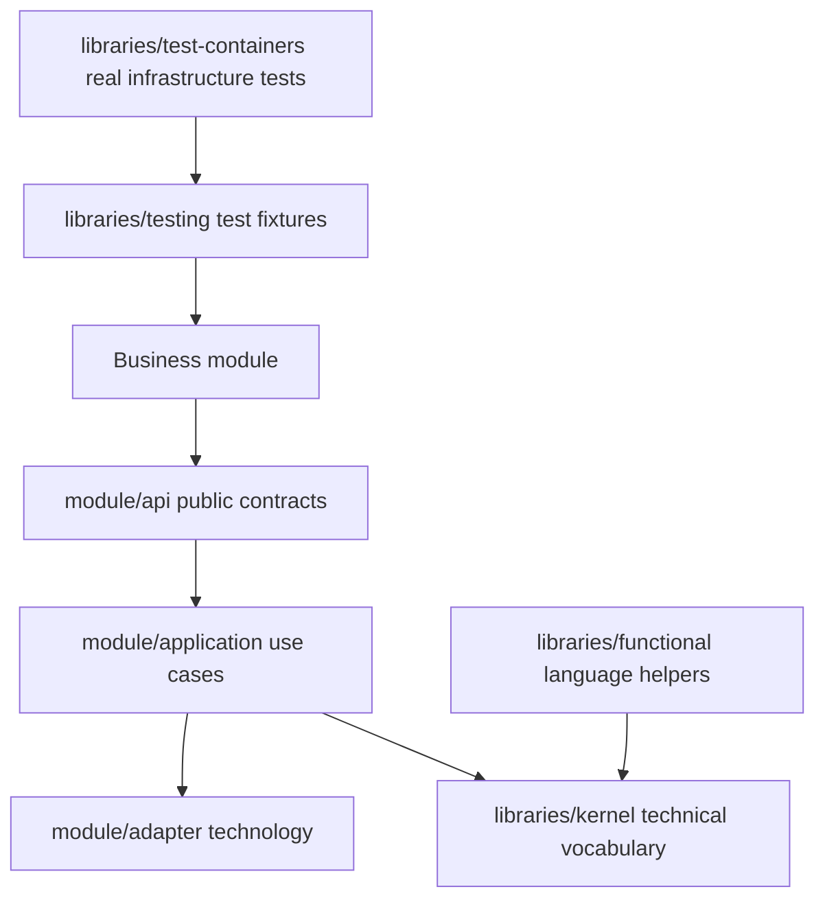
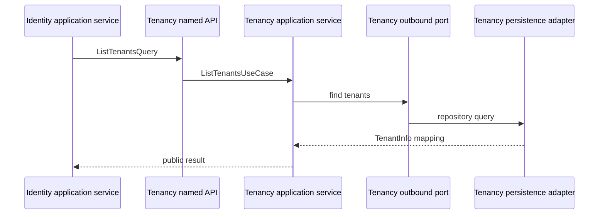
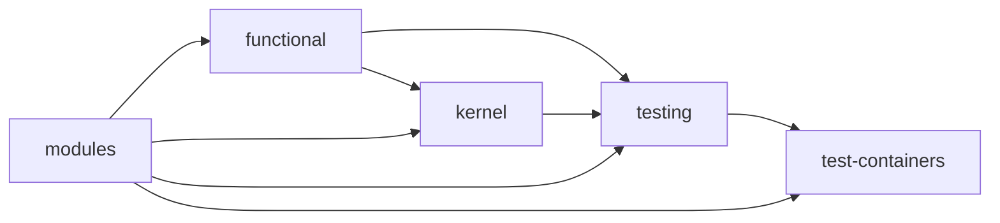

# Library Architecture

> Libraries provide framework-level capabilities. Business contracts remain
> owned by their Spring Modulith module under `module/api`; there is no generic
> `contracts` library and no duplicated cross-module façade.

## Ownership rule

Organize libraries by capability and ownership, not by Java type:



The dependency direction is inward for each business module. A consumer imports
only a publisher module's named API package, for example:

```java
import com.emme.tenancy.api.query.ListTenantsQuery;
import com.emme.tenancy.api.usecase.ListTenantsUseCase;
```

It must not import the publisher's `application`, `domain`, `adapter`, JPA, or
provider packages.

## Current library set

| Library | Owns | May depend on | Must not own |
|---|---|---|---|
| `functional` | Small checked-exception and functional-interface bridges | JDK | Business models, Spring, persistence |
| `kernel` | Cross-module technical vocabulary such as tenant context, tracing IDs, and channel types | JDK, `functional` | Module use cases, database entities, provider clients |
| `observability-support` | Shared observability integration primitives | JDK and approved observability dependencies | Business audit decisions or module events |
| `testing` | Fast Spring/H2 base classes, security test configuration, test applications, and fixtures | Spring Boot, module test APIs | Production code or compatibility façades |
| `test-containers` | PostgreSQL/Redis/Testcontainers infrastructure and integration annotations | Testcontainers, `testing` | Production runtime wiring |

## Module contracts stay with modules

Every real module owns its public contracts:

```text
modules/tenancy/src/main/java/com/emme/tenancy/api/
├── command/
├── query/
├── result/
├── usecase/
└── event/
```

This keeps the contract beside its use-case semantics, named interface, tests,
and versioning decision. A shared library must not become a second public API
surface for a business module.

### Cross-module dependency flow



Commands, queries, results, events, and use cases are documented in the
[module package template](../templates/module-package-structure-template.md).

## Kernel boundary

`kernel` contains only concepts that are genuinely technical and shared by at
least three modules. Examples include:

```text
com.emme.kernel.context/
com.emme.kernel.tracing/
com.emme.kernel.type/
```

Moving a business concept into `kernel` to avoid a module dependency is not
allowed. Prefer a public named API on the owning module.

## Testing boundary

`testing` supports fast tests without creating an alternative production
architecture:

```text
libraries/testing/src/testFixtures/java/com/emme/testing/
├── BaseSpringModuleTest.java
├── BaseWebTest.java
├── TestApplication.java
└── tenancy/
    ├── fixture/
    └── provisioning/
```

Test fixtures may compose public module use cases, but must not reintroduce a
production-style multi-operation service. For example, tenant setup uses
`CreateTenantUseCase` and `CreateTenantCommand`, not a legacy `TenantService`.

`test-containers` is deliberately separate because it starts external
infrastructure and is slower than the default test suite.

## Library dependency rules



The graph is illustrative; a module should declare only the smallest required
dependency. In particular:

- `functional` never depends on Spring or a business module.
- `kernel` never imports module packages.
- `testing` may use public module APIs and test fixtures, but production module
  code must not depend on `testing`.
- `test-containers` is test-only infrastructure and must not appear on a
  production runtime classpath.
- A new library requires a documented owner, a single cohesive capability, and
  a dependency-direction test.

## Adding a library

Before adding one:

1. Search for an existing owner in `functional`, `kernel`, or
   `observability-support`.
2. Confirm the capability is technical and shared, not a business contract.
3. Define its allowed dependencies and package metadata.
4. Add compile and architecture tests before implementation.
5. Update this page and the project layout documentation.

The library is ready only when `./gradlew check`, architecture verification,
formatting, and the documentation validator pass.

## Related architecture

- [Project layout](00-project/project-layout.md)
- [Module package structure](../templates/module-package-structure-template.md)
- [Build-logic capability architecture](00-project/build-logic.md)
- [Documentation index](../README.md)
