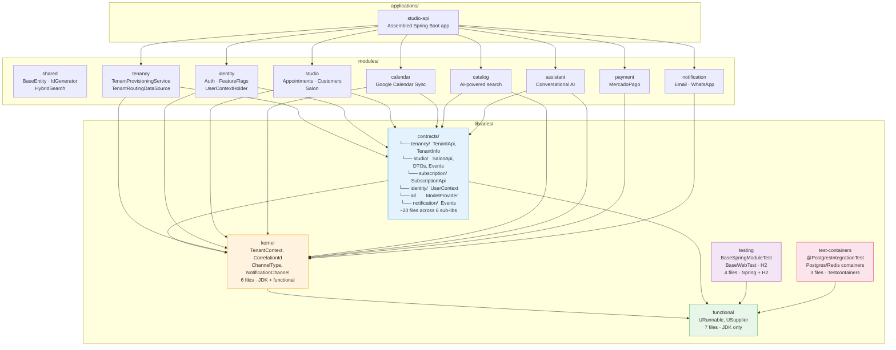
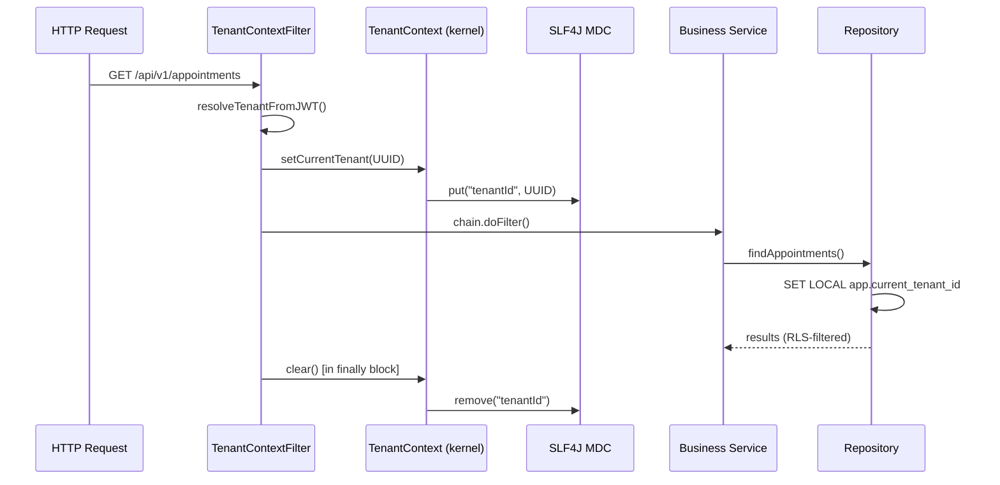
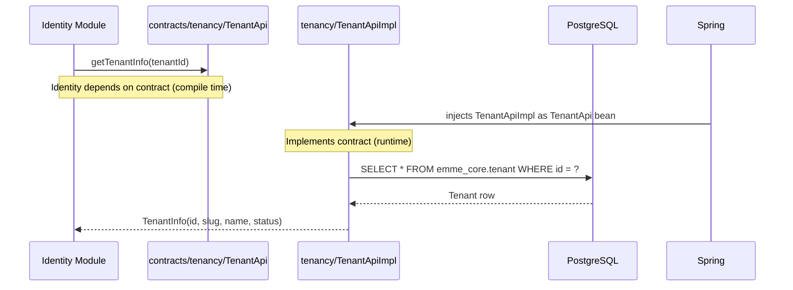
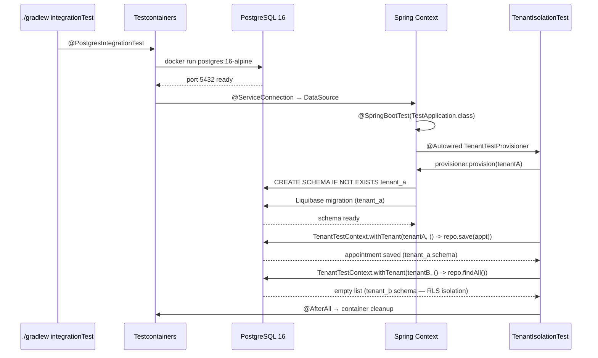

# Emme Modulith — Library Architecture

## ADR-001: Library Extraction & Dependency Direction

**Status:** Proposed  
**Date:** 2026-07-13  
**Deciders:** Architecture review

---

## 1. Principle

> **Package by ownership, not by kind. Every library has exactly one reason to exist.**

| Anti-pattern | Pattern |
|-------------|---------|
| `libraries/commons/` — dumping ground | Each library = single purpose |
| `libraries/types/` — grouping by kind | Group by who changes it together |
| 1 library = 50 files | 1 library ≤ 10 files or it splits |

---

## 2. Final Structure

```
emme/
│
├── libraries/
│   │
│   ├── functional/          ← Language extension: checked exception → lambda bridge
│   │   com.emme.functional/
│   │   URunnable, USupplier, UFunction, UConsumer, UBiConsumer, UBiFunction, UPredicate
│   │   Depends on: JDK
│   │   Never grows.
│   │
│   ├── kernel/              ← Types shared by 3+ modules (max 10 files, or it splits)
│   │   com.emme.kernel.context/     TenantContext, TenantContextHolder
│   │   com.emme.kernel.tracing/     CorrelationId, CorrelationContextHolder
│   │   com.emme.kernel.type/        ChannelType, NotificationChannel
│   │   Depends on: JDK + functional
│   │
│   ├── contracts/           ← Module boundaries (prefixed by module name)
│   │   ├── tenancy/         TenantApi, TenantInfo
│   │   ├── studio/          SalonApi, AppointmentInfo, CustomerInfo, BusinessProfileInfo,
│   │   │                    AppointmentCreatedEvent, AppointmentCancelledEvent, AppointmentRescheduledEvent
│   │   ├── subscription/    SubscriptionApi, PlanInfo, PlanType
│   │   ├── identity/        UserContext
│   │   ├── ai/              ModelProvider
│   │   └── notification/    NotificationDeliveredEvent
│   │   Depends on: JDK + functional + kernel
│   │   Each contract = 2-5 files. Deleted when its module is deleted.
│   │
│   ├── testing/             ← H2 / Spring slice test base classes
│   │   com.emme.testing/
│   │   BaseSpringModuleTest, BaseWebTest, BaseRepositoryTest, BaseUnitTest, TestSecurityConfig, TestApplication
│   │   Depends on: Spring Boot + H2
│   │
│   └── test-containers/     ← Docker-backed integration test infrastructure
│       com.emme.testing.integration/
│       PostgresContainerConfiguration, RedisContainerConfiguration,
│       @PostgresIntegrationTest, @MultitenantIntegrationTest
│       Depends on: Testcontainers
│
├── modules/                 ← Business modules (one per bounded context)
│   ├── shared/              Infrastructure (BaseEntity, IdGenerator, HybridSearch)
│   ├── tenancy/             Tenant provisioning, multi-database routing
│   ├── identity/            Authentication, authorization, feature flags
│   ├── studio/              Salon, appointments, customers, artists
│   ├── booking/             Appointment booking orchestration
│   ├── payment/             MercadoPago integration
│   ├── notification/        Email, WhatsApp, push notifications
│   ├── catalog/             Service catalog search (AI-powered)
│   ├── assistant/           Conversational AI
│   ├── calendar/            Google Calendar sync
│   ├── customer/            Customer profiles
│   ├── workforce/           Staff management
│   └── audit/               Audit trail
│
└── applications/
    └── studio-api/           Assembled Spring Boot application
```

---

## 3. Use Cases

### 3.1 `functional` — Checked Exception Bridge

**Problem:** Java lambdas can't throw checked exceptions. `TenantContextHolder.withTenantOverride()` needs to run arbitrary code that may throw.

**Solution:** `URunnable`, `USupplier`, `UFunction`, `UConsumer`, `UBiConsumer`, `UBiFunction`, `UPredicate` — each extends a JDK functional interface with a `*Throws` method. The default method catches checked exceptions → re-wraps as `RuntimeException`.

```java
// BEFORE: forced try-catch everywhere
TenantContextHolder.withTenantOverride(tenantId, () -> {
    try {
        repository.save(entity);
    } catch (DataAccessException e) {
        throw new RuntimeException(e);
    }
    return null;
});

// AFTER: clean lambda
import com.emme.functional.URunnable;
TenantContextHolder.withTenantOverride(tenantId, (URunnable) () -> repository.save(entity));
```

**Consumers:** `TenantContextHolder`, `CorrelationContextHolder`, `UserContextHolder`.

---

### 3.2 `kernel` — Cross-Cutting Types

**Problem:** `TenantContext` is in `:modules:tenancy`, but `:modules:payment`, `:modules:identity`, and `:modules:calendar` need it for webhook processing, async jobs, and background tasks. They shouldn't depend on the entire tenancy module (Spring, JPA, Liquibase, HikariCP).

**Solution:** Extract the context propagation pattern (ThreadLocal + save/restore) to `kernel`.

```java
// Payment webhook: set tenant context before processing
import com.emme.kernel.context.TenantContextHolder;

@PostMapping("/webhook/mercadopago")
public void handleWebhook(@RequestBody WebhookPayload payload) {
    var tenantId = resolveTenantFromWebhook(payload);
    TenantContextHolder.withTenantOverride(tenantId, () -> {
        paymentService.processNotification(payload);
    });
}
```

**What stays in tenancy module:** `TenantProvisioningService`, `TenantRoutingDataSource`, `DatabasePoolManager`, `TenantProvisioningWorker`, Liquibase migrations, `TenantRepository`.

**What moves to kernel:** `TenantContext` (ThreadLocal), `TenantContextHolder` (save/restore facade), `CorrelationId`, `CorrelationContextHolder`, `ChannelType`, `NotificationChannel` (unified).

---

### 3.3 `contracts` — Module Boundaries

**Problem:** `:modules:identity` needs `TenantInfo` from `:modules:tenancy`, pulling in the entire tenancy module as a compile-time dependency. Same pattern for `:modules:calendar → :modules:studio`.

**Solution:** Extract ONLY the interface + DTO record to `contracts/<module>/`. The implementation stays in the module.

```java
// contracts/tenancy/TenantApi.java — PURE CONTRACT
package com.emme.contracts.tenancy;

public interface TenantApi {
    TenantInfo getTenantInfo(UUID tenantId);
    List<TenantInfo> getActiveTenants();
    Optional<UUID> getTenantIdBySlug(String slug);
}

// contracts/tenancy/TenantInfo.java — PURE DATA
package com.emme.contracts.tenancy;

public record TenantInfo(
    UUID id,
    String slug,
    String displayName,
    String schemaName,
    String status,
    String databaseMode
) {}
```

```java
// modules/identity/build.gradle.kts — MINIMAL DEPENDENCY
dependencies {
    implementation(project(":contracts:tenancy"))   // 2 files, zero transitive deps
    // No longer depends on :modules:tenancy
}
```

**Dependency inversion achieved:**

```
BEFORE:
  identity ──depends on──▶ tenancy (Spring + JPA + Liquibase + 50+ classes)

AFTER:
  identity ──depends on──▶ contracts/tenancy (TenantApi + TenantInfo — 2 files)
  tenancy  ──implements──▶ contracts/tenancy/TenantApi
```

---

### 3.4 `testing` — Fast Test Base Classes

**Problem:** Every module needs Spring context for slice tests but shouldn't depend on Testcontainers for fast feedback.

**Solution:** Provide `BaseSpringModuleTest`, `BaseWebTest`, `BaseRepositoryTest`, `BaseUnitTest` with H2 profile. Run in `< 30s`.

```java
// Fast test: no Docker, no PostgreSQL. Runs in CI on every push.
class BookingControllerTest extends BaseWebTest {
    @Test void shouldRejectOverlappingAppointments() { ... }
}
```

---

### 3.5 `test-containers` — Real Infrastructure Tests

**Problem:** H2 doesn't catch PostgreSQL-specific behavior (RLS, JSONB, pgvector, locking). Tests pass against H2, fail in production.

**Solution:** `@PostgresIntegrationTest` wires a real PostgreSQL 16 container via `@ServiceConnection`. Run explicitly (`./gradlew integrationTest`), not on every `check`.

```java
@PostgresIntegrationTest
class BookingTenantIsolationTest {
    @Autowired TenantTestProvisioner provisioner;

    @Test void appointmentsAreIsolatedByTenant() {
        var tenantA = provisioner.provision(TenantFixtures.uniqueTenant());
        var tenantB = provisioner.provision(TenantFixtures.uniqueTenant());

        TenantTestContext.withTenant(tenantA, () -> repository.save(appointment()));
        TenantTestContext.withTenant(tenantB, () ->
            assertThat(repository.findAll()).isEmpty());
    }
}
```

---

## 4. Functional Requirements

| ID | Requirement | Implementation |
|----|------------|---------------|
| FR1 | Modules must NOT depend on other modules' internals | `contracts/*` exposes only public API |
| FR2 | Context propagation (tenant, correlation) must work across async boundaries | `kernel/context` uses ThreadLocal + MDC with save/restore |
| FR3 | Integration tests must run against real PostgreSQL | `test-containers` provides `@ServiceConnection` |
| FR4 | Fast tests must run without Docker | `testing` provides H2 profile base classes |
| FR5 | Checked exceptions must not leak through functional interfaces | `functional` bridges checked → unchecked |
| FR6 | Cross-module events must not create circular dependencies | Events extracted to `contracts/<publisher>/` |
| FR7 | Enums with cross-module usage must be single-source | `kernel/type` unifies duplicates |
| FR8 | Libraries must never depend on business modules | All libraries: zero module deps |

---

## 5. Non-Functional Requirements

| ID | Requirement | Metric |
|----|------------|--------|
| NFR1 | Library count ≤ 5 | 5 libraries (functional, kernel, contracts, testing, test-containers) |
| NFR2 | Library size ≤ 10 files | Kernel = 6 files, functional = 7 files, contracts = ~20 files across 6 sub-libraries |
| NFR3 | Compile-time dependency reduction | Identity: 50+ classes → 5 files (90% reduction) |
| NFR4 | Build time: unit tests | < 30s (H2 profile, no Docker) |
| NFR5 | Build time: integration tests | < 2min (Testcontainers, PostgreSQL) |
| NFR6 | Module deletion = contract deletion | Delete `modules/X` + `contracts/X` — zero orphans |
| NFR7 | No `commons` or `utils` package | Enforced by code review |
| NFR8 | New contract = 5 minutes | Create `contracts/X/`, 2 Java files, 1 build.gradle.kts |

---

## 6. Architecture Diagram



---

## 7. Flow Diagrams

### 7.1 Context Propagation Flow



### 7.2 Contract Resolution Flow



### 7.3 Integration Test Flow



---

## 8. Contracts vs. OpenAI API Contracts

### 8.1 Similarities

| Aspect | Emme Contracts | OpenAI API |
|--------|---------------|------------|
| **Purpose** | Define module boundaries | Define service boundaries |
| **Format** | Java interface + record | OpenAPI 3.1 / JSON Schema |
| **Versioning** | Semantic versioning on contract library | `/v1/` in URL path |
| **Consumers** | Other modules (compile-time) | External clients (HTTP) |
| **Backward compat** | Adding fields = ok. Removing = breaking. | Same rule. |
| **Documentation** | Javadoc on interface methods | OpenAPI `description` fields |

### 8.2 Differences

| Aspect | Emme Contracts | OpenAI API |
|--------|---------------|------------|
| **Transport** | Direct method call (JVM) | HTTP/HTTPS |
| **Serialization** | None (same JVM) | JSON over the wire |
| **Authentication** | None (trusted internal) | API key / OAuth2 bearer token |
| **Rate limiting** | None (internal) | Tiered (RPM/TPM) |
| **SDK generation** | Not needed (interface = SDK) | OpenAPI → client generators |
| **Error model** | Java exceptions | HTTP status codes + JSON error body |
| **Streaming** | `Stream<T>` or `Flux<T>` | Server-Sent Events (SSE) |
| **Deprecation** | `@Deprecated` on interface method | `Deprecation: true` header + sunset date |
| **Change log** | Git history of contract files | Changelog page + migration guides |

### 8.3 Why Emme Contracts Are Better for Internal Modules

OpenAI's API contracts are designed for **external, untrusted, network-bound** consumers. They need:

- Serialization (JSON schema)
- Authentication (API keys)
- Rate limiting
- SDK generation for 7 languages
- Backward compatibility across years

Emme's contracts are **internal, trusted, same-JVM** consumers. They only need:

- Compile-time type safety
- Interface + record (zero serialization overhead)
- Method signature compatibility
- Module dependency isolation

**The contract is the SDK.** No code generation. No HTTP overhead. No serialization cost. An `import com.emme.contracts.tenancy.TenantApi` is exactly as expressive as `openai.tenants.list()` in an OpenAI SDK — but with zero network cost and instant type checking.

### 8.4 What We Can Learn from OpenAI

| OpenAI Practice | Apply to Emme? | How |
|----------------|---------------|-----|
| **Per-service contracts** (e.g., `/v1/chat`, `/v1/embeddings` separate specs) | ✅ Yes | `contracts/tenancy/`, `contracts/studio/` — one per bounded context |
| **Request/Response objects named explicitly** (`CreateChatCompletionRequest`) | ✅ Yes | Records named after intent: `TenantInfo`, `AppointmentInfo`, `PlanInfo` |
| **Deprecation with migration path** | ✅ Yes | `@Deprecated(since = "2.0", forRemoval = true)` with Javadoc linking to replacement |
| **Idempotency keys** | ❌ No | Same-JVM calls don't need idempotency |
| **Streaming responses** | ❌ No | Internal calls are synchronous or event-driven |
| **Usage tracking per consumer** | ✅ Optional | Add `ModuleConsumptionMetrics` interceptor on contract implementations |

---

## 9. Migration Plan

| # | Commit | Files Changed | Gate |
|---|--------|--------------|------|
| 1 | `refactor: rename functional-interfaces → functional` | settings + 1 build.gradle.kts + 4 imports | `./gradlew compileJava` |
| 2 | `refactor: create kernel library from shared + tenancy context types` | ~6 files created, ~20 imports updated | `./gradlew compileJava` |
| 3 | `refactor: extract module contracts to contracts/` | ~15 files created, ~30 imports updated | `./gradlew compileJava` |
| 4 | `refactor: rename integration-test-support → test-containers` | settings + 5 imports | `./gradlew compileJava` |
| 5 | `chore: update convention plugin for new library names` | 1 file | `./gradlew integrationTestClasses` |
| 6 | `chore: delete empty domain-kernel, verify zero references` | settings cleanup | `rg "domain-kernel" → empty` |

---

## 10. Verification Checklist

```bash
# Library count = 5 (no more, no less)
ls -d libraries/*/ | wc -l

# Zero circular dependencies
./gradlew :modules:identity:dependencies --configuration compileClasspath | grep "modules:studio"

# Contracts have zero business deps (only JDK + functional + kernel)
./gradlew :contracts:tenancy:dependencies --configuration compileClasspath

# All integration tests compile (single invocation)
./gradlew compileIntegrationTestJava --dependency-verification=off

# Legacy reference search
rg "com.emme.tenancy.api.TenantApi" modules/identity/ → found in contracts import, not module import
```
