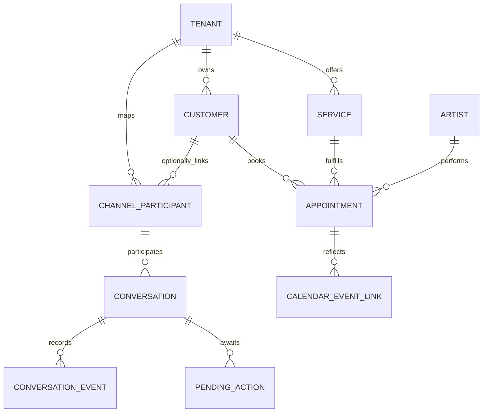

# Client App — Entity Model

Entities visible in customer-facing interactions. See [`docs/entity_model.md`](../entity_model.md) for the complete model.

| Entity | Description |Location |
|---|---|---|
| **CHANNEL_PARTICIPANT** | Customer's channel identity: WhatsApp number or web chat session. Links to optional CUSTOMER profile. | [`entity_model.md`](../entity_model.md#channel_participant) |
| **CUSTOMER** | Customer profile: name, phone, email. Status: ACTIVE, RETIRED. | [`entity_model.md`](../entity_model.md#customer) |
| **CONVERSATION** | One customer interaction: linked to a participant and channel. Status: ACTIVE, CLOSED, EXPIRED. | [`entity_model.md`](../entity_model.md#conversation) |
| **CONVERSATION_EVENT** | One ordered fact in a conversation: message, action, system event. Payload stored as JSONB. | [`entity_model.md`](../entity_model.md#conversation_event) |
| **PENDING_ACTION** | Consequential action awaiting customer confirmation: BOOK, CANCEL, PAY, REFUND. Expires if unconfirmed. | [`entity_model.md`](../entity_model.md#pending_action) |
| **SERVICE** | Salon offering visible to customer: name, description, duration, price. | [`entity_model.md`](../entity_model.md#service) |
| **ARTIST** | Staff member performing the service (name only visible to customer). | [`entity_model.md`](../entity_model.md#artist) |
| **APPOINTMENT** | Customer's booked appointment: service, artist, time, lifecycle status. | [`entity_model.md`](../entity_model.md#appointment) |
| **CALENDAR_EVENT_LINK** | Links a customer's confirmed appointment to their personal calendar. | [`entity_model.md`](../entity_model.md#calendar_event_link) |
