# Entity Model

## Entity Relationship Diagram

```mermaid
erDiagram
    TENANT ||--o{ MEMBERSHIP : authorizes
    ROLE ||--o{ MEMBERSHIP : assigns
    ROLE ||--o{ ROLE_PERMISSION : contains
    PERMISSION ||--o{ ROLE_PERMISSION : grants
    TENANT ||--|| BUSINESS_PROFILE : describes
    TENANT ||--o{ OPERATING_HOURS : schedules
    TENANT ||--|| BOOKING_POLICY : configures
    TENANT ||--o{ NOTIFICATION_PREFERENCE : tunes
    TENANT ||--o{ CUSTOMER : owns
    TENANT ||--o{ CHANNEL_PARTICIPANT : maps
    CUSTOMER ||--o{ CHANNEL_PARTICIPANT : optionally_links
    TENANT ||--o{ SERVICE : offers
    TENANT ||--o{ ARTIST : employs
    TENANT ||--o{ ARTIST_CAPABILITY : scopes
    ARTIST ||--o{ ARTIST_CAPABILITY : has
    SERVICE ||--o{ ARTIST_CAPABILITY : qualifies
    CUSTOMER ||--o{ APPOINTMENT : books
    SERVICE ||--o{ APPOINTMENT : fulfills
    ARTIST ||--o{ APPOINTMENT : performs
    TENANT ||--o{ CONVERSATION : owns
    CHANNEL_PARTICIPANT ||--o{ CONVERSATION : participates
    CONVERSATION ||--o{ CONVERSATION_EVENT : records
    CONVERSATION ||--o{ PENDING_ACTION : awaits
    TENANT ||--o{ CONVERSATION_EVENT : scopes
    TENANT ||--o{ PENDING_ACTION : scopes
    TENANT ||--o{ DOCUMENT : owns
    DOCUMENT ||--o{ DOCUMENT_CHUNK : contains
    DOCUMENT_CHUNK ||--o{ VECTOR_PROJECTION : embeds
    TENANT ||--o{ DOCUMENT_CHUNK : scopes
    TENANT ||--o{ VECTOR_PROJECTION : scopes
    TENANT ||--o{ PROJECTION_CHECKPOINT : tracks
    TENANT ||--o{ NOTIFICATION : sends
    TENANT ||--|| SUBSCRIPTION : subscribes
    TENANT ||--o{ PAYMENT : owns
    TENANT ||--o{ AUDIT_EVENT : scopes
    TENANT ||--o{ CALENDAR_SYNC_STATE : syncs
    TENANT ||--o{ CALENDAR_EVENT_LINK : maps
    APPOINTMENT ||--o{ CALENDAR_EVENT_LINK : reflects
```

All identifiers are UUIDv7 unless noted otherwise. Foreign keys use the same UUID type.

### TENANT

Represents one isolated service business using EMME.

| Attribute | Description | Data Type | Length/Precision | Validation Rules |
|---|---|---|---|---|
| id | Unique tenant identifier | UUIDv7 | 36 | Primary Key |
| slug | Stable tenant URL name | String | 63 | Not Null, Unique |
| name | Display name | String | 150 | Not Null |
| status | Lifecycle status | String | 30 | Not Null, Values: ACTIVE, SUSPENDED, DELETED |
| created_at | Creation time | DateTime | - | Not Null |

### MEMBERSHIP

Associates one authenticated user identity with a tenant role.

| Attribute | Description | Data Type | Length/Precision | Validation Rules |
|---|---|---|---|---|
| id | Unique membership identifier | UUIDv7 | 36 | Primary Key |
| tenant_id | Owning tenant | UUIDv7 | 36 | Not Null, Foreign Key (TENANT.id) |
| role_id | Assigned role | UUIDv7 | 36 | Not Null, Foreign Key (ROLE.id) |
| user_reference | External user identity reference | String | 150 | Not Null |
| status | Membership status | String | 20 | Not Null, Values: ACTIVE, SUSPENDED, REVOKED |
| created_at | Assignment time | DateTime | - | Not Null |

**Constraints:** A user identity may have only one active membership role assignment of the same kind within a tenant.

### ROLE

Defines a named collection of tenant or platform permissions.

| Attribute | Description | Data Type | Length/Precision | Validation Rules |
|---|---|---|---|---|
| id | Unique role identifier | UUIDv7 | 36 | Primary Key |
| code | Stable role code | String | 80 | Not Null, Unique |
| name | Human-readable role name | String | 120 | Not Null |
| scope | Role applicability | String | 20 | Not Null, Values: PLATFORM, TENANT |
| active | Whether assignments are allowed | Boolean | 1 | Not Null |

### PERMISSION

Defines one protected business action.

| Attribute | Description | Data Type | Length/Precision | Validation Rules |
|---|---|---|---|---|
| id | Unique permission identifier | UUIDv7 | 36 | Primary Key |
| code | Stable resource-action code | String | 120 | Not Null, Unique |
| name | Human-readable permission name | String | 150 | Not Null |
| description | Permission purpose | String | 500 | Not Null |
| active | Whether the permission can be granted | Boolean | 1 | Not Null |

### ROLE_PERMISSION

Associates a permission with a role.

| Attribute | Description | Data Type | Length/Precision | Validation Rules |
|---|---|---|---|---|
| id | Unique association identifier | UUIDv7 | 36 | Primary Key |
| role_id | Role receiving the permission | UUIDv7 | 36 | Not Null, Foreign Key (ROLE.id) |
| permission_id | Granted permission | UUIDv7 | 36 | Not Null, Foreign Key (PERMISSION.id) |
| granted_at | Grant time | DateTime | - | Not Null |

**Constraints:** A role and permission pair must be unique.

### BUSINESS_PROFILE

Stores the tenant's identity and public business details.

| Attribute | Description | Data Type | Length/Precision | Validation Rules |
|---|---|---|---|---|
| id | Unique profile identifier | UUIDv7 | 36 | Primary Key |
| tenant_id | Owning tenant | UUIDv7 | 36 | Not Null, Foreign Key (TENANT.id) |
| time_zone | Business time zone | String | 80 | Not Null |
| locale | Default business locale | String | 20 | Not Null |
| display_name | Public-facing business name | String | 150 | Not Null |
| metadata | Optional non-core profile data | JSONB | - | Nullable |
| updated_at | Last configuration change | DateTime | - | Not Null |

**Constraints:** Exactly one business profile exists per tenant.

### OPERATING_HOURS

Stores weekly opening hours.

| Attribute | Description | Data Type | Length/Precision | Validation Rules |
|---|---|---|---|---|
| id | Unique schedule row identifier | UUIDv7 | 36 | Primary Key |
| tenant_id | Owning tenant | UUIDv7 | 36 | Not Null, Foreign Key (TENANT.id) |
| day_of_week | Weekday | String | 10 | Not Null, Values: MONDAY..SUNDAY |
| opens_at | Opening time | Time | - | Not Null |
| closes_at | Closing time | Time | - | Not Null |
| active | Whether the day is enabled | Boolean | 1 | Not Null |

**Constraints:** One row per tenant and day_of_week.

### BOOKING_POLICY

Stores scheduling rules for bookings.

| Attribute | Description | Data Type | Length/Precision | Validation Rules |
|---|---|---|---|---|
| id | Unique policy identifier | UUIDv7 | 36 | Primary Key |
| tenant_id | Owning tenant | UUIDv7 | 36 | Not Null, Foreign Key (TENANT.id) |
| min_notice_minutes | Minimum notice before booking | Integer | 10 | Not Null, Min: 0 |
| max_advance_days | Maximum advance booking window | Integer | 10 | Not Null, Min: 0 |
| cancellation_window_minutes | Allowed cancellation window | Integer | 10 | Not Null, Min: 0 |
| allow_overlap | Whether override slots are allowed | Boolean | 1 | Not Null |
| updated_at | Last policy change | DateTime | - | Not Null |

**Constraints:** Exactly one booking policy exists per tenant.

### NOTIFICATION_PREFERENCE

Stores tenant communication preferences.

| Attribute | Description | Data Type | Length/Precision | Validation Rules |
|---|---|---|---|---|
| id | Unique preference identifier | UUIDv7 | 36 | Primary Key |
| tenant_id | Owning tenant | UUIDv7 | 36 | Not Null, Foreign Key (TENANT.id) |
| channel | Notification channel | String | 30 | Not Null, Values: WHATSAPP, EMAIL, PUSH, SMS |
| enabled | Whether the channel is active | Boolean | 1 | Not Null |
| template_policy | Template selection policy | String | 40 | Not Null, Values: DEFAULT, TENANT_CUSTOM |
| metadata | Optional channel metadata | JSONB | - | Nullable |

**Constraints:** One row per tenant and channel.

### CUSTOMER

Represents a tenant-owned salon customer.

| Attribute | Description | Data Type | Length/Precision | Validation Rules |
|---|---|---|---|---|
| id | Unique customer identifier | UUIDv7 | 36 | Primary Key |
| tenant_id | Owning tenant | UUIDv7 | 36 | Not Null, Foreign Key (TENANT.id) |
| name | Customer display name | String | 150 | Not Null |
| phone | Customer phone number | String | 30 | Optional |
| email | Customer email address | String | 254 | Optional |
| status | Customer lifecycle status | String | 20 | Not Null, Values: ACTIVE, RETIRED |
| created_at | Creation time | DateTime | - | Not Null |

### CHANNEL_PARTICIPANT

Represents one channel-side identity for a customer or prospect.

| Attribute | Description | Data Type | Length/Precision | Validation Rules |
|---|---|---|---|---|
| id | Unique participant identifier | UUIDv7 | 36 | Primary Key |
| tenant_id | Owning tenant | UUIDv7 | 36 | Not Null, Foreign Key (TENANT.id) |
| channel | Originating channel | String | 30 | Not Null, Values: WHATSAPP, WEB_CHAT |
| provider_reference | External participant reference | String | 150 | Not Null |
| customer_id | Linked customer, if any | UUIDv7 | 36 | Nullable, Foreign Key (CUSTOMER.id) |
| consent_status | Consent state | String | 20 | Not Null, Values: UNKNOWN, GRANTED, REVOKED |
| created_at | Link creation time | DateTime | - | Not Null |

**Constraints:** One provider_reference per tenant and channel.

### SERVICE

Represents one explicit salon offering and its current commercial terms.

| Attribute | Description | Data Type | Length/Precision | Validation Rules |
|---|---|---|---|---|
| id | Unique service identifier | UUIDv7 | 36 | Primary Key |
| tenant_id | Owning tenant | UUIDv7 | 36 | Not Null, Foreign Key (TENANT.id) |
| code | Tenant-stable service code | String | 80 | Not Null |
| name | Service name | String | 150 | Not Null |
| duration_minutes | Scheduled duration | Integer | 10 | Not Null, Min: 1, Max: 1440 |
| base_price | Current base price | Decimal | 10,2 | Not Null, Min: 0 |
| status | Offering status | String | 20 | Not Null, Values: ACTIVE, RETIRED |

**Constraints:** Service code must be unique within a tenant.

### ARTIST

Represents a tenant staff member eligible to perform salon services.

| Attribute | Description | Data Type | Length/Precision | Validation Rules |
|---|---|---|---|---|
| id | Unique artist identifier | UUIDv7 | 36 | Primary Key |
| tenant_id | Owning tenant | UUIDv7 | 36 | Not Null, Foreign Key (TENANT.id) |
| name | Artist display name | String | 150 | Not Null |
| status | Artist availability status | String | 20 | Not Null, Values: ACTIVE, INACTIVE |
| created_at | Creation time | DateTime | - | Not Null |

### ARTIST_CAPABILITY

Associates an artist with a service the artist may perform.

| Attribute | Description | Data Type | Length/Precision | Validation Rules |
|---|---|---|---|---|
| id | Unique capability identifier | UUIDv7 | 36 | Primary Key |
| tenant_id | Owning tenant | UUIDv7 | 36 | Not Null, Foreign Key (TENANT.id) |
| artist_id | Qualified artist | UUIDv7 | 36 | Not Null, Foreign Key (ARTIST.id) |
| service_id | Qualified service | UUIDv7 | 36 | Not Null, Foreign Key (SERVICE.id) |
| active | Whether capability is current | Boolean | 1 | Not Null |
| updated_at | Last capability change | DateTime | - | Not Null |

**Constraints:** An artist and service capability pair must be unique.

### APPOINTMENT

Represents a scheduled customer service and its lifecycle.

| Attribute | Description | Data Type | Length/Precision | Validation Rules |
|---|---|---|---|---|
| id | Unique appointment identifier | UUIDv7 | 36 | Primary Key |
| tenant_id | Owning tenant | UUIDv7 | 36 | Not Null, Foreign Key (TENANT.id) |
| customer_id | Booking customer | UUIDv7 | 36 | Not Null, Foreign Key (CUSTOMER.id) |
| service_id | Booked service | UUIDv7 | 36 | Not Null, Foreign Key (SERVICE.id) |
| artist_id | Assigned artist | UUIDv7 | 36 | Not Null, Foreign Key (ARTIST.id) |
| starts_at | Scheduled start | DateTime | - | Not Null |
| ends_at | Scheduled end | DateTime | - | Not Null |
| status | Appointment state | String | 30 | Not Null, Values: DRAFT, CONFIRMED, IN_PROGRESS, COMPLETED, CANCELLED, NO_SHOW |
| external_calendar_status | Sync state | String | 20 | Not Null, Values: NOT_SYNCED, SYNCED, CONFLICT, FAILED |
| created_at | Creation time | DateTime | - | Not Null |

**Constraints:** End time must be after start time; active appointments for one artist cannot overlap.

### CALENDAR_SYNC_STATE

Tracks the last known synchronization status for calendar providers.

| Attribute | Description | Data Type | Length/Precision | Validation Rules |
|---|---|---|---|---|
| id | Unique sync state identifier | UUIDv7 | 36 | Primary Key |
| tenant_id | Owning tenant | UUIDv7 | 36 | Not Null, Foreign Key (TENANT.id) |
| provider | Calendar provider | String | 30 | Not Null, Values: GOOGLE_CALENDAR |
| sync_token | Provider sync token | String | 255 | Not Null |
| last_synced_at | Last successful sync time | DateTime | - | Nullable |
| status | Sync status | String | 20 | Not Null, Values: ACTIVE, STALE, FAILED |

### CALENDAR_EVENT_LINK

Represents one external calendar event mapped to an appointment.

| Attribute | Description | Data Type | Length/Precision | Validation Rules |
|---|---|---|---|---|
| id | Unique event link identifier | UUIDv7 | 36 | Primary Key |
| tenant_id | Owning tenant | UUIDv7 | 36 | Not Null, Foreign Key (TENANT.id) |
| appointment_id | Linked appointment | UUIDv7 | 36 | Not Null, Foreign Key (APPOINTMENT.id) |
| provider | Calendar provider | String | 30 | Not Null, Values: GOOGLE_CALENDAR |
| external_event_id | Provider event id | String | 150 | Not Null |
| etag | Provider version token | String | 150 | Nullable |
| status | Link status | String | 20 | Not Null, Values: PENDING, SYNCED, CONFLICT, DELETED, FAILED |
| updated_at | Last link change | DateTime | - | Not Null |

**Constraints:** One provider event id per tenant and provider.

### CONVERSATION

Represents a tenant customer interaction across one approved channel.

| Attribute | Description | Data Type | Length/Precision | Validation Rules |
|---|---|---|---|---|
| id | Unique conversation identifier | UUIDv7 | 36 | Primary Key |
| tenant_id | Owning tenant | UUIDv7 | 36 | Not Null, Foreign Key (TENANT.id) |
| participant_id | Participating channel identity | UUIDv7 | 36 | Not Null, Foreign Key (CHANNEL_PARTICIPANT.id) |
| channel | Originating channel | String | 30 | Not Null, Values: WHATSAPP, WEB_CHAT |
| status | Conversation state | String | 20 | Not Null, Values: ACTIVE, CLOSED, EXPIRED |
| started_at | Conversation start | DateTime | - | Not Null |

### CONVERSATION_EVENT

Records one ordered fact in a conversation history.

| Attribute | Description | Data Type | Length/Precision | Validation Rules |
|---|---|---|---|---|
| id | Unique event identifier | UUIDv7 | 36 | Primary Key |
| tenant_id | Owning tenant | UUIDv7 | 36 | Not Null, Foreign Key (TENANT.id) |
| conversation_id | Owning conversation | UUIDv7 | 36 | Not Null, Foreign Key (CONVERSATION.id) |
| sequence_number | Order within conversation | Integer | 10 | Not Null, Min: 1 |
| event_type | Conversation fact type | String | 80 | Not Null |
| payload | Structured event content | JSONB | - | Not Null |
| occurred_at | Event time | DateTime | - | Not Null |

**Constraints:** Sequence number must be unique within a conversation.

### PENDING_ACTION

Represents a consequential conversation action awaiting customer confirmation.

| Attribute | Description | Data Type | Length/Precision | Validation Rules |
|---|---|---|---|---|
| id | Unique pending action identifier | UUIDv7 | 36 | Primary Key |
| tenant_id | Owning tenant | UUIDv7 | 36 | Not Null, Foreign Key (TENANT.id) |
| conversation_id | Owning conversation | UUIDv7 | 36 | Not Null, Foreign Key (CONVERSATION.id) |
| action_type | Requested action | String | 50 | Not Null, Values: BOOK, CANCEL, PAY, REFUND |
| status | Confirmation state | String | 20 | Not Null, Values: PENDING, CONFIRMED, REJECTED, EXPIRED, EXECUTED |
| expires_at | Confirmation expiry | DateTime | - | Not Null |
| created_at | Draft creation time | DateTime | - | Not Null |

### DOCUMENT

Represents one tenant knowledge source and its ingestion status.

| Attribute | Description | Data Type | Length/Precision | Validation Rules |
|---|---|---|---|---|
| id | Unique document identifier | UUIDv7 | 36 | Primary Key |
| tenant_id | Owning tenant | UUIDv7 | 36 | Not Null, Foreign Key (TENANT.id) |
| name | Source display name | String | 255 | Not Null |
| source_type | Source format | String | 30 | Not Null |
| status | Ingestion status | String | 30 | Not Null, Values: UPLOADED, PROCESSING, READY, FAILED, RETIRED |
| version | Authoritative content version | Integer | 10 | Not Null, Min: 1 |

### DOCUMENT_CHUNK

Represents one ordered retrievable portion of a document.

| Attribute | Description | Data Type | Length/Precision | Validation Rules |
|---|---|---|---|---|
| id | Unique chunk identifier | UUIDv7 | 36 | Primary Key |
| tenant_id | Owning tenant | UUIDv7 | 36 | Not Null, Foreign Key (TENANT.id) |
| document_id | Owning document | UUIDv7 | 36 | Not Null, Foreign Key (DOCUMENT.id) |
| chunk_index | Order within document | Integer | 10 | Not Null, Min: 0 |
| content | Normalized text content | String | 500 | Not Null |
| content_fingerprint | Stable content identity | String | 128 | Not Null |
| created_at | Chunk creation time | DateTime | - | Not Null |

**Constraints:** Chunk index must be unique within a document.

### VECTOR_PROJECTION

Represents a rebuildable vector projection for one document chunk.

| Attribute | Description | Data Type | Length/Precision | Validation Rules |
|---|---|---|---|---|
| id | Unique vector projection identifier | UUIDv7 | 36 | Primary Key |
| tenant_id | Owning tenant | UUIDv7 | 36 | Not Null, Foreign Key (TENANT.id) |
| chunk_id | Projected chunk | UUIDv7 | 36 | Not Null, Foreign Key (DOCUMENT_CHUNK.id) |
| model_name | Embedding model identity | String | 120 | Not Null |
| model_version | Embedding model version | String | 80 | Not Null |
| projection_value | Stored vector representation | String | 500 | Not Null |
| projected_at | Projection completion time | DateTime | - | Not Null |

### PROJECTION_CHECKPOINT

Tracks projection progress for reconciliation and rebuild operations.

| Attribute | Description | Data Type | Length/Precision | Validation Rules |
|---|---|---|---|---|
| id | Unique checkpoint identifier | UUIDv7 | 36 | Primary Key |
| tenant_id | Owning tenant | UUIDv7 | 36 | Not Null, Foreign Key (TENANT.id) |
| projection_type | Projection kind | String | 20 | Not Null, Values: VECTOR, GRAPH |
| source_reference | Authoritative source identifier | String | 120 | Not Null |
| source_version | Last successful source version | Integer | 10 | Not Null, Min: 1 |
| status | Projection status | String | 20 | Not Null, Values: PENDING, CURRENT, FAILED, STALE |
| updated_at | Last processing time | DateTime | - | Not Null |

### NOTIFICATION

Represents one logical tenant notification and its delivery outcome.

| Attribute | Description | Data Type | Length/Precision | Validation Rules |
|---|---|---|---|---|
| id | Unique notification identifier | UUIDv7 | 36 | Primary Key |
| tenant_id | Owning tenant | UUIDv7 | 36 | Not Null, Foreign Key (TENANT.id) |
| channel | Delivery channel | String | 30 | Not Null, Values: WHATSAPP, WEB, PUSH, EMAIL |
| recipient_reference | Channel recipient | String | 150 | Not Null |
| status | Delivery status | String | 30 | Not Null, Values: REQUESTED, SENT, DELIVERED, FAILED, CANCELLED |
| created_at | Request time | DateTime | - | Not Null |

### SUBSCRIPTION

Represents one tenant's commercial plan and billing state.

| Attribute | Description | Data Type | Length/Precision | Validation Rules |
|---|---|---|---|---|
| id | Unique subscription identifier | UUIDv7 | 36 | Primary Key |
| tenant_id | Subscribed tenant | UUIDv7 | 36 | Not Null, Foreign Key (TENANT.id) |
| plan | Effective plan | String | 30 | Not Null, Values: STARTER, PRO, ENTERPRISE |
| status | Billing status | String | 30 | Not Null, Values: TRIAL, ACTIVE, PAST_DUE, SUSPENDED, CANCELLED |
| period_ends_at | Current period end | DateTime | - | Not Null |
| updated_at | Last subscription change | DateTime | - | Not Null |

**Constraints:** Exactly one current subscription exists per tenant.

### PAYMENT

Represents a tenant payment, callback result, or refund lifecycle.

| Attribute | Description | Data Type | Length/Precision | Validation Rules |
|---|---|---|---|---|
| id | Unique payment identifier | UUIDv7 | 36 | Primary Key |
| tenant_id | Owning tenant | UUIDv7 | 36 | Not Null, Foreign Key (TENANT.id) |
| provider_reference | External payment reference | String | 150 | Not Null |
| amount | Payment amount | Decimal | 10,2 | Not Null, Min: 0 |
| currency | Three-letter currency code | String | 3 | Not Null |
| status | Payment state | String | 30 | Not Null, Values: PENDING, AUTHORIZED, CAPTURED, DECLINED, REFUNDED, CANCELLED |
| updated_at | Last reconciled time | DateTime | - | Not Null |

**Constraints:** Provider reference must be unique within a tenant.

### AUDIT_EVENT

Records a security-sensitive or consequential business activity.

| Attribute | Description | Data Type | Length/Precision | Validation Rules |
|---|---|---|---|---|
| id | Unique audit event identifier | UUIDv7 | 36 | Primary Key |
| tenant_id | Scoped tenant | UUIDv7 | 36 | Nullable for platform scope |
| actor_reference | Acting identity reference | String | 150 | Not Null |
| action | Stable audited action | String | 120 | Not Null |
| outcome | Activity outcome | String | 20 | Not Null, Values: SUCCEEDED, DENIED, FAILED |
| occurred_at | Activity time | DateTime | - | Not Null |

**Constraints:** Every tenant-owned entity is protected by tenant isolation; vector and graph projections are derived and rebuildable from authoritative entities. Platform-scoped events may omit `tenant_id`.

