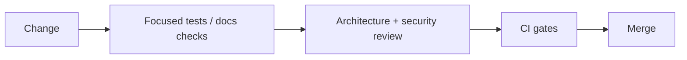

# Git and Change Policy

## Branches and commits

- Branch names MUST describe one cohesive change, for example
  `feat/quote-submission` or `docs/architecture-handbook`.
- Commits MUST use `type(scope): imperative description`.
- Keep commits atomic and reversible.
- Do not rewrite shared history unless the owner explicitly authorizes it.
- Never commit generated output, local credentials, tokens, HAR recordings, or
  machine-specific paths.

## Pull request evidence

Every change should explain:

- the capability and repository owner;
- the contract or behavior changed;
- risks, migrations, and rollback;
- tests, scans, builds, and checks run;
- intentionally unrun checks and why.

## Review gate

A clean diff is not sufficient evidence. The verification story must match the
risk and the changed boundary.
