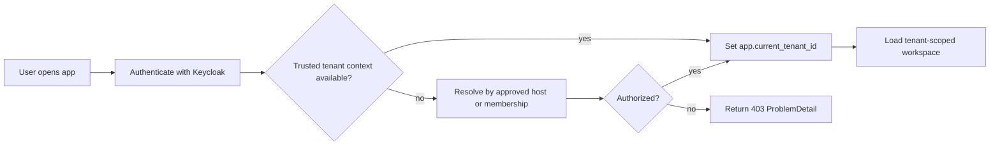
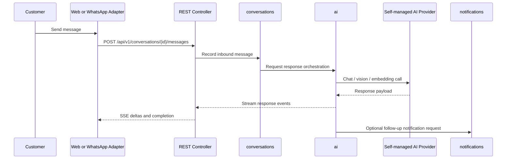
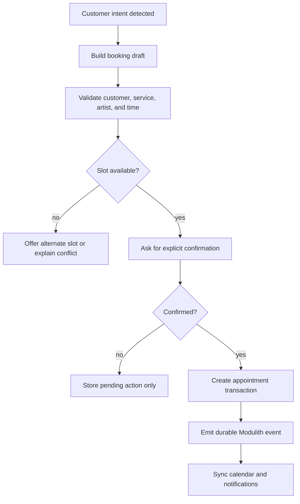
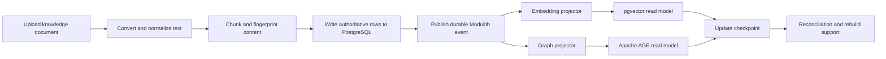
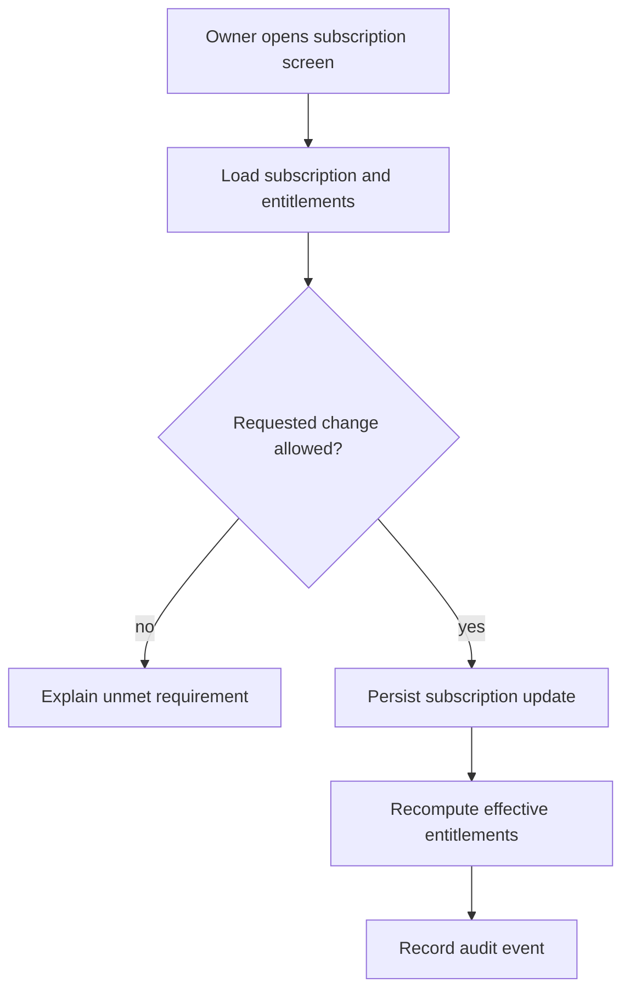
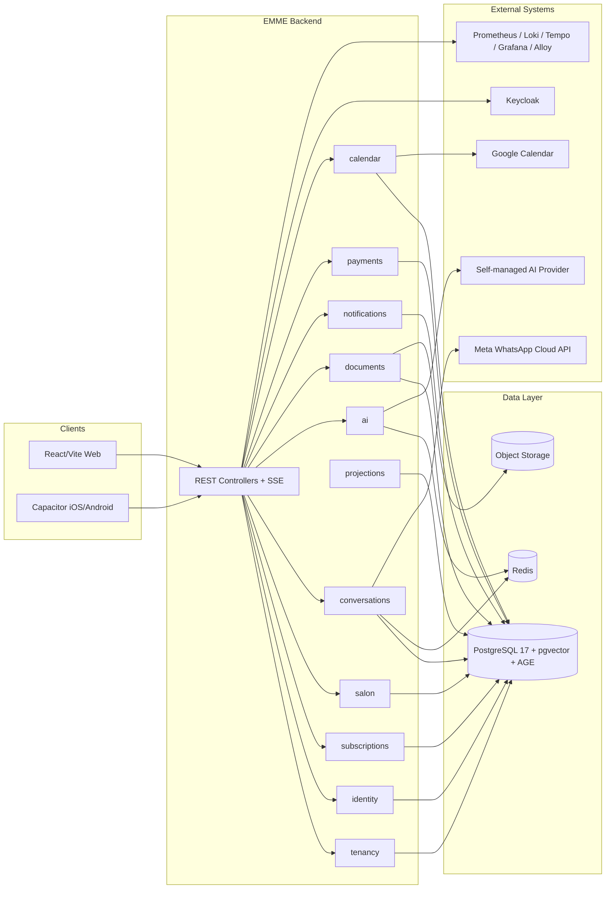
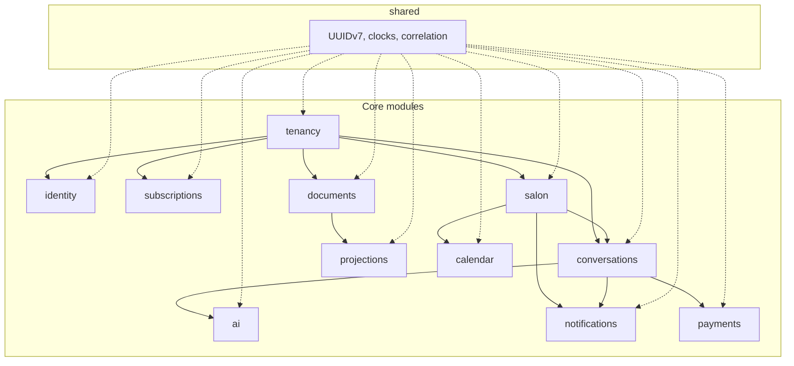

# EMME Modulith PRD

| Field | Value |
|---|---|
| Product | EMME Modulith v1 |
| Source vision | [`../vision.md`](../vision.md) |
| Source requirements | [`../requirements.md`](../requirements.md) |
| Source entity model | [`../entity_model.md`](../entity_model.md) |
| Source use-case index | [`../requirements/use-cases/README.md`](../requirements/use-cases/README.md) |
| Status | Draft for review |

## 1. Product Summary

EMME Modulith is the first production-oriented version of EMME for nail salons and adjacent service businesses. It keeps the existing frontend experience and collapses the backend into one Java 25 Spring Boot modular monolith with clear boundaries, one database source of truth, and durable post-commit events.

The v1 objective is not to reduce capability. It is to reduce operational and architectural fragmentation while preserving the user-visible workflows already proven in the source platform.

## 2. Product Goals

- Preserve the existing React/Vite/Capacitor experience.
- Replace GraphQL/Apollo adapters with REST/OpenAPI clients.
- Keep all retained business capabilities inside one Spring Modulith deployment.
- Use PostgreSQL 17 as the authoritative store, with pgvector and Apache AGE as derived read models.
- Keep the runtime simple: single backend deployment, single frontend deployment, Kubernetes-native packaging, self-hosted observability, and no Docker Compose runtime target.

## 3. Non-Goals

- No Quarkus or Micronaut runtime in v1.
- No microservice split for retained capabilities.
- No GraphQL or gRPC public API surface.
- No Docker Compose runtime.
- No Debezium requirement for v1 projections.
- No generic integrations catch-all module in the backend.

## 4. Core Actors

| Actor | Role |
|---|---|
| Customer | Chats, books, confirms actions, and receives replies through WhatsApp or web chat. |
| Staff member | Operates customers, appointments, services, and notifications. |
| Salon owner | Owns configuration, subscription, and operational decisions. |
| Platform administrator | Manages tenant lifecycle, subscriptions, entitlements, and platform health. |
| System operator | Handles deployment, observability, backup, and restore operations. |
| External provider | Supplies Keycloak, Meta WhatsApp, Google Calendar, object storage, and the self-managed AI provider boundary. |

## 5. Workflow Diagrams

### 5.1 Tenant Access and Context Resolution

### 5.2 Channel Message to Response

### 5.3 Conversational Booking

### 5.4 Knowledge Ingestion and Projection

### 5.5 Subscription and Entitlement Enforcement

## 6. Architecture Diagrams

### 6.1 System Context

### 6.2 Modulith Boundary View

## 7. Data Model Summary

The authoritative model is relational and tenant-isolated through shared-schema `tenant_id` plus PostgreSQL RLS. The most important entities for v1 are:

- Tenant, membership, role, permission
- Business profile, operating hours, booking policy, notification preference
- Customer, channel participant, service, artist, artist capability, appointment
- Conversation, conversation event, pending action
- Document, document chunk, vector projection, projection checkpoint
- Subscription, payment, calendar sync state, calendar event link
- Audit event

The detailed entity model lives in [entity_model.md](../entity_model.md).

## 8. Key Product Rules

- Tenant context must be trusted, not user-asserted.
- Consequential actions require explicit confirmation.
- Prices and availability come from structured modules, not RAG output.
- Projections are derived and rebuildable.
- REST is used for command submission and SSE for streamed conversation responses.
- The system is built for one VM and one backend deployment in v1, even though the architecture keeps future extraction possible.

## 9. Success Metrics

- All retained frontend flows operate against the new backend contract.
- Chat responses can stream via SSE without WebSockets.
- Appointment creation avoids double booking through transaction and lock boundaries.
- pgvector and AGE projections recover from rebuild without data loss in authoritative tables.
- The system can be deployed with one backend image, one frontend image, and one single-node Kubernetes environment.

## 10. Open Questions

- Which Google Calendar sync depth is required in v1: busy-time only, or full create/update/cancel parity?
- Which exact external AI provider contract should be versioned first for chat, vision, and embeddings?
- Should notifications support email in v1 or remain focused on WhatsApp and in-app flows?

## 11. Traceability

- User-facing behavior: [../requirements.md](../requirements.md)
- Use-case map: [../requirements/use-cases/README.md](../requirements/use-cases/README.md)
- Detailed entities: [../entity_model.md](../entity_model.md)
- Architecture and migration decisions: [repository architecture](../architecture/README.md)
