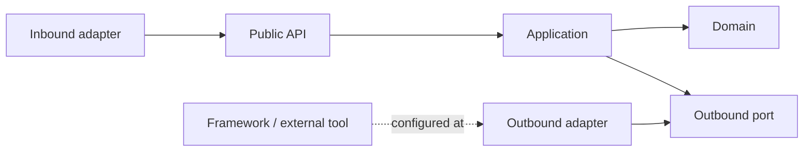

# Engineering Principles

## Decision order

1. Correctness and data integrity.
2. Security and privacy.
3. Clear ownership and dependency direction.
4. Testability and operability.
5. Simplicity and maintainability.
6. Performance proven by measurement.

## Cohesion and ownership

- Organize business code by DDD capability, not global technical type.
- Organize build and operational code by technical capability, not `task`,
  `provider`, `script`, or `config` type.
- Keep files that change together together.
- Give each business datum one authoritative owning module.
- Keep `shared` small, stable, and dependency-light.
- Prefer explicit public contracts over imports of another module's internals.

## Dependency direction

- Domain code MUST not import transport, persistence, messaging, cache, or DI
  frameworks.
- Application code orchestrates use cases and depends on domain types and ports.
- Adapters translate protocols and implement ports.
- Composition roots select concrete implementations.
- Cycles are prohibited within and between business modules.

## Side effects and errors

- Validate at boundaries and protect invariants again in the domain.
- Make I/O, time, randomness, and external calls visible at a port/adapter.
- Inject replaceable dependencies; do not instantiate infrastructure in core code.
- Use stable machine-readable error semantics at public boundaries.
- Never swallow failures or turn them into success-like empty values.
- Never log credentials, tokens, secrets, or sensitive customer data.

## Simplicity

- Prefer direct code over speculative abstractions.
- Introduce an abstraction for a stable boundary or demonstrated duplication.
- Use provider/strategy polymorphism only where implementations are replaceable.
- Do not create architecture layers without responsibility.

## Review questions

- Which capability owns this change?
- What is its public contract?
- Does every dependency point in the allowed direction?
- What fails, retries, times out, or rolls back?
- Which automated evidence proves the design still holds?
