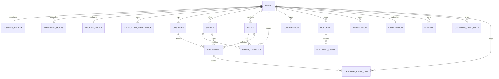

# Studio App — Entity Model

Entities visible in the studio operations app. See [`docs/entity_model.md`](../entity_model.md) for the complete model.

| Entity | Description | Location |
|---|---|---|
| **BUSINESS_PROFILE** | Tenant identity: name, address, timezone, locale, metadata. One per tenant. | [`entity_model.md`](../entity_model.md#business_profile) |
| **OPERATING_HOURS** | Per-day open/close times with active toggle. One row per day per tenant. | [`entity_model.md`](../entity_model.md#operating_hours) |
| **BOOKING_POLICY** | Scheduling rules: min notice, max advance, cancellation window, overlap. | [`entity_model.md`](../entity_model.md#booking_policy) |
| **NOTIFICATION_PREFERENCE** | Channel enable/disable per tenant: WHATSAPP, EMAIL, PUSH, SMS. | [`entity_model.md`](../entity_model.md#notification_preference) |
| **SERVICE** | Salon offering: code, name, duration, base price. Status: ACTIVE, RETIRED. | [`entity_model.md`](../entity_model.md#service) |
| **ARTIST** | Staff member eligible to perform services. Status: ACTIVE, INACTIVE. | [`entity_model.md`](../entity_model.md#artist) |
| **ARTIST_CAPABILITY** | Links an artist to a service they can perform. | [`entity_model.md`](../entity_model.md#artist_capability) |
| **CUSTOMER** | Salon client: name, phone, email. Status: ACTIVE, RETIRED. | [`entity_model.md`](../entity_model.md#customer) |
| **APPOINTMENT** | Scheduled service: customer, service, artist, time window, lifecycle status (DRAFT → CONFIRMED → IN_PROGRESS → COMPLETED/NO_SHOW/CANCELLED). | [`entity_model.md`](../entity_model.md#appointment) |
| **CALENDAR_SYNC_STATE** | Per-provider sync tracking: GOOGLE_CALENDAR with last sync token. | [`entity_model.md`](../entity_model.md#calendar_sync_state) |
| **CALENDAR_EVENT_LINK** | Maps an appointment to an external calendar event with sync status. | [`entity_model.md`](../entity_model.md#calendar_event_link) |
| **CONVERSATION** | Customer interaction across WhatsApp or web chat; linked to a channel participant. | [`entity_model.md`](../entity_model.md#conversation) |
| **DOCUMENT** | Tenant knowledge source: name, type, ingestion status (UPLOADED → PROCESSING → READY → FAILED → RETIRED). | [`entity_model.md`](../entity_model.md#document) |
| **DOCUMENT_CHUNK** | One retrievable portion of a document with content and fingerprint. | [`entity_model.md`](../entity_model.md#document_chunk) |
| **NOTIFICATION** | One logical notification with channel, recipient, and delivery status. | [`entity_model.md`](../entity_model.md#notification) |
| **SUBSCRIPTION** | Tenant billing plan and period. | [`entity_model.md`](../entity_model.md#subscription) |
| **PAYMENT** | Tenant transaction: amount, currency, provider reference, status. | [`entity_model.md`](../entity_model.md#payment) |
